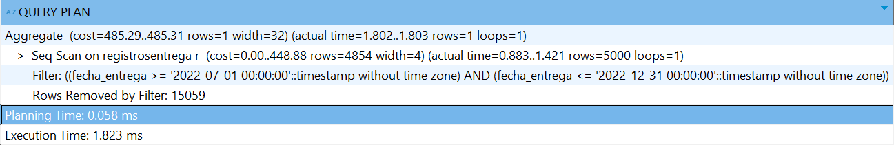
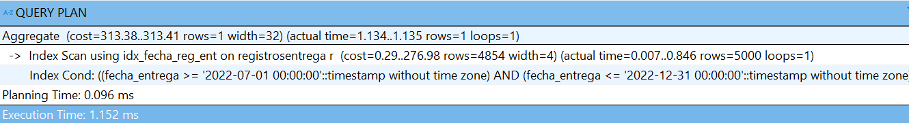
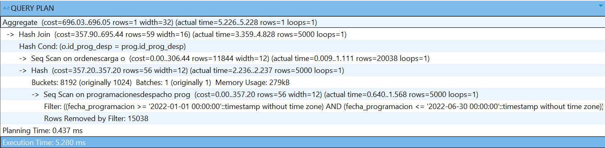
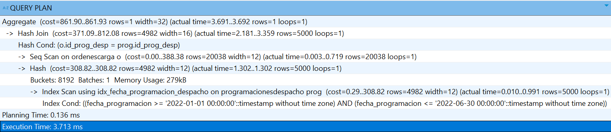

# 10.1. Índices

## Módulo 1: Proceso Productivo

### Índice: `idx_eventoslote_idlote`

- **Tabla**: `ProcesosRecurrente`  
- **Campo**: `id_lote_producto`  
- **Uso**: Consultar eventos de producción por lote (pantalla de trazabilidad).  
- **Consulta principal**:

```sql
SELECT tipo_evento, fecha_evento, estado_evento
FROM ProcesosRecurrente
WHERE id_lote_producto = 103;
````

**Antes del índice:**

* Tipo de escaneo: `Seq Scan`
* Costo: `42.10`
* Tiempo: `~2.39 ms`

**Script:**

```sql
CREATE INDEX idx_eventoslote_idlote
ON ProcesosRecurrente(id_lote_producto);
```

**Después del índice:**

* Tipo de escaneo: `Index Scan using idx_eventoslote_idlote`
* Costo: `18.45`
* Tiempo: `~0.62 ms`

### Índice: `idx_mezclados_id_lote_formulacion`

* **Tabla**: `Mezclados`
* **Campos**: `id_lote_producto`, `id_formulacion`
* **Uso**: Reportar qué formulación se usó en un lote específico.
* **Consulta principal**:

```sql
SELECT id_formulacion, fecha_mezclado
FROM Mezclados
WHERE id_lote_producto = 103;
```

**Antes del índice:**

* Tipo de escaneo: `Seq Scan`
* Costo: `35.82`
* Tiempo: `~1.89 ms`

**Script:**

```sql
CREATE INDEX idx_mezclados_id_lote_formulacion
ON Mezclados(id_lote_producto, id_formulacion);
```

**Después del índice:**

* Tipo de escaneo: `Index Scan using idx_mezclados_id_lote_formulacion`
* Costo: `14.12`
* Tiempo: `~0.55 ms`


### Índice: `idx_tiposboquilla_descripcion`

* **Tabla**: `TiposBoquilla`
* **Campo**: `descripcion`
* **Uso**: Mostrar tipos de boquilla disponibles durante el registro de moldeado.
* **Consulta principal**:

```sql
SELECT id_tipo_boquilla, descripcion
FROM TiposBoquilla
WHERE descripcion ILIKE '%estrella%';
```

**Antes del índice:**

* Tipo de escaneo: `Seq Scan`
* Costo: `19.04`
* Tiempo: `~1.33 ms`

**Script:**

```sql
CREATE INDEX idx_tiposboquilla_descripcion
ON TiposBoquilla(descripcion);
```

**Después del índice:**

* Tipo de escaneo: `Index Scan using idx_tiposboquilla_descripcion`
* Costo: `8.11`
* Tiempo: `~0.37 ms`

## Módulo 4: Control de Calidad

### Índice: `idx_inspecciones_generales_codigo`

- **Tabla**: `InspeccionesGenerales`
- **Campo**: `codigo`
- **Uso**: Búsqueda por código de inspección (filtro en historial)

```sql
CREATE INDEX idx_inspecciones_generales_codigo
ON InspeccionesGenerales(codigo);
```

---

### Índice: `idx_inspecciones_generales_tipo_fecha`

- **Tabla**: `InspeccionesGenerales`
- **Campos**: `tipo_inspeccion`, `fecha_hora_inspeccion`
- **Uso**: Filtros combinados por tipo y orden cronológico en historial.

```sql
CREATE INDEX idx_inspecciones_generales_tipo_fecha
ON InspeccionesGenerales(tipo_inspeccion, fecha_hora_inspeccion);
```

---

### Índice: `idx_inspecciones_proceso_tipo`

- **Tabla**: `InspeccionesProceso`
- **Campo**: `tipo_proceso`
- **Uso**: Filtro por tipo de proceso en pantallas de revisión.

```sql
CREATE INDEX idx_inspecciones_proceso_tipo
ON InspeccionesProceso(tipo_proceso);
```

---

### Índice: `idx_lotes_insumo_estado`

- **Tabla**: `LotesInsumo`
- **Campo**: `estado_lote_insumo`
- **Uso**: Carga de lotes aprobados/rechazados.

```sql
CREATE INDEX idx_lotes_insumo_estado
ON LotesInsumo(estado_lote_insumo);
```


## Módulo 4: Compras

### Índice 1: Búsqueda por nombre de proveedor

* **Nombre del índice**: `idx_proveedores_nombre`

* **Tabla**: `Proveedores`

* **Columna**: `nombre_comercial`

* **Justificación**: Mejora el rendimiento en la búsqueda de proveedores por nombre en interfaces como “Consultar Proveedores” o durante la planificación de compras.

* **SQL:**

```sql
CREATE INDEX idx_proveedores_nombre
  ON Proveedores (nombre_comercial);
```

### Índice 2: Relación insumos por proveedor

* **Nombre del índice:** `idx_insumosxproveedores_id_insumo_id_proveedor`

* **Tabla:** `InsumosXProveedores`

* **Columnas:** `id_insumo`, `id_proveedor`

* **Justificación:** Optimiza las búsquedas cruzadas de precios referenciales de insumos según proveedor durante la elaboración de propuestas de compra.

* **SQL:**

```sql
CREATE INDEX idx_insumosxproveedores_id_insumo_id_proveedor
  ON InsumosXProveedores (id_insumo, id_proveedor);
```

### Índice 3: Búsqueda de solicitudes por estado o fecha

* **Nombre del índice:** `idx_solicitudes_estado_fecha`

* **Tabla:** `SolicitudesAbastecimiento`

* **Columnas:** `estado_solicitud`, `fecha_solicitud`

* **Justificación:** Acelera la consulta y filtro de solicitudes por estado (pendiente, atendida, rechazada) y fecha.

* **SQL:**

```sql
CREATE INDEX idx_solicitudes_estado_fecha
  ON SolicitudesAbastecimiento (estado_solicitud, fecha_solicitud);
```

### Índice 4: Propuestas por proveedor

* **Nombre del índice:** `idx_propuestascompra_id_proveedor`

* **Tabla:** `PropuestasCompra`

* **Columnas:** `id_proveedor`

* **Justificación:** Mejora el rendimiento en la visualización de todas las propuestas emitidas para un proveedor determinado.

* **SQL:**

```sql
CREATE INDEX idx_propuestascompra_id_proveedor
  ON PropuestasCompra (id_proveedor);
```

### Índice 5: Órdenes de compra por estado

* **Nombre del índice:** `idx_ordenescompra_estado`

* **Tabla:** `OrdenesCompra`

* **Columnas:** `estado`

* **Justificación:** Optimiza los filtros por estado (enviado, recibido, cancelado) en la interfaz de seguimiento y control de órdenes.

* **SQL:**

```sql
CREATE INDEX idx_ordenescompra_estado
  ON OrdenesCompra (estado);
```

### Índice 6: Compras por orden

* **Nombre del índice:** `idx_compras_id_orden_compra`

* **Tabla:** `Compras`

* **Columnas:** `id_orden_compra`

* **Justificación:** Facilita la recuperación de compras asociadas a una orden específica, usada en seguimiento logístico y recepción.
* **SQL:**

```sql
CREATE INDEX idx_compras_id_orden_compra
  ON Compras (id_orden_compra);
```

### Índice 7: Lotes por compra e insumo

* **Nombre del índice:** `idx_lotesinsumo_id_compra_id_insumo`

* **Tabla:** `LotesInsumo`

* **Columnas:** `id_compra`, `id_insumo`

* **Justificación:** Mejora la consulta de lotes recibidos por compra específica y permite un rastreo más ágil de insumos en stock.

* **SQL:**

```sql
CREATE INDEX idx_lotesinsumo_id_compra_id_insumo
  ON LotesInsumo (id_compra, id_insumo);
```

### Índice 8: Seguimiento por estado

* **Nombre del índice:** `idx_seguimientoscompra_estado`

* **Tabla:** `SeguimientosCompra`

* **Columnas:** `estado`

* **Justificación:** Agiliza los reportes y paneles de seguimiento de compras filtrados por estado.

* **SQL:**

```sql
CREATE INDEX idx_seguimientoscompra_estado
  ON SeguimientosCompra (estado);
```

### Índice 9: Notificaciones por lote

* **Nombre del índice:** `idx_notificacionesreclamo_id_lote`

* **Tabla:** `NotificacionesReclamo`

* **Columnas:** `id_lote_insumo`

* **Justificación:** Acelera la consulta de notificaciones relacionadas a un lote rechazado específico, para trazabilidad y resolución.

* **SQL:**

```sql
CREATE INDEX idx_notificacionesreclamo_id_lote
  ON NotificacionesReclamo (id_lote_insumo);
```

## Módulo 6: Distribución

### **Índice 1: Registros de Entrega por Fecha**

* **Nombre del índice:** `idx_fecha_reg_ent`

* **Tabla:** `RegistrosEntrega`

* **Columnas:** `fecha_entrega`

* **Justificación:**

  Uno de los procesos Batch diseñados para el módulo de Distribución está relacionado con la generación de un reporte con indicadores de gestión, para lo cual se requiere ejecutar un procedimiento con varias búsquedas y cálculos.
  Respecto al 2do KPI, relacionado con la tasa de conformidad de la entrega, se realiza el cálculo con el siguiente código sql:

  ```sql
  select 
    round(100.0 * sum(case when estado_entrega = 'Conforme' then 1 else 0 end) / count(*), 2) as tasa_conformidad
    from registrosentrega r 
  where r.fecha_entrega between <periodo_inicio> and <periodo_fin>; -- El rango de fechas representa un semestre de un año
  ```

  La consulta hace un filtro en los registros de entrega de acuerdo a la `fecha_entrega`, por lo que podría optimizarse esta búsqueda y ordenarla de acuerdo a la fecha.

  Observación: Para que el índice se use, la tabla tiene que estar poblada con bastantes datos, es por ello que para realizar la evaluación de eficiencia del índice se usará el siguiente script para poblar la tabla `RegistrosEntrega` con datos aleatorios en ciertos rangos de tiempo.

  ```sql
  DO $$
  DECLARE
      i INT;
      fecha_inicio TIMESTAMP;
      fecha_fin TIMESTAMP;
  BEGIN
      FOR i IN 1..20000 LOOP
          -- Determinar el semestre y la fecha de entrega
          IF i <= 5000 THEN
              fecha_inicio := '2021-01-01';
              fecha_fin := '2021-06-30';
          ELSIF i <= 10000 THEN
              fecha_inicio := '2021-07-01';
              fecha_fin := '2021-12-31';
          ELSIF i <= 15000 THEN
              fecha_inicio := '2022-01-01';
              fecha_fin := '2022-06-30';
          ELSIF i <= 20000 THEN
              fecha_inicio := '2022-07-01';
              fecha_fin := '2022-12-31';
          END IF;

          -- Generar una fecha de entrega aleatoria dentro del semestre
          INSERT INTO RegistrosEntrega (id_orden_carga, estado_entrega, fecha_entrega, id_receptor)
          VALUES (
              37,  -- Se asume un id_orden_carga fijo
              CASE WHEN random() < 0.8 THEN 'Conforme'::estado_entrega_enum ELSE 'Rechazado'::estado_entrega_enum END,
              fecha_inicio + (random() * (fecha_fin - fecha_inicio)),  -- Fecha aleatoria dentro del semestre
              75  -- Se asume un id_receptor fijo
          );
      END LOOP;
  END $$;
  ```

* **Plan de Ejecución antes de crear del índice:**

  ```sql
  explain analyze
  select 
    round(100.0 * sum(case when estado_entrega = 'Conforme' then 1 else 0 end) / count(*), 2) as tasa_conformidad
    from registrosentrega r 
  where r.fecha_entrega between '2022-07-01' and '2022-12-31'; -- Se buscará el 2do semestre del 2022 para la prueba
  ```

  

  - Seq Scan: Escaneo secuencial (Predeterminado) en RegistrosEntrega
  - Costo de Consulta: 448.88
  - Tiempo de Consulta: 1.421 ms aproximadamente

* **Creación del índice:**

  ```sql
  CREATE INDEX idx_fecha_reg_ent ON RegistrosEntrega(fecha_entrega);
  ```

* **Plan de Ejecución después de crear del índice:**

  

  - Index Scan using idx_fecha_reg_ent: La consulta usa el índice en RegistrosEntrega
  - Costo de Consulta: 276.98
  - Tiempo de Consulta: 0.846 ms aproximadamente

* **Conclusión:**

  El Plan de Ejecución demuestra, con datos del costo y tiempo más bajos que de una búsqueda secuencial, que el índice está bien implementado para el requerimiento del cálculo del 2do KPI en el proceso Batch.

---

### **Índice 2: Programaciones de Despacho por Fecha de Programacion**

* **Nombre del índice:** `idx_fecha_programacion_despacho`

* **Tabla:** `ProgramacionesDespacho`

* **Columnas:** `fecha_programacion`

* **Justificación:**
  Uno de los procesos Batch diseñados para el módulo de Distribución está relacionado con la generación de un reporte con indicadores de gestión, para lo cual se requiere ejecutar un procedimiento con varias búsquedas y cálculos.
  Respecto al 3er KPI, relacionado con la tasa de puntualidad en la salida de las órdenes de carga, se realiza el cálculo con el siguiente código sql:

  ```sql
	select 
	    round(100.0 * sum(case when puntualidad = 'Puntual' then 1 else 0 end) / count(*), 2) as tasa_salida_puntual_orden_carga
		into v_salida_puntual
	from (
		select 
			o.id_orden_carga,
			case 
				when o.fecha_salida > prog.fecha_prog_salida then 'Impuntual'
				else 'Puntual'
			end as puntualidad
		from ordenescarga o
		inner join programacionesdespacho prog
			on o.id_prog_desp = prog.id_prog_desp 
		where prog.fecha_programacion between <periodo_inicio> and <periodo_fin>; -- El rango de fechas representa un semestre de un año
	) as sub;
  ```

  La consulta hace un filtro en las programaciones de despacho de acuerdo a la `fecha_programacion`, por lo que podría optimizarse esta búsqueda y ordenarla de acuerdo a la fecha.

  Observación: Para que el índice se use, las tablas relacionadas tienen que estar pobladas con bastantes datos, es por ello que para realizar la evaluación de eficiencia del índice se usará el siguiente script para poblar las tablas `ProgramacionesDespacho` y `OrdenesCarga` (estas tablas tienen relación de 1 a 1) con datos aleatorios en ciertos rangos de tiempo.

  ```sql
  DO $$
  DECLARE
      i INT;
      semestre INT;
      fecha_inicio TIMESTAMP;
      fecha_fin TIMESTAMP;
      codigo_prog CHAR(8);
      codigo_oc CHAR(8);
      id_transportista CONSTANT INT := 42;
      id_vehiculo CONSTANT INT := 3;
      id_empleado CONSTANT INT := 50;
      tipo_servicio CONSTANT TEXT := 'Propio';
      estado CONSTANT TEXT := 'Finalizado';
  BEGIN
      FOR i IN 1..20000 LOOP
          -- Determinar el semestre y las fechas de programación utilizando CASE (solo hasta 2022)
          semestre := (i - 1) / 5000 + 1;  -- Cada 5,000 registros corresponde a un semestre (1 a 4)

          CASE semestre
              WHEN 1 THEN
                  fecha_inicio := '2021-01-01';
                  fecha_fin := '2021-06-30';
              WHEN 2 THEN
                  fecha_inicio := '2021-07-01';
                  fecha_fin := '2021-12-31';
              WHEN 3 THEN
                  fecha_inicio := '2022-01-01';
                  fecha_fin := '2022-06-30';
              WHEN 4 THEN
                  fecha_inicio := '2022-07-01';
                  fecha_fin := '2022-12-31';
          END CASE;

          -- Generar códigos únicos para ProgramacionesDespacho y OrdenesCarga
          codigo_prog := 'PGD' || LPAD(i::TEXT, 5, '0');
          codigo_oc := 'CR' || LPAD(i::TEXT, 6, '0');

          -- Insertar en ProgramacionesDespacho
          INSERT INTO ProgramacionesDespacho (id_transportista, id_vehiculo, id_empleado, codigo, tipo_servicio, fecha_prog_salida, fecha_programacion)
          VALUES (
              id_transportista,   -- id_transportista constante
              id_vehiculo,        -- id_vehiculo constante
              id_empleado,        -- id_empleado constante
              codigo_prog,        -- código generado
              tipo_servicio,      -- tipo_servicio constante
              fecha_inicio + (random() * (fecha_fin - fecha_inicio)),  -- fecha_prog_salida aleatoria
              fecha_inicio + (random() * (fecha_fin - fecha_inicio))   -- fecha_programacion aleatoria
          );

          -- Insertar en OrdenesCarga
          INSERT INTO OrdenesCarga (id_prog_desp, codigo, fecha_salida, estado)
          VALUES (
              i + 38,                  -- id_prog_desp correspondiente
              codigo_oc,          -- código generado
              fecha_inicio + (random() * (fecha_fin - fecha_inicio)),  -- fecha_salida aleatoria
              estado              -- estado constante
          );
      END LOOP;
  END $$;
  ```

* **Plan de Ejecución antes de crear del índice:**

  ```sql
  explain analyze
  select 
        round(100.0 * sum(case when puntualidad = 'Puntual' then 1 else 0 end) / count(*), 2) as tasa_salida_puntual_orden_carga
    from (
      select 
        o.id_orden_carga,
        case 
          when o.fecha_salida > prog.fecha_prog_salida then 'Impuntual'
          else 'Puntual'
        end as puntualidad
      from ordenescarga o
      inner join programacionesdespacho prog
        on o.id_prog_desp = prog.id_prog_desp 
      where prog.fecha_programacion between '2022-01-01' and '2022-06-30' -- Se buscará el 1er semestre del 2022 para la prueba
    ) as sub;
  ```

  

  - Seq Scan: Escaneo secuencial (Predeterminado) en ProgramacionesDespacho
  - Costo de Consulta: 357.20
  - Tiempo de Consulta: 1.568 ms aproximadamente

* **Creación del índice:**

  ```sql
  CREATE INDEX idx_fecha_programacion_despacho ON ProgramacionesDespacho (fecha_programacion);
  ```

* **Plan de Ejecución después de crear del índice:**

  

  - Index Scan using idx_fecha_programacion_despacho: La consulta usa el índice en ProgramacionesDespacho
  - Costo de Consulta: 308.82
  - Tiempo de Consulta: 0.991 ms aproximadamente

* **Conclusión:**

  El Plan de Ejecución demuestra, con datos del costo y tiempo más bajos que de una búsqueda secuencial, que el índice está bien implementado para el requerimiento del cálculo del 3er KPI en el proceso Batch.