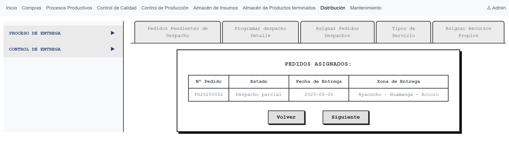
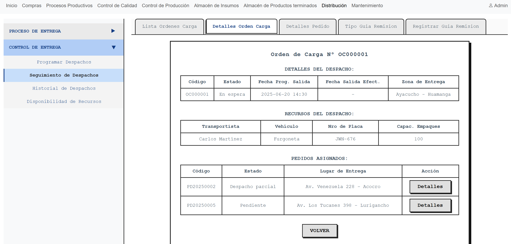

# 12.3. Flujo de Pantallas por Módulo

## Módulo 01: Proceso Productivo

### Visualizar Eventos por Lote

Botón Registrar Evento:

### Registrar datos Dosificado

### Registrar datos Mezclado

### Registrar datos Moldeado

### Registrar datos Secado

### Registrar datos Envasado

### Solicitar Cierre de Lote

Botón Solicitar Cierre de Lote

## Módulo 02: Almacén de Insumos

### Proceso de Recepcion de insumos
1. El usuario visualiza las compras que no han sido recepcionadas.

2. El sistema actualiza los estados mediante un proceso batch

3. El usuario mediante el boton Recepcionar elige que compra recepcionar y rellena los datos

4. El usuario al confirmar la recepcion, el sistema lo redirige a la panatlla de carga de copmras pendientes por recepcionar

### Proceso de Abastecimientos de Ordenes Produccion
1. El usuario visualiza las ordenes de produccion sin atender

2. Con el boton atender atendemos a orden de produccion y nos redirige a siguinete pantalla

3. El usuario mediante el boton + asigna insumos a la tabla inferior

4. El usuario confirma el abastecimiento de insumos y te redirige a los abastecimientos pendientes

### Proceso de Solicitud de Abastecimientos de Insumos
1. El usuario visualiza la pantalla de solicitud insumos

2. El usuario busca que insumo requiere y rellena la cantidad requerida

3. El sistema con el boton de agregar a la tabla inferior

4. El usuario confirma la solicitud de Insumos y nos redirige a el inventario de insumo

### Alertas de Vencimiento y stock minimo
1. El usuario visualiza una tabla de insumos por vencer y otra tabla de insumos con muy poco stock

### Historial de Insumos
1. El usuario visualiza la entrada de Insumos respecto a la compra 

2. El usuario visualiza la salida de Insumos respecto al lote producido y orden de produccion

## Módulo 03: 

## Módulo 04: Compras

### Proceso de Atender Abastecimiento hasta Generar Compra

## Módulo 05: 

## Módulo 06: Distribución

### Proceso de Programación de Despachos
1. El usuario visualiza una lista pedidos pendientes de programarse su despacho

2. El usuario ingresa datos iniciales de la programación del despacho

3. El usuario escoge pedidos para asignarlos a la orden de carga

4. El usuario visualiza un resumen de los pedidos que ha escogido antes de continuar

5. El usuario define el tipo de transporte

6. El usuario visualiza, luego de elegir el tipo de servicio "Propio", una lista de transportistas y vehículos disponibles. Debe seleccionarlos y registrarlos para finalizar la programación del despacho

7. Una ventana emergente indica el registro exitoso y opción de volver a la pantalla inicial

### Proceso de Seguimiento de Despachos
1. El usuario visualiza una lista de órdenes de carga pendientes o en tránsito

2. El usuario visualiza los detalles de la orden de carga y la lista de pedidos asignados

3. El usuario visualiza los detalles del pedido

4. El usuario selecciona el tipo de guía de remisión que va a registrar

5. El usuario registra el número de guía de remisión y demás detalles de entrega

### Proceso de Entregas Pendientes (Transportista)
1. El usuario busca órdenes de carga pendientes de acuerdo al filtro del número de licencia del transportista asignado

2. El usuario registra la salida efectiva de la orden de carga

3. El usuario visualiza los detalles de la orden de carga

4. El usuario visualiza los detalles de un pedido y puede ingresar información de las incidencias o rechazos de los productos

## Módulo 07: Almacén de Productos Terminados