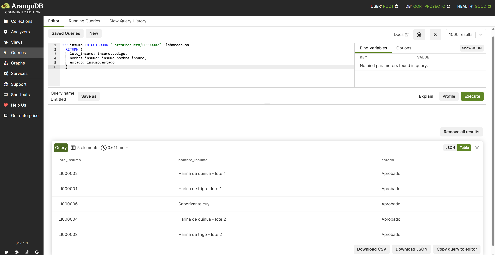
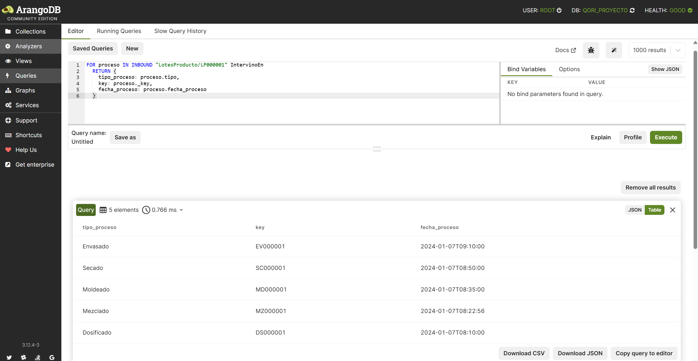
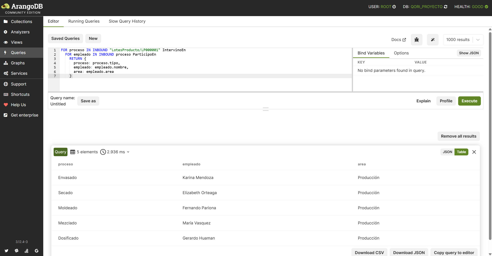
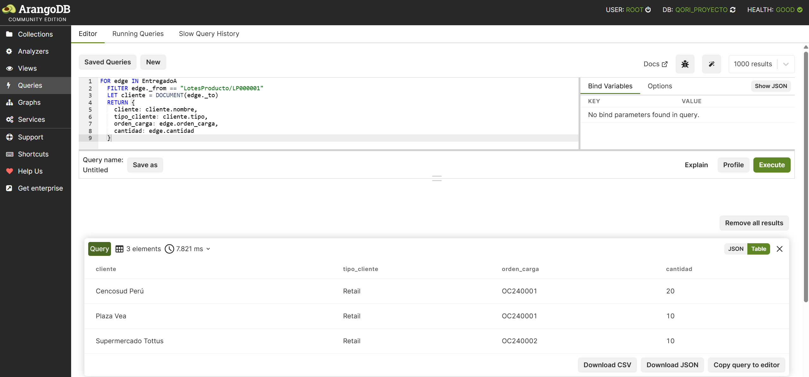
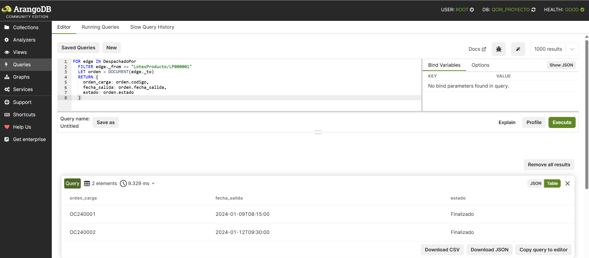
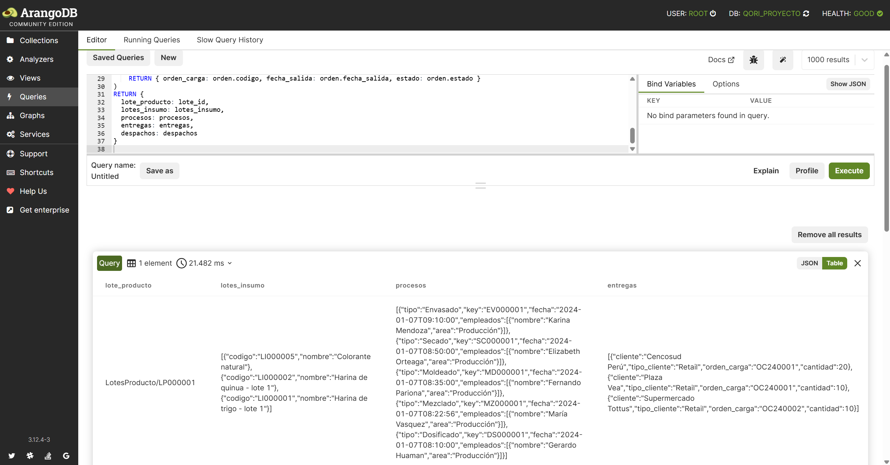
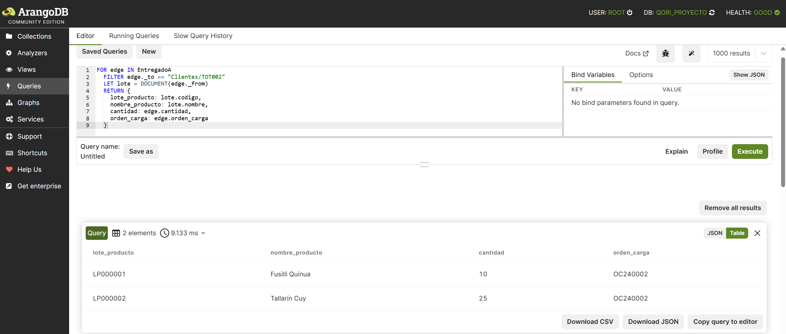
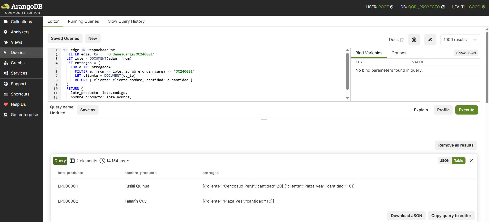
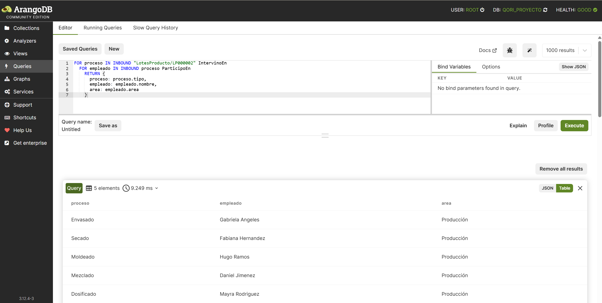

# Consultas de Trazabilidad

1. ¿Qué lotes de insumo se usaron para fabricar un lote de producto específico?
Ejemplo: Lote de producto 'LP000002'
```sql
FOR insumo IN OUTBOUND "LotesProducto/LP000002" ElaboradoCon
  RETURN {
    lote_insumo: insumo.codigo,
    nombre_insumo: insumo.nombre_insumo,
    estado: insumo.estado
  }
```
 

---

2. ¿Qué procesos intervinieron en la producción de un lote de producto?
Ejemplo: Lote de producto 'LP000001'
```sql
FOR proceso IN INBOUND "LotesProducto/LP000001" IntervinoEn
  RETURN {
    tipo_proceso: proceso.tipo,
    key: proceso._key,
    fecha_proceso: proceso.fecha_proceso
  }
```
 

---

3. ¿Qué empleados participaron en los procesos de producción de un lote de producto?
Ejemplo: Lote de producto 'LP000001'
```sql
FOR proceso IN INBOUND "LotesProducto/LP000001" IntervinoEn
  FOR empleado IN INBOUND proceso ParticipoEn
    RETURN {
      proceso: proceso.tipo,
      empleado: empleado.nombre,
      area: empleado.area
    }
```
 

---

4. ¿A qué clientes fue entregado un lote de producto, por medio de qué orden de carga y qué cantidad?
Ejemplo: Lote de producto 'LP000001'
```sql
FOR edge IN EntregadoA
  FILTER edge._from == "LotesProducto/LP000001"
  LET cliente = DOCUMENT(edge._to)
  RETURN {
    cliente: cliente.nombre,
    tipo_cliente: cliente.tipo,
    orden_carga: edge.orden_carga,
    cantidad: edge.cantidad
  }
```
 

---

5. ¿Por qué órdenes de carga fue despachado un lote de producto?
Ejemplo: Lote de producto 'LP000001'
```sql
FOR edge IN DespachadoPor
  FILTER edge._from == "LotesProducto/LP000001"
  LET orden = DOCUMENT(edge._to)
  RETURN {
    orden_carga: orden.codigo,
    fecha_salida: orden.fecha_salida,
    estado: orden.estado
  }
```  
 

---

6. Consulta completa de trazabilidad de un lote de producto:
Lotes de insumo usados, procesos y empleados involucrados, clientes y órdenes de carga.
```sql
LET lote_id = "LotesProducto/LP000001"
LET lotes_insumo = (
  FOR v IN OUTBOUND lote_id ElaboradoCon
    RETURN { codigo: v.codigo, nombre: v.nombre_insumo }
)
LET procesos = (
  FOR p IN INBOUND lote_id IntervinoEn
    LET empleados = (
      FOR e IN INBOUND p ParticipoEn
        RETURN { nombre: e.nombre, area: e.area }
    )
    RETURN {
      tipo: p.tipo,
      key: p._key,
      fecha: p.fecha_proceso,
      empleados: empleados
    }
)
LET entregas = (
  FOR edge IN EntregadoA
    FILTER edge._from == lote_id
    LET cliente = DOCUMENT(edge._to)
    RETURN { cliente: cliente.nombre, tipo_cliente: cliente.tipo, orden_carga: edge.orden_carga, cantidad: edge.cantidad }
)
LET despachos = (
  FOR edge IN DespachadoPor
    FILTER edge._from == lote_id
    LET orden = DOCUMENT(edge._to)
    RETURN { orden_carga: orden.codigo, fecha_salida: orden.fecha_salida, estado: orden.estado }
)
RETURN {
  lote_producto: lote_id,
  lotes_insumo: lotes_insumo,
  procesos: procesos,
  entregas: entregas,
  despachos: despachos
}
```
 

---

7. Consultar todos los lotes de producto que recibió un cliente específico, por lote, orden de carga y cantidad
Ejemplo: Cliente 'TOT002'
```sql
FOR edge IN EntregadoA
  FILTER edge._to == "Clientes/TOT002"
  LET lote = DOCUMENT(edge._from)
  RETURN {
    lote_producto: lote.codigo,
    nombre_producto: lote.nombre,
    cantidad: edge.cantidad,
    orden_carga: edge.orden_carga
  }
```
 

---

8. ¿Qué productos transportó una orden de carga? (lotes, clientes y cantidad)
Ejemplo: Orden de carga 'OC240001'
```sql
FOR edge IN DespachadoPor
  FILTER edge._to == "OrdenesCarga/OC240001"
  LET lote = DOCUMENT(edge._from)
  LET entregas = (
    FOR e IN EntregadoA
      FILTER e._from == lote._id && e.orden_carga == "OC240001"
      LET cliente = DOCUMENT(e._to)
      RETURN { cliente: cliente.nombre, cantidad: e.cantidad }
  )
  RETURN {
    lote_producto: lote.codigo,
    nombre_producto: lote.nombre,
    entregas: entregas
  }
```
 

---

9. ¿Qué empleados participaron en la producción de un producto dado?
Ejemplo: Lote de producto 'LP000002'
```sql
FOR proceso IN INBOUND "LotesProducto/LP000002" IntervinoEn
  FOR empleado IN INBOUND proceso ParticipoEn
    RETURN {
      proceso: proceso.tipo,
      empleado: empleado.nombre,
      area: empleado.area
    }
```
 