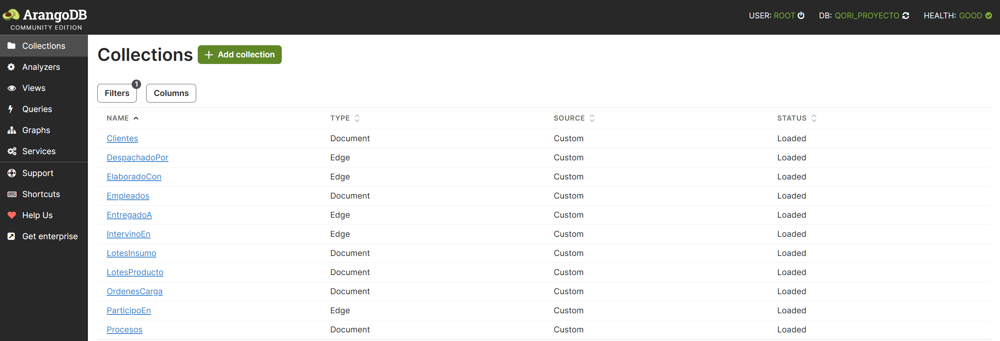

# Creación de las colecciones

## Nodos (Document)

```sql
// Crear colecciones de nodos (document collections)
CREATE COLLECTION LotesProducto;
CREATE COLLECTION LotesInsumo;
CREATE COLLECTION Procesos;
CREATE COLLECTION Empleados;
CREATE COLLECTION Clientes;
CREATE COLLECTION OrdenesCarga;
```
## Relaciones (Edge)

```sql
// Crear colecciones de relaciones (edges)
CREATE EDGE COLLECTION ElaboradoCon;      // Lote de producto <-> Lote de insumo
CREATE EDGE COLLECTION IntervinoEn;       // Proceso <-> Lote de producto
CREATE EDGE COLLECTION ParticipadoPor;    // Proceso <-> Empleado
CREATE EDGE COLLECTION EntregadoA;        // Lote de producto <-> Cliente
CREATE EDGE COLLECTION DespachadoPor;     // Entrega <-> Orden de carga
```

## Resultado Final

Las colecciones también pueden crearse manualmente en el Web UI de ArangoDB.

 