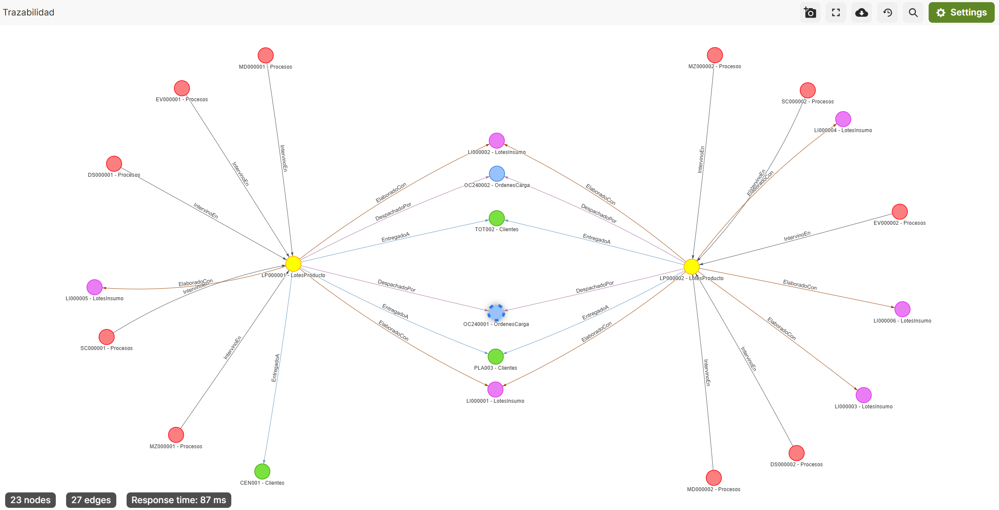

# Inserción de datos

## Inserción de nodos (documentos)

```sql
// Lotes de Producto
FOR lote IN [
  { _key: "LP000001", codigo: "LP000001", nombre: "Fusilli Quinua", cantidad_producida: 40, fecha_creacion: "2024-01-07T08:00:00", estado: "Completado" },
  { _key: "LP000002", codigo: "LP000002", nombre: "Tallarín Cuy", cantidad_producida: 55, fecha_creacion: "2024-01-08T08:00:00", estado: "Completado" }
]
  INSERT lote INTO LotesProducto

// Lotes de Insumo
FOR insumo IN [
  { _key: "LI000001", codigo: "LI000001", nombre_insumo: "Harina de trigo - lote 1", estado: "Aprobado" },
  { _key: "LI000002", codigo: "LI000002", nombre_insumo: "Harina de quinua - lote 1", estado: "Aprobado" },
  { _key: "LI000003", codigo: "LI000003", nombre_insumo: "Harina de trigo - lote 2", estado: "Aprobado" },
  { _key: "LI000004", codigo: "LI000004", nombre_insumo: "Harina de quinua - lote 2", estado: "Aprobado" },
  { _key: "LI000005", codigo: "LI000005", nombre_insumo: "Colorante natural", estado: "Aprobado" },
  { _key: "LI000006", codigo: "LI000006", nombre_insumo: "Saborizante cuy", estado: "Aprobado" }
]
  INSERT insumo INTO LotesInsumo

// Procesos
FOR proceso IN [
  { _key: "DS000001", tipo: "Dosificado", numero_batch: 1, fecha_proceso: "2024-01-07T08:10:00" },
  { _key: "MZ000001", tipo: "Mezclado", porcentaje_humedad: 0.32, cantidad_agua: 3189, fecha_proceso: "2024-01-07T08:22:56" },
  { _key: "MD000001", tipo: "Moldeado", presion: 103, fecha_proceso: "2024-01-07T08:35:00" },
  { _key: "SC000001", tipo: "Secado", temperatura_inicial: 26, temperatura_final: 48, fecha_proceso: "2024-01-07T08:50:00" },
  { _key: "EV000001", tipo: "Envasado", tipo_envase: "Caja de cartón", fecha_proceso: "2024-01-07T09:10:00" },
  // Procesos para el segundo lote de producto
  { _key: "DS000002", tipo: "Dosificado", numero_batch: 2, fecha_proceso: "2024-01-08T08:10:00" },
  { _key: "MZ000002", tipo: "Mezclado", porcentaje_humedad: 0.31, cantidad_agua: 3000, fecha_proceso: "2024-01-08T08:22:00" },
  { _key: "MD000002", tipo: "Moldeado", presion: 100, fecha_proceso: "2024-01-08T08:35:00" },
  { _key: "SC000002", tipo: "Secado", temperatura_inicial: 25, temperatura_final: 49, fecha_proceso: "2024-01-08T08:50:00" },
  { _key: "EV000002", tipo: "Envasado", tipo_envase: "Bolsa plástica", fecha_proceso: "2024-01-08T09:10:00" }
]
  INSERT proceso INTO Procesos

// Empleados (uno por proceso)
FOR empleado IN [
  { _key: "E0003", nombre: "Gerardo Huaman", area: "Producción" },
  { _key: "E0004", nombre: "María Vasquez", area: "Producción" },
  { _key: "E0005", nombre: "Fernando Pariona", area: "Producción" },
  { _key: "E0006", nombre: "Elizabeth Orteaga", area: "Producción" },
  { _key: "E0007", nombre: "Karina Mendoza", area: "Producción" },
  // Para el segundo lote
  { _key: "E0008", nombre: "Mayra Rodriguez", area: "Producción" },
  { _key: "E0009", nombre: "Daniel Jimenez", area: "Producción" },
  { _key: "E0010", nombre: "Hugo Ramos", area: "Producción" },
  { _key: "E0011", nombre: "Fabiana Hernandez", area: "Producción" },
  { _key: "E0012", nombre: "Gabriela Angeles", area: "Producción" }
]
  INSERT empleado INTO Empleados

// Clientes
FOR cliente IN [
  { _key: "CEN001", nombre: "Retail Quinua Perú", tipo: "Retail" },
  { _key: "TOT002", nombre: "Supermercado PeruMall", tipo: "Retail" },
  { _key: "PLA003", nombre: "Retail Alfa", tipo: "Retail" }
]
  INSERT cliente INTO Clientes

// Ordenes de Carga
FOR orden IN [
  { _key: "OC240001", codigo: "OC240001", fecha_salida: "2024-01-09T08:15:00", estado: "Finalizado" },
  { _key: "OC240002", codigo: "OC240002", fecha_salida: "2024-01-12T09:30:00", estado: "Finalizado" }
]
  INSERT orden INTO OrdenesCarga
```

## Inserción de relaciones (edges)

```sql
// Lote de producto LP000001 fue elaborado con insumos LI000001, LI000002, LI000005
FOR edge IN [
  { _from: "LotesProducto/LP000001", _to: "LotesInsumo/LI000001" },
  { _from: "LotesProducto/LP000001", _to: "LotesInsumo/LI000002" },
  { _from: "LotesProducto/LP000001", _to: "LotesInsumo/LI000005" }
]
  INSERT edge INTO ElaboradoCon

// Lote de producto LP000002 elaborado con LI000003, LI000004, LI000006
FOR edge IN [
  { _from: "LotesProducto/LP000002", _to: "LotesInsumo/LI000003" },
  { _from: "LotesProducto/LP000002", _to: "LotesInsumo/LI000004" },
  { _from: "LotesProducto/LP000002", _to: "LotesInsumo/LI000006" }
]
  INSERT edge INTO ElaboradoCon

// Simula que LI000001 y LI000002 (trigo y quinua, lote 1) también se usan en el segundo producto
FOR edge IN [
  { _from: "LotesProducto/LP000002", _to: "LotesInsumo/LI000001" },
  { _from: "LotesProducto/LP000002", _to: "LotesInsumo/LI000002" }
]
  INSERT edge INTO ElaboradoCon

// Procesos que intervinieron en LP000001 y LP000002
FOR edge IN [
  { _from: "Procesos/DS000001", _to: "LotesProducto/LP000001" },
  { _from: "Procesos/MZ000001", _to: "LotesProducto/LP000001" },
  { _from: "Procesos/MD000001", _to: "LotesProducto/LP000001" },
  { _from: "Procesos/SC000001", _to: "LotesProducto/LP000001" },
  { _from: "Procesos/EV000001", _to: "LotesProducto/LP000001" },
  { _from: "Procesos/DS000002", _to: "LotesProducto/LP000002" },
  { _from: "Procesos/MZ000002", _to: "LotesProducto/LP000002" },
  { _from: "Procesos/MD000002", _to: "LotesProducto/LP000002" },
  { _from: "Procesos/SC000002", _to: "LotesProducto/LP000002" },
  { _from: "Procesos/EV000002", _to: "LotesProducto/LP000002" }
]
  INSERT edge INTO IntervinoEn

// Empleados que participaron en procesos (1 a 1)
FOR edge IN [
  { _from: "Empleados/E0003", _to: "Procesos/DS000001" },
  { _from: "Empleados/E0004", _to: "Procesos/MZ000001" },
  { _from: "Empleados/E0005", _to: "Procesos/MD000001" },
  { _from: "Empleados/E0006", _to: "Procesos/SC000001" },
  { _from: "Empleados/E0007", _to: "Procesos/EV000001" },
  { _from: "Empleados/E0008", _to: "Procesos/DS000002" },
  { _from: "Empleados/E0009", _to: "Procesos/MZ000002" },
  { _from: "Empleados/E0010", _to: "Procesos/MD000002" },
  { _from: "Empleados/E0011", _to: "Procesos/SC000002" },
  { _from: "Empleados/E0012", _to: "Procesos/EV000002" }
]
  INSERT edge INTO ParticipoEn

// Entregas: Una orden de carga puede atender varios pedidos y clientes, y transportar varios lotes de producto

// OC240001 entrega LP000001 a CEN001 y a PLA003
FOR edge IN [
  { _from: "LotesProducto/LP000001", _to: "Clientes/CEN001", orden_carga: "OC240001", cantidad: 20 },
  { _from: "LotesProducto/LP000001", _to: "Clientes/PLA003", orden_carga: "OC240001", cantidad: 10 },
  { _from: "LotesProducto/LP000002", _to: "Clientes/PLA003", orden_carga: "OC240001", cantidad: 10 }
]
  INSERT edge INTO EntregadoA

// OC240002 entrega LP000001 y LP000002 a TOT002
FOR edge IN [
  { _from: "LotesProducto/LP000001", _to: "Clientes/TOT002", orden_carga: "OC240002", cantidad: 10 },
  { _from: "LotesProducto/LP000002", _to: "Clientes/TOT002", orden_carga: "OC240002", cantidad: 25 }
]
  INSERT edge INTO EntregadoA

// Lote de producto despachado por orden de carga (varios lotes por orden)
FOR edge IN [
  { _from: "LotesProducto/LP000001", _to: "OrdenesCarga/OC240001" },
  { _from: "LotesProducto/LP000002", _to: "OrdenesCarga/OC240001" },
  { _from: "LotesProducto/LP000001", _to: "OrdenesCarga/OC240002" },
  { _from: "LotesProducto/LP000002", _to: "OrdenesCarga/OC240002" }
]
  INSERT edge INTO DespachadoPor
```

## Resultado Final

Se formará el siguiente grafo:

 