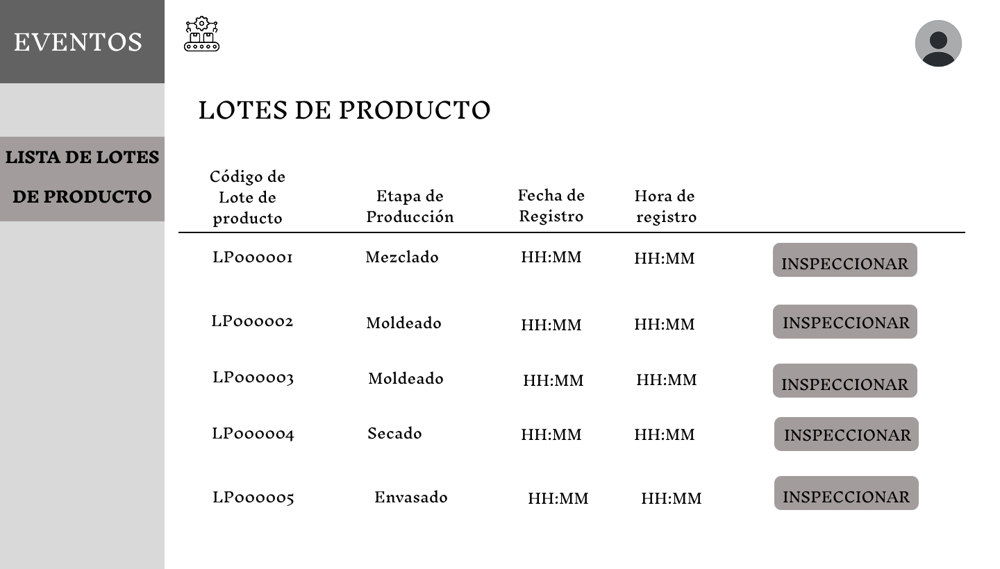

# **3.3. Módulo de Control de Calidad**

| Requerimiento | Nombre                                        |
|---------------|-----------------------------------------------|
| R-301         | Registrar Lote de Insumo Recibido en Calidad  |
| R-302         | Registrar Inspección de Lote de Insumo        |
| R-303         | Registrar Inspección de Procesos Productivos  |
| R-304         | Registrar Inspección de Envasado              |
| R-305         | Registrar Inspección de Lote en Picking       |
| R-306         | Historial de Inspecciones Generales           |

## **Caso de uso #1: Registrar Lote de Insumo Recibido en Calidad**

| **ID**               | R-301                                                                   |
|----------------------|-------------------------------------------------------------------------|
| **Actor(es)**        | Inspector de Calidad                                         |
| **Descripción**      | Permite registrar el ingreso de un lote de insumo al laboratorio para dar inicio al control de calidad       |
| **Precondiciones**   | 1. La compra debe estar registrada.   2. El lote debe haber llegado físicamente al laboratorio.        |
| **Flujo Principal**  | 1. El inspector accede a la pantalla “Lotes Pendientes de Registro en Calidad”.   2. Selecciona el lote de insumo recibido.    3. Ingresa la Fecha y Hora de ingreso al laboratorio.   4. Confirma el registro.
| **Requerimientos Especiales** | Los datos de compra deben estar sincronizados con el módulo de compras.    |
| **Frecuencia de Uso**| Por cada lote que llega a calidad, incluso reposiciones.                  |

### **Flujo Principal:**
1. El inspector accede a la pantalla “Lotes Pendientes de Registro en Calidad”.

2. Selecciona el lote de insumo recibido.
3. Ingresa la Fecha y Hora de ingreso al laboratorio.
4. Confirma el registro.

## **Caso de uso #2: Registrar Inspección de Lote de Insumo**

| **ID**               | R-302                                                                   |
|----------------------|-------------------------------------------------------------------------|
| **Actor(es)**        | Inspector de Calidad                                       |
| **Descripción**      | Permite inspeccionar un lote de insumo recibido y registrar el estado de calidad.          |
| **Precondiciones**   | 1. El lote debe estar registrado en calidad.   2. La inspección debe estar en estado "pendiente".   |
| **Flujo Principal**  | 1. Accede a la pantalla “Lista de compras” con estado "en proceso".    2. Selecciona una compra y ver los lotes de insumos.    3. Visualizar sus lotes asociados en estado “Pendiente”.    4. Selecciona un lote y accede a “Registrar Inspección”.   5. Completa el formulario y confirma.   | 6. Se muestra un modal de notificación según estado Aprobado/Rechazado.
| **Requerimientos Especiales** | El sistema debe actualizar el estado general de la compra según los resultados de los lotes. |
| **Frecuencia de Uso**| Cada vez que se inspecciona una compra nueva o una reposición.                     |

### **Flujo Principal:**
1. Accede a la pantalla “Lista de compras” con estado "en proceso".
2. El inspector accede a la pantalla “Lista de Compras”.

3. Selecciona una compra con estado "En Proceso".
4. Visualiza los lotes asociados y accede a la pantalla “Lotes de Insumo Pendientes”.

5. Selecciona un lote y accede a “Registrar Inspección”.

6. Completa el formulario y confirma.
7. Se muestra un modal de notificación según estado (Aprobado/Rechazado).

## **Caso de uso #3:  Registrar Inspección de Procesos Productivos (Mezclado, Moldeado y Secado)**

| **ID**               | R-303                                                                   |
|----------------------|-------------------------------------------------------------------------|
| **Actor(es)**        | Inspector de Calidad                                         |
| **Descripción**      | Permite registrar la inspección de cada proceso (mezclado, moldeado, secado) ejecutado en ejemplares de máquina.             |
| **Precondiciones**   | Debe existir un lote de producto en etapa productiva.     |
| **Flujo Principal**  | 1. Accede a la pantalla "Lista de Lotes de Producto".    2. Seleccionar un lote en etapa intermedia (mezclado, moldeado, secado).    3. Visualizar los procesos asociados a un lote de producto.   4. Accede a la pantalla “Procesos Pendientes de Inspección”.    5. Inspecciona uno por uno, accediendo a “Registrar Inspección”.   6. Al confirmar, se muestra un modal de notificación según tipo de fallo (Humano/Máquina) y estado. |
| **Requerimientos Especiales** | El sistema debe calcular el estado general de la etapa según el resultado de los procesos.   |
| **Frecuencia de Uso**| Por lote que pasa por cada etapa del proceso.         |

### **Flujo Principal:**
1. Accede a la pantalla "Lista de Lotes de Producto".
2. Seleccionar un lote en etapa intermedia (mezclado, moldeado, secado).

3. Visualizar los procesos asociados a un lote de producto.
4. Accede a la pantalla “Procesos Pendientes de Inspección”.

5. Inspecciona uno por uno, accediendo a “Registrar Inspección”. 

6. Al confirmar, se muestra un modal de notificación según tipo de fallo (Humano/Máquina) y estado. 

## **Caso de uso #4: Registrar Inspección de Envasado**

| **ID**               | R-304                                                                   |
|----------------------|-------------------------------------------------------------------------|
| **Actor(es)**        | Inspector de Calidad          |
| **Descripción**      |Permite registrar si un lote envasado presenta defectos visibles antes de su almacenamiento.             |
| **Precondiciones**   | El lote debe haber completado los procesos anteriores.    |
| **Flujo Principal**  | 1. El inspector accede a la pantalla “Lotes de Producto”.    2. Selecciona el lote con etapa Envasado.    3. Accede a “Registrar Inspección”.     4. Ingresa número de envases defectuosos, selecciona motivo.     5. Confirma inspección.    6. Se muestra modal: Aprobado si la cantidad es 0, Rechazado si >0. |
| **Requerimientos Especiales** | Validación automática del estado según cantidad.   |
| **Frecuencia de Uso**|Una vez por lote, en la etapa de envasado.   |

### **Flujo Principal:**
1. El inspector accede a la pantalla “Lotes de Producto”.
2. Selecciona el lote con etapa Envasado.

3. Accede a “Registrar Inspección”.
4. Ingresa número de envases defectuosos, selecciona motivo.
5. Confirma inspección.

6. Se muestra modal: Aprobado si la cantidad es 0, Rechazado si >0.

## **Caso de uso #5: Registrar Inspección de Lote en Picking**

| **ID**               | R-305                                                                   |
|----------------------|-------------------------------------------------------------------------|
| **Actor(es)**        | Inspector de Calidad                                     |
| **Descripción**      | Permite registrar defectos en empaques extraídos durante el proceso de picking.   |
| **Precondiciones**   | El picking debe estar en estado pendiente de inspección.    |
| **Flujo Principal**  | 1. El inspector accede a la pantalla “Picking Pendientes”.    2. Selecciona un picking y accede a los lotes asociados.    3. Inspecciona lote por lote, registrando cantidad observada y motivos.   4. Confirma inspección.    5. Se muestra modal: Aprobado si la cantidad es 0, Rechazado si >0.  |
| **Requerimientos Especiales** | Soporte multiselección de motivos + campo Otro.   |
| **Frecuencia de Uso**| Por cada lote de producto entregado vía picking.           |

### **Flujo Principal:**
1. El inspector accede a la pantalla “Picking Pendientes”.
2. Selecciona un picking.

3. Accede a la pantalla de lotes asociados a un picking.

4. Inspecciona lote por lote, registrando cantidad observada y motivos.
5. Confirma inspección.

6. Se muestra modal: Aprobado si la cantidad es 0, Rechazado si >0.

## **Caso de uso #6: Historial de Inspecciones Generales**

| **ID**               | R-306                                                                   |
|----------------------|-------------------------------------------------------------------------|
| **Actor(es)**        | Jefe de Calidad                                     |
| **Descripción**      | Permite visualizar y filtrar todas las inspecciones realizadas a lo largo del proceso (insumos, producción, envasado y picking) para fines de trazabilidad, auditoría y control         |
| **Precondiciones**   | El usuario debe estar autenticado en el sistema. Deben existir registros de inspecciones previas.     |
| **Flujo Principal**  | 1. El usuario accede a la pantalla "Historial de Inspecciones".    2. Puede buscar por código o aplicar filtros por tipo.    3. El sistema muestra la tabla consolidada.   4. Hacer clic en "Ver Detalle" para redirigir a la pantalla específica según el tipo: Insumo → "Lotes de Insumo Revisados" / Proceso → "Procesos Revisados" / Envasado → "Envasados Revisados" / Picking → "Lotes de productos por Picking Revisados"   5. En la pantalla especializada, el usuario ve una nueva tabla con atributos propios del tipo de inspección.    6. El usuario puede hacer clic en "Ver Detalle" dentro de esa tabla para abrir una ventana modal, donde visualiza información complementaria como el comentario del inspector y la evidencia adjunta.  |
| **Requerimientos Especiales** | Filtro por tipo de inspección y fecha.   |
| **Frecuencia de Uso**| Constante, para revisión y trazabilidad.  |

### **Flujo Principal:**
1. El usuario accede a la pantalla "Historial de Inspecciones".
2. Puede buscar por código o aplicar filtros por tipo.
3. El sistema muestra la tabla consolidada con las inspecciones registradas.

4. Hacer clic en "Ver Detalle" para redirigir a la pantalla específica según el tipo:
Insumo → "Lotes de Insumo Revisados"

Proceso → "Procesos Revisados"

Envasado → "Envasados Revisados"

Picking → "Lotes de productos por Picking Revisados"

5. En la pantalla especializada, el usuario ve una nueva tabla con atributos propios del tipo de inspección.
6. El usuario puede hacer clic en "Ver Detalle" dentro de esa tabla para abrir una ventana modal, donde visualiza información complementaria como el comentario del inspector y la evidencia adjunta.

