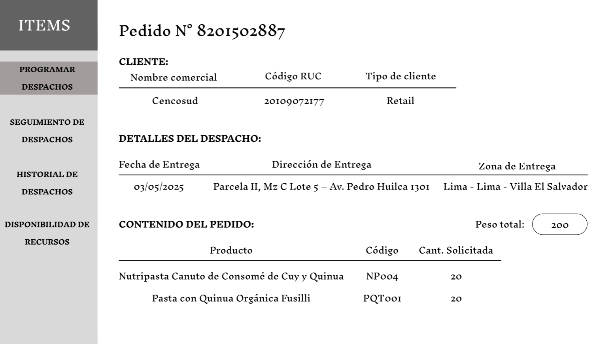
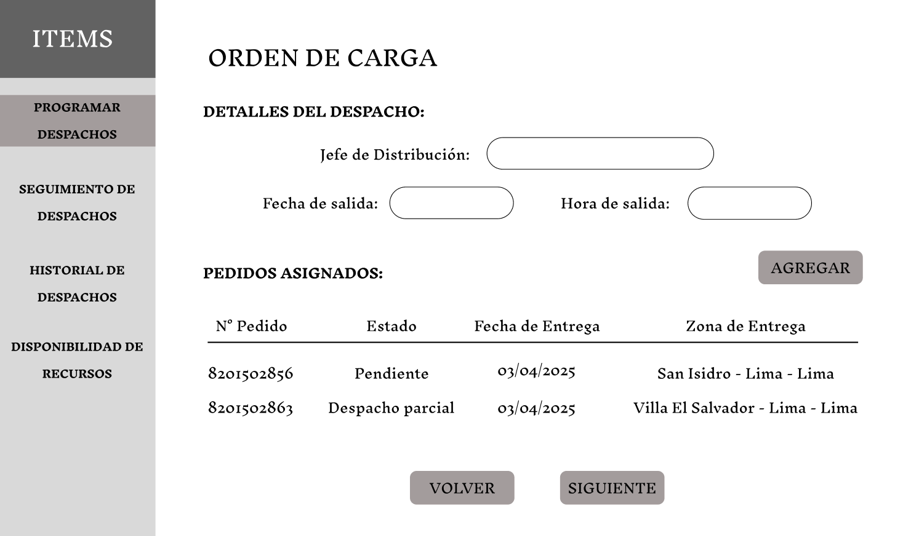

# 3.6. Módulo de Distribución

| Requerimiento | Nombre                                            |
|---------------|---------------------------------------------------|
| R-601         | Programar el Despacho Propio                      |
| R-602         | Gestionar la Disponibilidad de los Recursos       |
| R-603         | Programar el Despacho Tercerizado                 |
| R-604         | Asignar Pedidos a Ordenes de Carga Disponibles    |
| R-605         | Seguimiento de Ordenes de Carga                   |
| R-606         | Registrar Guias de Remision                       |
| R-607         | Historial de Despachos                            |
| R-608         | Registrar la Entrega de Productos                 |
| R-609         | Consultar Guias de Remision                       |

---

## **Caso de uso #1: Programar el Despacho Propio**

| **ID**               | R-601                                                                   |
|----------------------|-------------------------------------------------------------------------|
| **Actor(es)**        | Jefe de Distribución                                            |
| **Descripción**      | El jefe programa despachos de acuerdo a los pedidos del cliente debido a que cuenta con la fecha programada de entrega y la cantidad de productos que contiene dicho pedido. Debe comprometer recursos propios para generar la Orden de Carga |
| **Precondiciones**   | Debe estar registrado el pedido del cliente con detalles como la fecha de entrega, lugar de entrega y productos que se solicitan |
| **Flujo Principal**  | 1. El jefe recibe datos de los pedidos de los clientes pendientes de programación de despacho   2. Si el jefe escoge programar una nueva Orden de Carga registrará la fecha y hora de salida   3. Luego deberá asignar los pedidos a la Orden de Carga   Por último, el jefe debe comprometer los recursos propios de la empresa (transportistas y vehículos) |
| **Requerimientos Especiales** | Registro previo de los pedidos del cliente y verificación de la disponibilidad de los recursos (Transportista/Vehiculo) |
| **Frecuencia de Uso**| Recurrente respecto al módulo de Distribución, es parte del flujo principal del módulo |

### **Flujo Principal del Requerimiento:**

1. El jefe de Distribución visualiza una lista de pedidos pendientes de programación de despacho. Puede incluso ver los detalles del pedido respecto al cliente, su contenido o los detalles de entrega.

2. Al presionar el botón Detalles, se muestra al usuario los detalles del pedido respecto al cliente, detalles del despacho, contenido del pedido y detalles de picking.

3. En la interfaz I01, cuando el usuario presiona el botón Crear se redirige a un formulario para la programación de una orden de carga, donde se debe almacenar el código del jefe de Distribución y la fecha y hora de salida.

4. Al presionar el botón Agregar, se muestra al usuario la lista de pedidos pendientes de entrega para que pueda asignarlas a la orden de carga que se está programando. También se puede cancelar la asignación de determinados pedidos, posteriormente se mostrará al usuario un resumen de los pedidos seleccionados como se vio en la anteror interfaz (I603)

5. En la siguiente pantalla, el usuario deberá seleccionar el tipo de Servicio que se va a programar, ya sea Propio o Tercerizado.

6. En el presente flujo se va a considerar que el servicio seleccionado sea Propio por lo que se mostrará al usuario una lista de transportistas y vehículos disponibles para asignar a la programación del despacho.

---

## **Caso de uso #2: Gestionar la Disponibilidad de los Recursos**

| **ID**               | R-602                                                                   |
|----------------------|-------------------------------------------------------------------------|
| **Actor(es)**        | Jefe de Distribución                                            |
| **Descripción**      | El jefe gestiona la disponibilidad y actividad de los transportistas y vehículos propios de la empresa |
| **Precondiciones**   | Los transportistas deben estar asociados a empleados existentes en la empresa |
| **Flujo Principal**  | 1. El jefe selecciona el tipo de recurso propio de la empresa que desea inspeccionar   2. Si el jefe escoge la opción de Transportistas puede tanto visualizar la lista de transportistas como registrar la incorporación de nuevos transportistas   3. Por otro lado, si el jefe escoge la opción de Vehículos puede visualizar la lista de vehículos que dispone la empresa y registrar nuevas unidades. |
| **Requerimientos Especiales** | En un ambiente real, la suspensión de transportistas lo determina el área de Recursos Humanos al desplazar personal de la empresa |
| **Frecuencia de Uso**| Ocasional, no llega a formar parte del flujo principal del módulo |

### **Flujo Principal del Requerimiento:**

1. Se muestra al usuario dos botones para que pueda gestionar ya sea a los transportistas o los vehiculos propios de la empresa.

2. Al seleccionar el botón Transportista, el usuario visualiza la lista de transportistas propios de la empresa. También se muestra un formulario que permite la integración de transportistas.

3. Al seleccionar el botón Vehículos, el usuario visualiza la lista de vehículos propios de la empresa. También se muestra un formulario que permite el ingreso de vehículos.

---

## **Caso de uso #3: Programar el Despacho Tercerizado**

| **ID**               | R-603                                                                   |
|----------------------|-------------------------------------------------------------------------|
| **Actor(es)**        | Jefe de Distribución                                            |
| **Descripción**      | El jefe terceriza el servicio del despacho de los pedidos y también gestiona la lista de empresas de transportes |
| **Precondiciones**   | Las empresas tercerizadas deben estar registradas previamente para disponer información de identificación como el código RUC o la razón social |
| **Flujo Principal**  | 1. En la interfaz I605 de la programación del despacho, el usuario escoge el servicio Tercerizado   2. Si el usuario decide registrar una nueva empresa de transporte, entonces va a visualizar un formulario para que ingrese información de identificación, información de contacto y detalles de la cobertura del servicio   3. Por otro lado, si el usuario decide seleccionar una empresa de transporte se mostrarán primero su información detallada, luego se muestran los transportistas y vehículos asociados a esta empresa |
| **Requerimientos Especiales** | En un ambiente real, el registro de empresas de transporte se encarga al área de Relaciones Exteriores, el área de Distribución solo podría disponer de la información de empresas ya registradas |
| **Frecuencia de Uso**| Ocasional, no llega a formar parte del flujo principal del módulo |

### **Flujo Principal del Requerimiento:**

1. El usuario visualiza la lista de empresas de transporte a las que puede asignar el despacho.

2. Si el usuario presiona el botón Nuevo de la interfaz I611, entonces se le mostrará un formulario para el registro de una nueva empresa de transporte.

3. Si el usuario presiona el botón Seleccionar de la interfaz I611, entonces visualizará detalles de la empresa y la cobertura de su servicio.

4. En la siguiente interfaz, el usuario puede seleccionar un transportista asociado a la empresa seleccionada o registrar uno nuevo.

5. En la última pantalla, el usuario puede seleccionar un vehículo asociado a la empresa seleccionada o registrar uno nuevo.

---

## **Caso de uso #4: Asignar Pedidos a Ordenes de Carga Disponibles**

| **ID**               | R-604                                                                   |
|----------------------|-------------------------------------------------------------------------|
| **Actor(es)**        | Jefe de Distribución                                            |
| **Descripción**      | El jefe asigna pedidos pendientes de despacho a una orden de carga disponible |
| **Precondiciones**   | La orden de carga debe haber sido programada con éxito, es decir, debe tener recursos comprometidos y una salida programada |
| **Flujo Principal**  | 1. En la interfaz I601 de la programación del despacho, el usuario escoge el botón Asignar   2. El usuario visualiza una lista de órdenes de carga disponibles previamente programadas   3. El usuario visualiza los detalles de la orden de carga que desea escoger y puede asociar el pedido seleccionado al inicio del flujo a la orden de carga |
| **Requerimientos Especiales** | El pedido debe coincidir con la fecha y lugar de entrega de la orden de carga |
| **Frecuencia de Uso**| Ocasional, no llega a formar parte del flujo principal del módulo |

### **Flujo Principal del Requerimiento:**

1. El usuario visualiza la lista de ordenes de carga disponibles a las que puede asociar el despacho de un pedido.

2. Si el usuario selecciona los detalles de la orden de carga puede visualizar detalles de la orden de carga y los pedidos asignados.

3. El usuario también puede visualizar los detalles del Pedido asociado a la orden de carga.

--- 

## **Caso de uso #5: Seguimiento de Ordenes de Carga**

| **ID**               | R-605                                                                   |
|----------------------|-------------------------------------------------------------------------|
| **Actor(es)**        | Jefe de Distribución                                            |
| **Descripción**      | El jefe puede hacer el seguimiento de las órdenes de carga pendientes o en tránsito |
| **Precondiciones**   | Las órdenes de carga se filtran por su estado |
| **Flujo Principal**  | 1. El usuario visualiza la lista de órdenes de carga pendientes o en tránsito   2. El usuario puede obtener los detalles de cada orden de carga como la programación de salida o asignación de recursos y pedidos   3. El usuario puede visualizar los detalles de los pedidos asociados a la orden de carga |
| **Requerimientos Especiales** | La actualización de los estados de las órdenes de carga deben realizarse de forma inmediata y automática |
| **Frecuencia de Uso**| Ocasional, no llega a formar parte del flujo principal del módulo |

### **Flujo Principal del Requerimiento:**

1. El usuario visualiza la lista de ordenes de carga que están pendientes de salida o que se encuentran en tránsito. 

2. Al seleccionar el botón Detalles de una orden de carga puede ver más información del despacho, los recursos y pedidos asignados.

3. El usuario también puede visualizar los detalles de un pedido específico.

--- 

## **Caso de uso #6: Registrar Guias de Remision**

| **ID**               | R-606                                                                   |
|----------------------|-------------------------------------------------------------------------|
| **Actor(es)**        | Jefe de Distribución                                            |
| **Descripción**      | El jefe registra guías de remisión necesarias para la salida efectiva de la orden de carga o el retorno de productos rechazados en la entrega |
| **Precondiciones**   | Las órdenes de carga deben contener información completa acerca del cliente, el lugar de entrega y los lotes pickeados |
| **Flujo Principal**  | 1. El usuario selecciona el botón Guia de Remision de la interfaz I619   2. El usuario visualiza información correspondiente al cliente, punto de partida, punto de llegada y productos que se van a trasladar   3. El usuario registra el número de guía de remisión y, en consecuencia, se registra la creación de la guía de remisión |
| **Requerimientos Especiales** | La actualización de los estados de los registros de entrega debe realizarse de forma inmediata y automática para asegurar el correcto funcionamiento en un ambiente real |
| **Frecuencia de Uso**| Ocasional, no llega a formar parte del flujo principal del módulo |

### **Flujo Principal del Requerimiento:**

1. Al seleccionar el botón Guía de Remisión en la interfaz I619, se mostrará al usuario dos botones para que escoja el tipo de Guía de Remisión que quiere registrar.

2. Cualquiera de las dos selecciones mostrarán al usuario el mismo formato de tablas respecto al cliente, origen, destino y productos que se van a trasladar. Además, el usuario visualizará un formulario para registrar el número de guía de remisión generada.

--- 

## **Caso de uso #7: Historial de Despachos**

| **ID**               | R-606                                                                   |
|----------------------|-------------------------------------------------------------------------|
| **Actor(es)**        | Jefe de Distribución                                            |
| **Descripción**      | El jefe puede consultar información acerca de órdenes de carga finalizadas |
| **Precondiciones**   | Se debe verificar la finalización de las órdenes de carga cuando se termine de realizar la entrega de los pedidos |
| **Flujo Principal**  | 1. El usuario visualiza la lista de órdenes de carga finalizadas   2. Al seleccionar los detalles de una orden de carga se visualiza información de su programación   3. Al seleccionar los detalles de un pedido asociado a una orden de carga se muestran productos asociados o detalles del acuerdo de entrega |
| **Requerimientos Especiales** | Para asegurar la consistencia de la trazabilidad se requiere que los datos correspondan entre sí. Por ejemplo, si hay productos observados en la entrega se debe reflejar en los estados de la orden de carga, el pedido y el registro de entrega |
| **Frecuencia de Uso**| Ocasional, no llega a formar parte del flujo principal del módulo |

### **Flujo Principal del Requerimiento:**

1. Se muestra al usuario una lista de órdenes de carga finalizadas.

2. Al seleccionar los detalles de una orden de carga se muestra al usuario información de su programación.

3. Al seleccionar los detalles de un pedido se muestra la relación de productos que fueron pickeados y están asociados a la orden de carga.

--- 

## **Caso de uso #8: Registrar la Entrega de Productos**

| **ID**               | R-608                                                                   |
|----------------------|-------------------------------------------------------------------------|
| **Actor(es)**        | Transportistas                                            |
| **Descripción**      | Los transportistas registran la salida efectiva y la entrega de un pedido |
| **Precondiciones**   | Se debe actualizar la lista de órdenes de carga asignadas a un transportista específico |
| **Flujo Principal**  | 1. El usuario visualiza la lista de órdenes de carga que tiene asignadas   2. Al seleccionar una orden de carga específica, el usuario debe ingresar la fecha y hora de salida efectiva   3. El usuario visualiza la lista de pedidos asignados a la orden de carga, incluso puede ver sus detalles   4. El usuario registra las posibles incidencias que puedan observarse durante la entrega y también registra la persona que recepciona los productos |
| **Requerimientos Especiales** | Para asegurar la consistencia de la trazabilidad se requiere que los datos correspondan entre sí. Por ejemplo, si hay productos observados en la entrega se debe reflejar en los estados de la orden de carga, el pedido y el registro de entrega |
| **Frecuencia de Uso**| Frecuente, llega a formar parte del flujo principal del módulo |

### **Flujo Principal del Requerimiento:**

1. Se muestra al usuario una lista de órdenes de carga que le fueron asignadas.

2. Al seleccionar el botón Atender de una orden de carga, el usuario debe registrar la fecha y hora de la salida efectiva.

3. El usuario visualiza una lista de pedidos asociados a un despacho.

4. Al seleccionar el botón Detalles de un pedido, el usuario visualiza información relevante del pedido y también un formulario que le permite registrar las incidencias observadas en los lotes o incluso registrar el recepcionista del despacho.

--- 

## **Caso de uso #9: Consultar Guias de Remision**

| **ID**               | R-609                                                                   |
|----------------------|-------------------------------------------------------------------------|
| **Actor(es)**        | Transportistas                                            |
| **Descripción**      | Los transportistas consultan las guías de remisión asociadas a las órdenes de carga que les fueron asignadas |
| **Precondiciones**   | La lista de guías de remisión que puede visualizar un transportista debe actualizarse constantemente para no afectar la salida o devolución de los productos |
| **Flujo Principal**  | 1. El usuario visualiza la lista de guías de remisión asociadas a determinadas órdenes de carga y pedidos de cliente específicos   2. Al seleccionar una guía de remisión, el usuario visualiza detalles del origen y destino del traslado de determinados productos |
| **Requerimientos Especiales** | Para asegurar la consistencia de datos, cada guía de remisión debe asociarse a un pedido y orden de carga específicos |
| **Frecuencia de Uso**| Ocasional, no llega a formar parte del flujo principal del módulo |

### **Flujo Principal del Requerimiento:**

1. Se muestra al usuario una lista de guías de remisión asociadas a los despachos que tiene asignados.

2. Al seleccionar una guía de remisión se muestran los detalles necesarios para permitir una salida efectiva del almacén o el retorno de productos rechazados.
