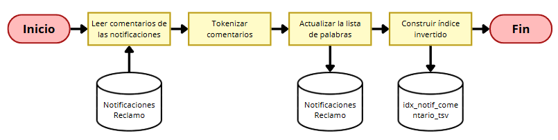
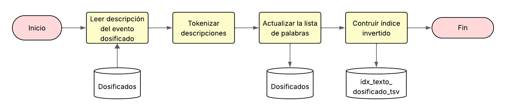
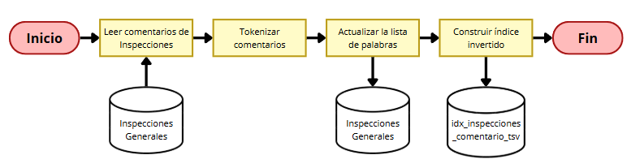
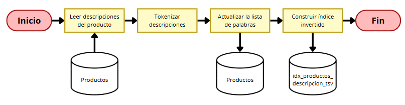
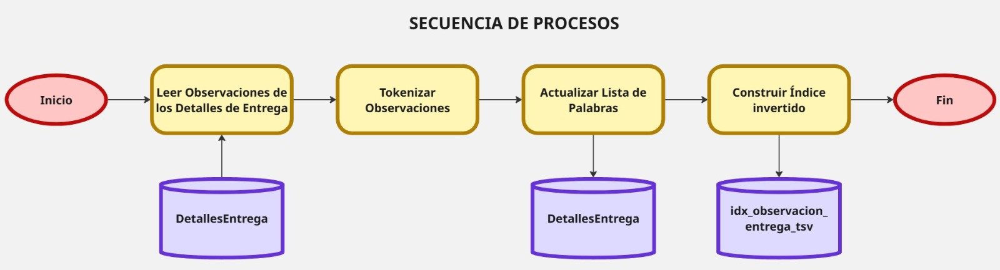

# 8.1. Búsqueda de texto

## Búsqueda de Texto: Productos usando tsvector

La tabla productos perteneciente al módulo de almacén de productos, guarda distintas descripciones de los productos que ofrecen, que a medida que vayan aumentando, será necesario tener una búsqueda mas eficiente que sea más facil identificar un producto por una palabra específica.

**Adaptación de la tabla Productos**

Añadimos una columna tipo `tsvector` que contendrá una versión indexada del texto de la descripción:

```sql
 ALTER TABLE Productos
ADD COLUMN descripcion_tsv tsvector;
 ```

**Actualización de registros existentes**

Cargamos el contenido de `descripcion` en el nuevo campo descripcion_tsv, usando el diccionario en español:

```sql
UPDATE Productos
SET descripcion_tsv = to_tsvector('spanish', descripcion);
```

**Creación del índice GIN**

Se genera un índice invertido sobre el campo `descripcion_tsv` para acelerar las búsquedas textuales:

```sql
CREATE INDEX idx_productos_descripcion_tsv
ON Productos
USING GIN (descripcion_tsv);
   ```

**Consulta optimizada con búsqueda textual**

Ya con los datos indexados, puedes hacer búsquedas rápidas por palabras clave en la descripción, como:

```sql
SELECT id_producto, codigo, nombre, precio_unitario, descripcion
FROM Productos
WHERE descripcion_tsv @@ plainto_tsquery('spanish', 'refrigerado envase vidrio');
```

**Diseño**

<p align="center">
  
</p>

## Módulo Proceso Productivo:

### Paso 1: Agregar columna tipo `tsvector`

Supongamos que deseamos buscar dentro de los registros de `Dosificados`, por ende se añade una nueva columna para almacenar el texto tokenizado:

```sql
ALTER TABLE Dosificados
ADD COLUMN texto_busqueda tsvector;
```

---

### Paso 2: Poblar la nueva columna 

Se combina `estado`, `codigo` y el nombre del `responsable` (usando subconsulta):

```sql
UPDATE Dosificados d
SET texto_busqueda = to_tsvector('spanish',
    coalesce(d.codigo, '') || ' ' ||
    coalesce(d.estado::text, '') || ' ' ||
    coalesce(p.nombre, '')
)
FROM Empleados e
JOIN Personas p ON e.id_empleado = p.id_persona
WHERE d.id_empleado = e.id_empleado;
```

---

### Paso 3: Crear un índice invertido (GIN)

Este índice permitirá búsquedas textuales eficientes:

```sql
CREATE INDEX idx_texto_dosificados_tsv
ON Dosificados
USING GIN (texto_busqueda);
```

---

### Paso 4: Realizar consultas optimizadas por texto

Ejemplo de buscar eventos donde haya coincidencias con "completado Luis":

```sql
SELECT d.codigo AS "Cod. Dosificado",
       d.estado AS "Estado",
       d.fecha_proceso AS "Fecha",
       p.nombre AS "Responsable"
FROM Dosificados d
JOIN Empleados e ON d.id_empleado = e.id_empleado
JOIN Personas p ON p.id_persona = e.id_empleado
WHERE d.texto_busqueda @@ plainto_tsquery('spanish', 'completado Luis');
```

### Diseño
<p align="center">
  
</p>

## Módulo Control de Calidad:

### Paso 1: Agregar columna tipo `tsvector`

Se añade una nueva columna en la tabla `InspeccionesGenerales` para almacenar el texto tokenizado de los comentarios:

```sql
ALTER TABLE InspeccionesGenerales
ADD COLUMN comentario_tsv tsvector;
```

---

### Paso 2: Poblar la nueva columna con los comentarios existentes

Convertimos todos los comentarios actuales al formato `tsvector`, utilizando el diccionario en español:

```sql
UPDATE InspeccionesGenerales
SET comentario_tsv = to_tsvector('spanish', comentario);
```

---

### Paso 3: Crear un índice invertido (GIN)

Este índice permitirá búsquedas textuales eficientes:

```sql
CREATE INDEX idx_comentario_inspecciones_tsv
ON InspeccionesGenerales
USING GIN (comentario_tsv);
```

---

### Paso 4: Realizar consultas optimizadas por texto

Ejemplo de búsqueda textual por palabra clave:

```sql
SELECT 
    codigo, tipo_inspeccion, comentario, evidencia
FROM InspeccionesGenerales
WHERE comentario_tsv @@ plainto_tsquery('spanish', 'envase sucio');
```

Otra búsqueda con varias palabras clave:

```sql
SELECT 
    codigo, tipo_inspeccion, comentario
FROM InspeccionesGenerales
WHERE comentario_tsv @@ plainto_tsquery('spanish', 'fallo mezcla sucia');
```

### Diseño
<p align="center">
  
</p>


## Módulo de Compras:

La tabla NotificacionesReclamo guarda los lotes de insumo que fueron rechazados por el área de calidad por no cumplir con los estándares de calidad definidos por la empresa, para rechazar dicho lote debe adjuntar cierta evidencia con comentarios de manera que sirva como justificación, sin embargo, conforme pase el tiempo la justificación se irá perdiendo y esta puede ser valiosa si queremos saber la calidad de productos que ofrece un proveedor.

Entonces una manera rápida de obtener esta información será por índices invertidos.

**Índices Invertidos para NotificacionesReclamo**

1. Añadir columnas `tsvector`:

```sql
ALTER TABLE NotificacionesReclamo
ADD COLUMN comentario_tsv tsvector;

ALTER TABLE NotificacionesReclamo
ADD COLUMN evidencia_tsv tsvector;
```

2. Actualizar valores existentes:

```sql
UPDATE NotificacionesReclamo
SET comentario_tsv = to_tsvector('spanish', comentario),
    evidencia_tsv = to_tsvector('spanish', evidencia);

```

3. Crear índices GIN:

```sql
CREATE INDEX idx_notif_comentario_tsv
ON NotificacionesReclamo
USING GIN (comentario_tsv);

CREATE INDEX idx_notif_evidencia_tsv
ON NotificacionesReclamo
USING GIN (evidencia_tsv);
```

4. Consulta optimizada de ejemplo:

```sql
SELECT codigo, comentario, evidencia
FROM NotificacionesReclamo
WHERE comentario_tsv @@ plainto_tsquery('spanish', 'vencido embalaje mal estado');
```

Si más adelante se accede a la estructura de una tabla `Reclamo`s y contiene campos como motivo, detalle, observación, etc., también podrías aplicar lógica similar allí. Pero por ahora, NotificacionesReclamo es la mejor opción para búsqueda textual eficiente.

<p align="center">
  
</p>


## Módulo de Distribución:

### Paso 1: Agregar columna tipo `tsvector`

Se añade una nueva columna en la tabla `DetallesEntrega` para almacenar el texto tokenizado de los comentarios de observación:

```sql
ALTER TABLE DetallesEntrega
ADD COLUMN observacion_tsv tsvector;
```

---

### Paso 2: Poblar la nueva columna

Convertimos todas las observaciones actuales al formato `tsvector`, utilizando el diccionario en español:

```sql
UPDATE DetallesEntrega
SET observacion_tsv = to_tsvector('spanish', coalesce(observacion, ''));
```

---

### Paso 3: Crear un índice invertido (GIN)

Este índice permitirá búsquedas textuales eficientes:

```sql
CREATE INDEX idx_observacion_entrega_tsv
ON DetallesEntrega
USING GIN (observacion_tsv);
```

---

### Paso 4: Realizar consultas optimizadas por texto

Ejemplo de búsqueda textual por palabra clave:

```sql
select oc.codigo as "Cod. Orden de Carga", prod.codigo as "Cod. Prod", lp.codigo as "Cod. Lote", dpick.cantidad_asignada as "Cant. Asignada",
    d.cant_observada as "Cant. Obs.", t.descripcion as "Tipo de Incidencia", d.observacion as "Observación"
from detallesentrega d 
inner join detallespicking dpick
    on dpick.id_picking = d.id_picking and d.id_lote_producto = dpick.id_lote_producto 
inner join pickings p
    on p.id_picking = dpick.id_picking 
inner join info_lote_producto ilp
    on ilp.id_lote_producto = d.id_lote_producto 
inner join lotesproducto lp
    on d.id_lote_producto = lp.id_lote_producto 
inner join productos prod
    on ilp.id_producto = prod.id_producto
inner join registrosentrega rent
    on d.id_reg_ent = rent.id_reg_ent 
inner join ordenescarga oc
    on rent.id_orden_carga = oc.id_orden_carga 
inner join pedidoscliente pc
    on pc.id_pedido_cliente = p.id_pedido_cliente
left join tiposincidencia t 
    on d.tipo_incidencia = t.codigo 
where d.observacion_tsv @@ plainto_tsquery('spanish', 'empaque dañado');
```

### Diseño de Secuencia de Procesos
<p align="center">
  
</p>
