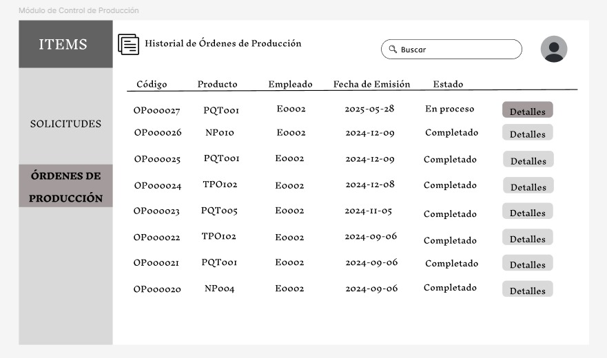

# 9.1. Sentencias SQL por módulo / prototipo

## MÓDULO 1:

|Código Requerimiento |R-101|
|---|---|
|Código Interfaz| I-101 |
|Imagen Interfaz|  |

**Eventos:**
- Carga de la Página:

	Se llenará la tabla con todos los eventos que están sucediendo o han sucedido respecto a un Lote de Producto asociado.

	```sql
        CREATE OR REPLACE FUNCTION encontrar_eventos_lote(codigo_lote TEXT)
    RETURNS TABLE (
        "N° Batch" TEXT,
        "Etapa de Producción" TEXT,
        "Estado" TEXT,
        "Fecha y hora de inicio" TIMESTAMP,
        "Tiempo de proceso" NUMERIC,
        "Responsable" TEXT
    ) AS $$
    BEGIN
        RETURN QUERY
        WITH LoteSeleccionado AS (
            SELECT id_lote_producto 
            FROM LotesProducto 
            WHERE codigo = codigo_lote
        ),
        EtapasRecurrentes AS (
            SELECT 
                pr.numero_batch::TEXT,
                CASE 
                    WHEN mz.id_proceso_recurrente IS NOT NULL THEN 'MEZCLADO'
                    WHEN md.id_proceso_recurrente IS NOT NULL THEN 'MOLDEADO'
                    WHEN s.id_proceso_recurrente IS NOT NULL THEN 'SECADO'
                END AS etapa,
                pr.estado::TEXT,
                pr.fecha_proceso,
                pr.tiempo_proceso::NUMERIC,
                COALESCE(mz.id_empleado, md.id_empleado, s.id_empleado) AS id_empleado
            FROM ProcesosRecurrente pr
            LEFT JOIN Mezclados mz ON pr.id_proceso_recurrente = mz.id_proceso_recurrente
            LEFT JOIN Moldeados md ON pr.id_proceso_recurrente = md.id_proceso_recurrente
            LEFT JOIN Secados s ON pr.id_proceso_recurrente = s.id_proceso_recurrente
            JOIN LoteSeleccionado l ON pr.id_lote_producto = l.id_lote_producto
        )

        -- DOSIFICADO
        SELECT 
            d.numero_batch::TEXT,
            'DOSIFICADO',
            d.estado::TEXT,
            d.fecha_proceso,
            (d.tiempo_proceso / 60)::NUMERIC,
            p.nombre::TEXT
        FROM Dosificados d
        JOIN Empleados e ON d.id_empleado = e.id_empleado
        JOIN Personas p ON e.id_empleado = p.id_persona
        JOIN LoteSeleccionado l ON d.id_lote_producto = l.id_lote_producto

        UNION ALL

        -- MEZCLADO, MOLDEADO, SECADO
        SELECT 
            er.numero_batch,
            er.etapa,
            er.estado,
            er.fecha_proceso,
            er.tiempo_proceso,
            p.nombre::TEXT
        FROM EtapasRecurrentes er
        JOIN Empleados e ON er.id_empleado = e.id_empleado
        JOIN Personas p ON e.id_empleado = p.id_persona

        UNION ALL

        -- ENVASADO
        SELECT 
            en.numero_batch::TEXT,
            'ENVASADO',
            en.estado::TEXT,
            en.fecha_proceso,
            (en.tiempo_proceso / 60)::NUMERIC,
            p.nombre::TEXT
        FROM Envasados en
        JOIN Empleados e ON en.id_empleado = e.id_empleado
        JOIN Personas p ON e.id_empleado = p.id_persona
        JOIN LoteSeleccionado l ON en.id_lote_producto = l.id_lote_producto;
    END;
    $$ LANGUAGE plpgsql;
	```
- Botón Solicitar Cierre de Lote:

	Redigirá al usuario a la interfaz I-108, donde se especificará mejor como se muestra las tablas asociadas a la solicitud del cierre del Lote de Producto usando sentencias SQL.

- Botón Registrar Evento:
 
 	Redigirá al usuario a la interfaz I-102, donde se especificará mejor como funcionan los botones para comenzar con la inserción de datos, usando sentencias SQL.

 - Botón Volver:
    
    Redigirá al usuario a la interfaz I-505, donde se muestran los Lotes de Producto asociados a una Orden de Produccion, usando sentencias SQL.


|Código Requerimiento |R-102|
|---|---|
|Código Interfaz| I-102 |
|Imagen Interfaz|  |

**Eventos:**
- Carga de la Página:

	Se muestran los eventos disponibles para agregar al Lote en producción.

- Botón Dosificado:

	Redigirá al usuario a la interfaz I-103, donde se especificará el proceso de inserción de datos para el evento Dosificado asociado a un Lote de Producto, usando sentencias SQL.

- Botón Mezclado:

	Redigirá al usuario a la interfaz I-104, donde se especificará el proceso de inserción de datos para el evento Mezclado asociado a un Lote de Producto, usando sentencias SQL.

- Botón Moldeado:

	Redigirá al usuario a la interfaz I-105, donde se especificará el proceso de inserción de datos para el evento Moldeado asociado a un Lote de Producto, usando sentencias SQL.

- Botón Secado:

	Redigirá al usuario a la interfaz I-106, donde se especificará el proceso de inserción de datos para el evento Secado asociado a un Lote de Producto, usando sentencias SQL.

- Botón Envasado:

	Redigirá al usuario a la interfaz I-107, donde se especificará el proceso de inserción de datos para el evento Envasado asociado a un Lote de Producto, usando sentencias SQL.

|Código Requerimiento |R-103|
|---|---|
|Código Interfaz| I-103 |
|Imagen Interfaz|  |

**Eventos:**
- Carga de la Página:
	
	Se muestran los espacios donde se debe completar para registrar el evento de Dosificado al Lote de Producto asociado. Pero además se muestran los Lotes de Insumo a dosificar respecto a la formulación del producto del Lote.

	```sql
		SELECT
		  i.tipo_insumo AS "Tipo de Insumo",
		  i.nombre_insumo AS "Nombre de Insumo",
		  li.codigo AS "Lote",
		  dxli.cantidad_dosificada AS "Cantidad Dosificada"
		FROM Dosificados d
		JOIN LotesProducto lp ON d.id_lote_producto = lp.id_lote_producto
		JOIN OrdenesProduccion op ON lp.id_orden_produccion = op.id_orden_produccion
		JOIN SolicitudesProduccion sp ON op.id_solicitud_produccion = sp.id_solicitud_produccion
		JOIN Formulaciones f ON sp.id_producto = f.id_producto
		JOIN DetallesFormulacion df ON f.id_formulacion = df.id_formulacion
		JOIN Insumos i ON df.id_insumo = i.id_insumo
		JOIN LotesInsumo li ON li.id_insumo = i.id_insumo
		  AND li.fecha_vencimiento >= d.fecha_proceso::DATE  
		JOIN DosificadosXLotesInsumo dxli ON dxli.id_dosificado = d.id_dosificado AND dxli.id_lote_insumo = li.id_lote_insumo
		WHERE lp.codigo = 'LP000001'; 
	```

- Mostrar índice correlativo

    Se muestra el índice al que pertenece este proceso para facilitar la insersión del código del evento.
    ```sql
    SELECT setval('codigo_dosificado_seq', (SELECT MAX(SUBSTRING(codigo, 3)::INT) FROM Dosificados))
    ```

- Botón Guardar:
 	
 	Se registran los datos del proceso en los espacios designados. La fecha está asociada a la fecha de creación del Lote de Producto y el id del empleado está asociado al ingreso del Usuario en su cuenta mediante su DNI.

 	```sql
	 	WITH 
		LoteSeleccionado AS (
	  	SELECT 
	    id_lote_producto,
	    fecha_creacion
	  	FROM LotesProducto 
	  	WHERE codigo = 'LP000056'
		),
		EmpleadoUsuario AS (
		SELECT e.id_empleado
		FROM Empleados e
		JOIN Personas p ON p.id_persona = e.id_empleado
		WHERE p.dni = '19004745'
		)

		INSERT INTO Dosificados (
		numero_batch, fecha_proceso, tiempo_proceso, estado, id_lote_producto, id_empleado 
		) 
		SELECT
		1,
		(l.fecha_creacion::date || ' 09:26:56')::timestamp,
		142,
		'En proceso',
		l.id_lote_producto,
		e.id_empleado
		FROM LoteSeleccionado l, EmpleadoUsuario e;
 	```

 - Botón Ícono de Guardar en cada Lote de Insumo:

 	Se actualizan las cantidades que se han dosificado por cada Lote de Insumo durante este proceso.

 	```sql
	 	UPDATE DosificadosXLotesInsumo
		SET cantidad_dosificada = 6.2
		WHERE id_dosificado = (SELECT id_dosificado FROM Dosificados WHERE codigo = 'DS000001')
		AND id_lote_insumo = (SELECT id_lote_insumo FROM LotesInsumo WHERE codigo = 'LI000001')
 	```

 - Botón Marcar como Completado (ahora Enviar a Inspeccion):

   Se actualiza el estado del proceso de Dosificado después de haber ingresado todos los datos correspondientes.

 	```sql
		UPDATE Dosificados 
			SET estado = 'En inspeccion'
			WHERE codigo = 'DS000001'
 	```

 - Botón Volver:

 	Redigirá al usuario a la interfaz I-102, donde se muestran los eventos disponibles para agregar al Lote en producción.

|Código Requerimiento |R-104|
|---|---|
|Código Interfaz| I-104 |
|Imagen Interfaz|  |

**Eventos:**
- Carga de la Página:
	
	Se muestran los espacios donde se debe completar para registrar el evento de Mezclado al Lote de Producto asociado.

- Botón Seleccionar Producto
 	
 	Se mostrarán las Formulaciones para ingresar su dato respecto al producto del Lote.
 	```sql
 		SELECT nombre_formulacion FROM Formulaciones
 	```

- Mostrar índice correlativo

    Se muestra el índice al que pertenece este proceso para facilitar la insersión del código del evento.
    ```sql
    SELECT setval('codigo_mezclado_seq',   (SELECT MAX(SUBSTRING(codigo, 3)::INT) FROM Mezclados))
    ```

- Botón Guardar:
 	
 	Se registran los datos del proceso en los espacios designados. La fecha está asociada a la fecha de creación del Lote de Producto y el id del empleado está asociado al ingreso del Usuario en su cuenta mediante su DNI.

 	```sql
		WITH 
		LoteSeleccionado AS (
		  SELECT 
		    id_lote_producto,
		    fecha_creacion
		  FROM LotesProducto 
		  WHERE codigo = 'LP000056'
		),
		CorrelativoPR AS (
		  SELECT COALESCE(MAX(id_proceso_recurrente), 0) + 1 AS nuevo_id
		  FROM ProcesosRecurrente
		),
		InsercionPR AS (
		  INSERT INTO ProcesosRecurrente (
		    id_proceso_recurrente, numero_batch, fecha_proceso, tiempo_proceso, peso_inicial, merma, estado, id_lote_producto
		  ) 
		  SELECT
		    n.nuevo_id,
		    1,                
		    (l.fecha_creacion::date || ' 09:26:56')::timestamp,
		    10,               
		    5556.7,            
		    0.6,              
		    'En proceso',
		    l.id_lote_producto
		  FROM LoteSeleccionado l, CorrelativoPR n
		  RETURNING id_proceso_recurrente
		)

		INSERT INTO Mezclados (
		  id_proceso_recurrente, porcentaje_humedad, cantidad_agua, id_empleado, id_ejemplar_maquina, id_formulacion
		)
		SELECT 
		  i.id_proceso_recurrente,
		  0.34,
		  3375,
		  (SELECT id_persona FROM Personas WHERE dni = 75320541),
		  (SELECT id_ejemplar_maquina FROM EjemplaresMaquina WHERE codigo = 'MQ000009'),
		  1
		FROM InsercionPR i;
 	```

 - Botón Marcar como Completado (ahora Enviar a Inspeccion):

   Se actualiza el estado del proceso de Mezclado después de haber ingresado todos los datos correspondientes.
   
 	```sql
		UPDATE ProcesosRecurrente
			SET estado = 'En inspeccion'
			WHERE id_proceso_recurrente = (SELECT id_proceso_recurrente FROM Mezclados WHERE codigo = 'MZ000172')
 	```

- Botón Volver:

 	Redigirá al usuario a la interfaz I-102, donde se muestran los eventos disponibles para agregar al Lote en producción.

|Código Requerimiento |R-105|
|---|---|
|Código Interfaz| I-105 |
|Imagen Interfaz|  |

**Eventos:**
- Carga de la Página:
	
	Se muestran los espacios donde se debe completar para registrar el evento de Moldeado al Lote de Producto asociado.

- Botón Seleccionar Boquilla
 	
 	Se mostrarán los tipos de boquilla para ingresar su dato respecto al producto del Lote.
 	```sql
 		SELECT descripcion FROM TiposBoquilla
 	```

- Mostrar índice correlativo

    Se muestra el índice al que pertenece este proceso para facilitar la insersión del código del evento.
    ```sql
    SELECT setval('codigo_moldeado_seq',   (SELECT MAX(SUBSTRING(codigo, 3)::INT) FROM Moldeados))
    ```

- Botón Guardar:
 	
 	Se registran los datos del proceso en los espacios designados. La fecha está asociada a la fecha de creación del Lote de Producto y el id del empleado está asociado al ingreso del Usuario en su cuenta mediante su DNI.

 	```sql
		WITH 
		LoteSeleccionado AS (
		  SELECT 
		    id_lote_producto,
		    fecha_creacion
		  FROM LotesProducto 
		  WHERE codigo = 'LP000056'
		),
		CorrelativoPR AS (
		  SELECT COALESCE(MAX(id_proceso_recurrente), 0) + 1 AS nuevo_id
		  FROM ProcesosRecurrente
		),
		InsercionPR AS (
		  INSERT INTO ProcesosRecurrente (
		    id_proceso_recurrente, numero_batch, fecha_proceso, tiempo_proceso, peso_inicial, merma, estado, id_lote_producto
		  ) 
		  SELECT
		    n.nuevo_id,
		    1,                
		    (l.fecha_creacion::date || ' 09:26:56')::timestamp,
		    12,               
		    5556.1,            
		    NULL,              
		    'En proceso',
		    l.id_lote_producto
		  FROM LoteSeleccionado l, CorrelativoPR n
		  RETURNING id_proceso_recurrente
		)

		INSERT INTO Moldeados (
		  id_proceso_recurrente, tipo_boquilla, presion, velocidad_corte, tamano_corte, id_empleado, id_ejemplar_maquina
		)
		SELECT 
		  i.id_proceso_recurrente,
		  (SELECT codigo FROM TiposBoquilla WHERE descripcion = 'Fusilli'),
		  103,
		  314.16,
		  10,
		  (SELECT id_persona FROM Personas WHERE dni = 68518091),
		  (SELECT id_ejemplar_maquina FROM EjemplaresMaquina WHERE codigo = 'MQ000038')
		FROM InsercionPR i;
 	```

 - Botón Marcar como Completado (ahora Enviar a Inspeccion):

   Se actualiza el estado del proceso de Moldeado después de haber ingresado todos los datos correspondientes.
   
 	```sql
		UPDATE ProcesosRecurrente
			SET estado = 'En inspeccion'
			WHERE id_proceso_recurrente = (SELECT id_proceso_recurrente FROM Mezclados WHERE codigo = 'MD000169')
 	```
 	
- Botón Volver:

 	Redigirá al usuario a la interfaz I-102, donde se muestran los eventos disponibles para agregar al Lote en producción.

|Código Requerimiento |R-106|
|---|---|
|Código Interfaz| I-106 |
|Imagen Interfaz|  |

**Eventos:**
- Carga de la Página:
	
	Se muestran los espacios donde se debe completar para registrar el evento de Secado al Lote de Producto asociado.

- Mostrar índice correlativo

    Se muestra el índice al que pertenece este proceso para facilitar la insersión del código del evento.
    ```sql
    SELECT setval('codigo_secado_seq',     (SELECT MAX(SUBSTRING(codigo, 3)::INT) FROM Secados))
    ```

- Botón Guardar:
 	
 	Se registran los datos del proceso en los espacios designados. La fecha está asociada a la fecha de creación del Lote de Producto y el id del empleado está asociado al ingreso del Usuario en su cuenta mediante su DNI.

 	```sql
		WITH 
		LoteSeleccionado AS (
		  SELECT 
		    id_lote_producto,
		    fecha_creacion
		  FROM LotesProducto 
		  WHERE codigo = 'LP000056'
		),
		CorrelativoPR AS (
		  SELECT COALESCE(MAX(id_proceso_recurrente), 0) + 1 AS nuevo_id
		  FROM ProcesosRecurrente
		),
		InsercionPR AS (
		  INSERT INTO ProcesosRecurrente (
		    id_proceso_recurrente, numero_batch, fecha_proceso, tiempo_proceso, peso_inicial, merma, estado, id_lote_producto
		  ) 
		  SELECT
		    n.nuevo_id,
		    1,                
		    (l.fecha_creacion::date || ' 09:26:56')::timestamp,
		    720,               
		    5555.6,            
		    NULL,              
		    'En proceso',
		    l.id_lote_producto
		  FROM LoteSeleccionado l, CorrelativoPR n
		  RETURNING id_proceso_recurrente
		)

		INSERT INTO Secados (
		  id_proceso_recurrente, numero_bandejas, temperatura_inicial, temperatura_final, porcentaje_humedad, id_empleado, id_ejemplar_maquina
		)
		SELECT 
		  i.id_proceso_recurrente,
		  5,   
		  26,
		  48,
		  0.12,   
		  (SELECT id_persona FROM Personas WHERE dni = 68518091),      
		  (SELECT id_ejemplar_maquina FROM EjemplaresMaquina WHERE codigo = 'MQ000054')
		FROM InsercionPR i;
 	```

 - Botón Marcar como Completado (ahora Enviar a Inspeccion):

   Se actualiza el estado del proceso de Secado después de haber ingresado todos los datos correspondientes.
   
 	```sql
		UPDATE ProcesosRecurrente
			SET estado = 'En inspeccion'
			WHERE id_proceso_recurrente = (SELECT id_proceso_recurrente FROM Mezclados WHERE codigo = 'SC000059')
 	```
 	
- Botón Volver:

 	Redigirá al usuario a la interfaz I-102, donde se muestran los eventos disponibles para agregar al Lote en producción.

|Código Requerimiento |R-107|
|---|---|
|Código Interfaz| I-107 |
|Imagen Interfaz|  |

**Eventos:**
- Carga de la Página:
	
	Se muestran los espacios donde se debe completar para registrar el evento de Envasado al Lote de Producto asociado.

- Mostrar índice correlativo

    Se muestra el índice al que pertenece este proceso para facilitar la insersión del código del evento.
    ```sql
    SELECT setval('codigo_envasado_seq',   (SELECT MAX(SUBSTRING(codigo, 3)::INT) FROM Envasados))
    ```

- Botón Guardar:
 	
 	Se registran los datos del proceso en los espacios designados. La fecha está asociada a la fecha de creación del Lote de Producto y el id del empleado está asociado al ingreso del Usuario en su cuenta mediante su DNI.

 	```sql
		WITH 
			LoteSeleccionado AS (
		  	SELECT 
		    id_lote_producto,
		    fecha_creacion
		  	FROM LotesProducto 
		  	WHERE codigo = 'LP000056'
		),
			EmpleadoUsuario AS (
			SELECT e.id_empleado
			FROM Empleados e
			JOIN Personas p ON p.id_persona = e.id_empleado
			WHERE p.dni = '19004745'
		)

		INSERT INTO Envasados (
			fecha_proceso, numero_batch, tipo_envase, tiempo_proceso, peso, estado, id_lote_producto, id_empleado
		) 
		SELECT
			(l.fecha_creacion::date || ' 09:26:56')::timestamp,
			1,
			'Bolsa de plastico', 
			26.8,
			20,
			'En proceso',
			l.id_lote_producto,
			e.id_empleado
		FROM LoteSeleccionado l, EmpleadoUsuario e;
 	```

 - Botón Marcar como Completado (ahora Enviar a Inspeccion):

   Se actualiza el estado del proceso de Envasado después de haber ingresado todos los datos correspondientes.
   
 	```sql
		UPDATE Envasados 
			SET estado = 'En inspeccion'
			WHERE codigo = 'EV000058'
 	```
 	
- Botón Volver:

 	Redigirá al usuario a la interfaz I-102, donde se muestran los eventos disponibles para agregar al Lote en producción.

|Código Requerimiento |R-108|
|---|---|
|Código Interfaz| I-108 |
|Imagen Interfaz|  |

**Eventos:**
- Carga de la Página:
	
	Se mostrará la Orden de Producción asociada así como su responsable y fecha de creación del Lote por cerrar.

	```sql
		SELECT o.codigo, p.nombre, lp.fecha_creacion
		FROM 
			LotesProducto lp
		JOIN OrdenesProduccion o ON o.id_orden_produccion = lp.id_orden_produccion
		JOIN Empleados e ON e.id_empleado = o.id_orden_produccion
		JOIN Personas p ON p.id_persona = e.id_empleado
		WHERE lp.codigo = 'LP000057'
	```

	Se llenará la tabla con todos los eventos que sucedieron (completados y retirados) respecto a un Lote de Producto asociado.

	```sql
    CREATE OR REPLACE FUNCTION encontrar_eventos_lote(codigo_lote TEXT)
    RETURNS TABLE (
        "N° Batch" TEXT,
        "Etapa de Producción" TEXT,
        "Estado" TEXT,
        "Fecha y hora de inicio" TIMESTAMP,
        "Tiempo de proceso" NUMERIC,
        "Responsable" TEXT
    ) AS $$
    BEGIN
        RETURN QUERY
        WITH LoteSeleccionado AS (
            SELECT id_lote_producto 
            FROM LotesProducto 
            WHERE codigo = codigo_lote
        ),
        EtapasRecurrentes AS (
            SELECT 
                pr.numero_batch::TEXT,
                CASE 
                    WHEN mz.id_proceso_recurrente IS NOT NULL THEN 'MEZCLADO'
                    WHEN md.id_proceso_recurrente IS NOT NULL THEN 'MOLDEADO'
                    WHEN s.id_proceso_recurrente IS NOT NULL THEN 'SECADO'
                END AS etapa,
                pr.estado::TEXT,
                pr.fecha_proceso,
                pr.tiempo_proceso::NUMERIC,
                COALESCE(mz.id_empleado, md.id_empleado, s.id_empleado) AS id_empleado
            FROM ProcesosRecurrente pr
            LEFT JOIN Mezclados mz ON pr.id_proceso_recurrente = mz.id_proceso_recurrente
            LEFT JOIN Moldeados md ON pr.id_proceso_recurrente = md.id_proceso_recurrente
            LEFT JOIN Secados s ON pr.id_proceso_recurrente = s.id_proceso_recurrente
            JOIN LoteSeleccionado l ON pr.id_lote_producto = l.id_lote_producto
        )

        -- DOSIFICADO
        SELECT 
            d.numero_batch::TEXT,
            'DOSIFICADO',
            d.estado::TEXT,
            d.fecha_proceso,
            (d.tiempo_proceso / 60)::NUMERIC,
            p.nombre::TEXT
        FROM Dosificados d
        JOIN Empleados e ON d.id_empleado = e.id_empleado
        JOIN Personas p ON e.id_empleado = p.id_persona
        JOIN LoteSeleccionado l ON d.id_lote_producto = l.id_lote_producto

        UNION ALL

        -- MEZCLADO, MOLDEADO, SECADO
        SELECT 
            er.numero_batch,
            er.etapa,
            er.estado,
            er.fecha_proceso,
            er.tiempo_proceso,
            p.nombre::TEXT
        FROM EtapasRecurrentes er
        JOIN Empleados e ON er.id_empleado = e.id_empleado
        JOIN Personas p ON e.id_empleado = p.id_persona

        UNION ALL

        -- ENVASADO
        SELECT 
            en.numero_batch::TEXT,
            'ENVASADO',
            en.estado::TEXT,
            en.fecha_proceso,
            (en.tiempo_proceso / 60)::NUMERIC,
            p.nombre::TEXT
        FROM Envasados en
        JOIN Empleados e ON en.id_empleado = e.id_empleado
        JOIN Personas p ON e.id_empleado = p.id_persona
        JOIN LoteSeleccionado l ON en.id_lote_producto = l.id_lote_producto;
    END;
    $$ LANGUAGE plpgsql;
	```
- Botón Aceptar:

	Se actualiza el estado del Lote de Producto a Completado.

	```sql
		UPDATE LotesProducto 
					SET estado_lote_producto = 'Completado'
					WHERE codigo = 'LP000001'
	```

- Botón Volver:

	Redigirá al usuario a la interfaz I-101, donde se podrá seguir creando eventos de producción.

## MÓDULO 2:
|Código Requerimiento |R-201|
|---|---|
|Código Interfaz| I-201 |
|Imagen Interfaz|     |

**Eventos:**
- Carga de Página:

    Se llenará la lista de compras pendiente con recepcion creada para atender.

    ```sql
    select c.codigo , pr.codigo, p.fecha_acuerdo_entrega, r.estado 
    from proveedores pr
    join propuestascompra p 
	on pr.id_proveedor = p.id_proveedor 
    join ordenescompra o 
	on o.id_propuesta_compra = p.id_propuesta_compra 
    join compras c 
	on c.id_orden_compra = o.id_orden_compra 
    join recepciones r
	on r.id_compra = c.id_compra 
    where not(r.estado = 'A recepcionar');
    ```

- Botón Recepcion:

    Se activa si la compra pasa a estado a recepcionar y redirige al usuario a la siguinete interfaz donde pude rellenar los datos del lote insumo como la cantidad recibida, f vencimineto y se registra la fecha de la operracion.


    ```sql
    --Cabecera de la segunda de carga de pantalla
    select c.codigo from recepciones r
    join compras c 
	on r.id_compra = c.id_compra
    where r.id_recepcion = 107; 

    --Carga de lotes que llegaron para recepcionar
    select i.tipo_insumo, i.nombre_insumo, l.codigo, l.cantidad_recibida, l.fecha_vencimiento 
    from lotesinsumo l
    join insumos i	
	on l.id_insumo = i.id_insumo
    join recepciones r 
	on l.id_recepcion = r.id_recepcion 
    where r.id_recepcion = 107;
	
    --APARTIR DEL BOTON REGISTRAR
    --Registrar fecha de llegada
    update recepciones set 
	fecha_llegada = NOW()
    where id_recepcion = 107;

    --Registrar lotes insumos 
    update lotesinsumo set 
	cantidad_recibida = 107,
	fecha_vencimiento = '2025-05-01 11:30:00'
    where id_lote_insumo = 134;
    ```

|Código Requerimiento |R-202|
|---|---|
|Código Interfaz| I-202 |
|Imagen Interfaz|   |

**Eventos:**
- Carga de Página:
    
    Se llenará la lista de lotes insumos que estan por vencer y insumos con su total de cantidad disponible sea cercara a el stock minimo.

    Botón de filtar: redirige la pantalla dependiendo lo que se quiera revisar.

    ```sql
	--Carga de pantalla para Fecha de vencimiento
    select i.nombre_insumo, l.codigo, l.fecha_vencimiento, l.cantidad_disponible 
    from insumos i
    join lotesinsumo l  
	on i.id_insumo = l.id_insumo
    where 
	(l.cantidad_disponible > 0) and
	(l.fecha_vencimiento - '2024-11-1' < 4) 
    order by l.fecha_vencimiento desc ;

    --Carga de pantalla para Stock minimo
    select i.tipo_insumo, i.nombre_insumo , SUM(l.cantidad_disponible) as cantidad 
    from insumos i
    join lotesinsumo l  
	on i.id_insumo = l.id_insumo
    group by 
    i.tipo_insumo, 
    i.nombre_insumo 
    having SUM(l.cantidad_disponible) < 200; 
    ```

|Código Requerimiento |R-203|
|---|---|
|Código Interfaz| I-203 |
|Imagen Interfaz|     |

**Eventos:**
- Carga de Página:

    Se llenará la lista de ordenes de produccion que todavia no son atentidas.

    ```sql
    --Carga de Pnatalla 
    select o.codigo, o.fecha_emision, p.nombre, lp.codigo 
    from productos p
    join solicitudesproduccion s
	on p.id_producto = s.id_producto  
    join ordenesproduccion o
	on o.id_solicitud_produccion = s.id_solicitud_produccion 
    join abastecimientos a 
	on a.id_orden_produccion = o.id_orden_produccion
    join lotesProducto lp 
	on lp.id_orden_produccion = o.id_orden_produccion 
    where a.estado = 'atender'; 

    ```

- Botón Atender:

    Redirige al ususrio a la siguiente interfaz donde se asignan los lotes insumos a esa orden de Produccion. 

    ```sql
    --Carga de la tabla de insumos necesitados
    select 
	    i.tipo_insumo, 
	    i.nombre_insumo, 
	    trunc(d.cantidad_asignada*
	    (select s.cantidad_requerida 
	    from solicitudesproduccion s
	    join ordenesproduccion o
	    on o.id_solicitud_produccion = s.id_solicitud_produccion 
	    where o.id_orden_produccion = 24)/
	    (select d.cantidad_asignada from solicitudesproduccion s
	    join ordenesproduccion o
	    on o.id_solicitud_produccion = s.id_solicitud_produccion 
	    join productos p 
	    on s.id_producto = p.id_producto 
	    join formulaciones f 
	    on f.id_producto = p.id_producto 
	    join detallesformulacion d 
	    on d.id_formulacion = f.id_formulacion 
	    where o.id_orden_produccion = 24 and ( d.id_insumo = 12 or d.id_insumo = 13)), 2) as Cantidad, 
	    i.unidad_medida 
    from ordenesproduccion o 
    join solicitudesproduccion s
	on o.id_solicitud_produccion = s.id_solicitud_produccion 
    join  productos p
	on p.id_producto = s.id_producto 
    join formulaciones f 
	on f.id_producto = p.id_producto 
    join detallesformulacion d 
	on f.id_formulacion = d.id_formulacion 
    join insumos i 
	on i.id_insumo = d.id_insumo 
    where o.id_orden_produccion = 27;

    --Asignacion de los insumos.
    --Insumo 1
    select 
	i.tipo_insumo, 
	i.nombre_insumo, 
	l.codigo,
	LEAST(l.cantidad_disponible , 18.83) as cantidad,
	i.unidad_medida 
    from lotesinsumo l 
    join insumos i
	on l.id_insumo = i.id_insumo 
    where 
	    (i.id_insumo = 1 ) and 
	    (l.fecha_vencimiento =
	        (select min(l.fecha_vencimiento) from lotesinsumo l 
	        join insumos i
	            on l.id_insumo = i.id_insumo
	        where l.cantidad_disponible > 0
	        group by i.id_insumo	
	        having i.id_insumo = 1 ) )

    --Insumo 2 
    select 
	i.tipo_insumo, 
	i.nombre_insumo, 
	l.codigo,
	LEAST(l.cantidad_disponible , 3.83) as cantidad,
	i.unidad_medida 
    from lotesinsumo l 
    join insumos i
	on l.id_insumo = i.id_insumo 
    where 
	    (i.id_insumo = 2 ) and 
	    (l.fecha_vencimiento =
	        (select min(l.fecha_vencimiento) from lotesinsumo l 
	        join insumos i
	            on l.id_insumo = i.id_insumo
	        where l.cantidad_disponible > 0
	        group by i.id_insumo	
	        having i.id_insumo = 2 ) )

    ```

- Botón de registrar:
    Se registrara los insumos asignados en la tabla de asignacion.

    ```sql
    --Carga de Pnatalla 
    INSERT INTO InventariosAbastecimiento (id_abastecimiento, id_lote_insumo, cantidad_asignada) VALUES
    (27, 1, 18.7),  
    (27, 2, 2.83);

    ```

|Código Requerimiento |R-204|
|---|---|
|Código Interfaz| I-204 |
|Imagen Interfaz|   |

**Eventos:**

- Carga de Pagina: 
    
    Se realiza primero la creacion de solicitud de abastecimiento.
    
     ```sql
    INSERT INTO SolicitudesAbastecimiento (id_solicitud_abastecimiento, codigo, Fecha_solicitud_abastecimiento, id_empleado, estado) VALUES
    (37,  'SA000037', Now(), 36, 'Pendiente');
    ```

- Boton buscar:
    
    Se realiza la parte de filtro de insumos que tenemos en el almacen 
    ```sql
    select i.tipo_insumo, i.nombre_insumo , SUM(l.cantidad_disponible) 
    from insumos i
    join lotesinsumo l  
	on i.id_insumo = l.id_insumo
    group by 
    i.tipo_insumo, 
    i.nombre_insumo
    having i.nombre_insumo = 'Harina de trigo' ; 
    
    ```
- Botón de agregar: 
    Agrega a los insumos filtrados en la pantalla y con la caantidad requerida.

    ```sql
    INSERT INTO DetallesSolicitud (id_solicitud_abastecimiento, id_insumo, cantidad_requeridos) VALUES
    (37, 1, 200), (37, 2, 18);
    ```
- Botón de confirmar: 
    Se confirma la solicitud y se envia al area de compras.

|Código Requerimiento |R-205|
|---|---|
|Código Interfaz| I-205 |
|Imagen Interfaz|    |

- Carga de Pagina: 
    
    Se rellenara la lista con los insumos que entraron o insmos que salieron.
    
    Botón de Entrada de insumos:
    Se encarga de que se muestren los lotes insumo ingresados.

     ```sql
    select i.nombre_insumo, c.codigo, r.fecha_llegada, l.codigo, l.cantidad_recibida 
    from insumos i
    join lotesinsumo l 
	    on i.id_insumo = l.id_insumo 
    join recepciones r
	    on l.id_recepcion = r.id_recepcion 
    join compras c 
	on c.id_compra = r.id_compra ;
    ```
    
    Botón de Salida de insumos:
    Se encarga de que se muestren los lotes insumo ingresados.

     ```sql
    select i.nombre_insumo, o.codigo, a.fecha_abastecimiento, l.codigo, ia.cantidad_asignada, lp.codigo  
    from insumos i
    join lotesinsumo l
	    on i.id_insumo = l.id_insumo 
    join inventariosabastecimiento ia 
	    on l.id_lote_insumo = ia.id_lote_insumo 
    join abastecimientos a
	    on ia.id_abastecimiento = a.id_abastecimiento 
    join ordenesproduccion o 
	    on a.id_orden_produccion = o.id_orden_produccion 
    join lotesproducto lp 
	    on lp.id_orden_produccion = o.id_orden_produccion ;
    ```

## MÓDULO 3: MÓDULO DE CONTROL DE CALIDAD

| Código Requerimiento | R-301 |
|----------------------|--------|
| Código Interfaz      | I-301  |
| Imagen Interfaz      |  |

**Eventos:**

*Pantalla: Registro de Lotes de Insumo en Calidad*

- **Carga de Página**:

    Se listan todos los lotes de insumo cuyo `fecha_hora_ingreso_lab` sea `NULL`, es decir, que aún no han sido registrados como ingresados al laboratorio de calidad.

    ```sql
    SELECT 
        l.codigo AS cod_lote_insumo,
        i.nombre_insumo AS insumo,
        i.tipo_insumo AS tipo_de_insumo,
        p.codigo AS proveedor,
        r.fecha_llegada::time AS hora_entrega
    FROM LotesInsumo l
    JOIN Insumos i ON l.id_insumo = i.id_insumo
    JOIN Compras c ON l.id_compra = c.id_compra
    JOIN OrdenesCompra oc ON c.id_orden_compra = oc.id_orden_compra
    JOIN PropuestasCompra pc ON oc.id_propuesta_compra = pc.id_propuesta_compra
    JOIN Proveedores p ON pc.id_proveedor = p.id_proveedor
    JOIN Recepciones r ON l.id_recepcion = r.id_recepcion
    WHERE l.fecha_hora_ingreso_lab IS NULL;
    ```

- **Botón Confirmar Registro**:

    Al presionar el botón **"Confirmar"**, se actualiza el atributo `fecha_hora_ingreso_lab` para el lote seleccionado, combinando la fecha y hora ingresadas por el usuario.

    ```sql
    UPDATE 
        LotesInsumo
    SET 
        fecha_hora_ingreso_lab = TO_TIMESTAMP(<fechaRegistro> || ' ' || <horaRegistro>, 'YYYY-MM-DD HH24:MI')
    WHERE 
        codigo = <codigoLoteSeleccionado>;
    ```

**Asociación de elementos en la interfaz con parámetros SQL**:

- Fila seleccionada → `<codigoLoteSeleccionado>`
- Campo de fecha → `<fechaRegistro>`
- Campo de hora → `<horaRegistro>`


| Código Requerimiento | R-302 |
|----------------------|--------|
| Código Interfaz      | I-302-1 |
| Imagen Interfaz      |  |

**Eventos:**

*Pantalla: Lista de Compras para Inspección*

- **Carga de Página**:

    Se listan las compras con lotes de insumo pendientes de inspección.

    ```sql
    SELECT DISTINCT
        c.codigo AS codigo_compra,
        i.tipo_insumo,
        p.codigo AS proveedor
    FROM Compras c
    JOIN LotesInsumo li ON li.id_compra = c.id_compra
    JOIN Insumos i ON li.id_insumo = i.id_insumo
    JOIN OrdenesCompra oc ON c.id_orden_compra = oc.id_orden_compra
    JOIN PropuestasCompra pc ON oc.id_propuesta_compra = pc.id_propuesta_compra
    JOIN Proveedores p ON pc.id_proveedor = p.id_proveedor
    WHERE li.id_lote_insumo NOT IN (
        SELECT id_lote_insumo FROM InspeccionesLoteInsumo
    );
    ```

---

| Código Requerimiento | R-302 |
|----------------------|--------|
| Código Interfaz      | I-302-2 |
| Imagen Interfaz      |  |

**Eventos:**

*Pantalla: Lotes Pendientes por Compra*

- **Carga de Página al seleccionar compra**:

    Se listan los lotes de insumo recibidos que aún no han sido inspeccionados.

    ```sql
    SELECT 
        li.codigo AS cod_lote_insumo,
        i.nombre_insumo AS insumo,
        li.fecha_hora_ingreso_lab::date AS fecha_ingreso,
        li.fecha_hora_ingreso_lab::time AS hora_ingreso
    FROM LotesInsumo li
    JOIN Insumos i ON li.id_insumo = i.id_insumo
    WHERE li.id_compra = <idCompraSeleccionada>
      AND li.fecha_hora_ingreso_lab IS NOT NULL
      AND li.id_lote_insumo NOT IN (
          SELECT id_lote_insumo FROM InspeccionesLoteInsumo
      );
    ```s

---

| Código Requerimiento | R-302 |
|----------------------|--------|
| Código Interfaz      | I-302-3 |
| Imagen Interfaz      |  |

**Eventos:**

*Pantalla: Registrar Inspección del Lote de Insumo*

- **Botón Confirmar Registro**:

    Se inserta el registro en `InspeccionesGenerales`.

    ```sql
    INSERT INTO InspeccionesGenerales (
        codigo, tipo_inspeccion, fecha_hora_inspeccion,
        estado_revision, comentario, evidencia, id_empleado
    )
    VALUES (
        <codigoInspeccion>, 'Lote de Insumo', NOW(),
        <estadoRevision>, <comentario>, <evidencia>, <idInspector>
    );
    ```

    Luego se inserta el detalle específico del lote inspeccionado.

    ```sql
    INSERT INTO InspeccionesLoteInsumo (
        id_inspeccion, id_lote_insumo, motivo_rechazo
    )
    VALUES (
        (SELECT id_inspeccion FROM InspeccionesGenerales WHERE codigo = <codigoInspeccion>),
        <idLoteInsumo>, <motivoRechazo>
    );
    ```

---

| Código Requerimiento | R-302 |
|----------------------|--------|
| Código Interfaz      | I-302-4 |
| Imagen Interfaz      |  |

**Eventos:**

*Pantalla: Modal de Resultado de Inspección*

- **Visualización del Resultado**:

    Se carga la información de la inspección (estado, área, inspector, comentario y evidencia).

    ```sql
    SELECT 
        eg.estado_revision,
        eg.comentario,
        eg.evidencia,
        e.area,
        CONCAT(p.nombre, ' ', p.ap_paterno) AS inspector,
        ili.motivo_rechazo
    FROM InspeccionesGenerales eg
    JOIN InspeccionesLoteInsumo ili ON eg.id_inspeccion = ili.id_inspeccion
    JOIN Empleados e ON eg.id_empleado = e.id_empleado
    JOIN Personas p ON p.id_persona = e.id_empleado
    WHERE eg.codigo = <codigoInspeccion>;
    ```

---

---

| Código Requerimiento | R-303 |
|----------------------|--------|
| Código Interfaz      | I-303-1 |
| Imagen Interfaz      |  |

**Eventos:**

*Pantalla: Lista de Lotes de Producto para Inspección por Proceso*

- **Carga de Página**:

    Se listan los lotes de producto cuya etapa de producción está en proceso y que tienen procesos registrados pendientes de inspección.

    ```sql
    SELECT 
        lp.codigo AS codigo_lote_producto,
        lp.etapa_produccion,
        lp.fecha_creacion::date AS fecha_registro,
        lp.fecha_creacion::time AS hora_registro
    FROM LotesProducto lp
    WHERE lp.estado_lote_producto = 'En proceso'
      AND lp.id_lote_producto IN (
          SELECT id_lote_producto FROM ProcesosRecurrente
          WHERE id_proceso_recurrente NOT IN (
              SELECT id_proceso_recurrente FROM InspeccionesProceso
          )
      );
    ```

---

| Código Requerimiento | R-303 |
|----------------------|--------|
| Código Interfaz      | I-303-2 |
| Imagen Interfaz      |  |

**Eventos:**

*Pantalla: Procesos del Lote de Producto Seleccionado*

- **Carga de Página al hacer clic en "Inspeccionar" un lote**:

    Se listan los procesos registrados del lote que aún no tienen inspección asociada.

    ```sql
    SELECT 
        pr.id_proceso_recurrente AS codigo_proceso,
        pr.numero_batch,
        pr.fecha_proceso::date AS fecha_registro,
        pr.fecha_proceso::time AS hora_registro
    FROM ProcesosRecurrente pr
    WHERE pr.id_lote_producto = <idLoteProductoSeleccionado>
        AND pr.id_proceso_recurrente NOT IN (
    SELECT id_proceso_recurrente FROM InspeccionesProceso
  );
    ```

---

| Código Requerimiento | R-303 |
|----------------------|--------|
| Código Interfaz      | I-303-3 |
| Imagen Interfaz      |  |

**Eventos:**

*Pantalla: Registrar Inspección del Proceso*

- **Botón Confirmar Registro**:

    Se insertan los datos generales de la inspección en `InspeccionesGenerales`, y luego los detalles específicos del proceso en `InspeccionesProceso`.

    ```sql
    -- Registro base en InspeccionesGenerales
    INSERT INTO InspeccionesGenerales (
        codigo, tipo_inspeccion, fecha_hora_inspeccion,
        estado_revision, comentario, evidencia, id_empleado
    )
    VALUES (
        <codigoInspeccion>, 'Proceso', NOW(),
        <estadoRevision>, <comentario>, <evidencia>, <idInspector>
    );
    ```

    ```sql
    -- Registro en InspeccionesProceso
    INSERT INTO InspeccionesProceso (
        id_inspeccion, id_proceso_recurrente,
        tipo_proceso, tipo_fallo, detalle_fallo_proceso, cantidad_perdida
    )
    VALUES (
        (SELECT id_inspeccion FROM InspeccionesGenerales WHERE codigo = <codigoInspeccion>),
        <idProcesoRecurrente>, <tipoProceso>, <tipoFallo>, <detalleFallo>, <cantidadPerdida>
    );
    ```

---

| Código Requerimiento | R-303 |
|----------------------|--------|
| Código Interfaz      | I-303-4 |
| Imagen Interfaz      |  |

**Eventos:**

*Pantalla: Modal de Resultado de Inspección por Proceso*

- **Carga de Resultado**:

    Se carga la información detallada de la inspección asociada al proceso, incluyendo fallo, área, inspector y evidencia.

    ```sql
    SELECT 
        eg.estado_revision,
        eg.comentario,
        eg.evidencia,
        e.area,
        CONCAT(p.nombre, ' ', p.ap_paterno) AS inspector,
        ip.tipo_fallo,
        ip.detalle_fallo_proceso,
        ip.cantidad_perdida
    FROM InspeccionesGenerales eg
    JOIN InspeccionesProceso ip ON eg.id_inspeccion = ip.id_inspeccion
    JOIN Empleados e ON eg.id_empleado = e.id_empleado
    JOIN Personas p ON p.id_persona = e.id_empleado
    WHERE eg.codigo = <codigoInspeccion>;
    ```

---

**Asociación de elementos en la interfaz con parámetros SQL**:

- Botón "Inspeccionar" (lote) → `<idLoteProductoSeleccionado>`
- Botón "Inspeccionar" (proceso) → `<idProcesoRecurrente>`
- Campo inspector (usuario actual) → `<idInspector>`
- Combo estado → `<estadoRevision>`
- Combo tipo de fallo → `<tipoFallo>`
- Campo texto detalle → `<detalleFallo>`
- Campo numérico pérdida → `<cantidadPerdida>`
- Área se obtiene de tabla Empleados → `<area>`
- Evidencia cargada → `<evidencia>`
- Código generado de inspección → `<codigoInspeccion>`
- Tipo de proceso se determina por tabla relacionada (Mezclado, Moldeado o Secado) → `<tipoProceso>`


---

| Código Requerimiento | R-304 |
|----------------------|--------|
| Código Interfaz      | I-304-1 |
| Imagen Interfaz      |  |

**Eventos:**

*Pantalla: Lista de Lotes de Producto – Filtro Envasado*

- **Carga de Página**:

    Se listan los lotes cuya etapa de producción es 'Envasado' y que tienen un registro en la tabla `Envasados` sin una inspección asociada.

    ```sql
    SELECT 
        lp.codigo AS codigo_lote_producto,
        lp.etapa_produccion,
        lp.fecha_creacion::date AS fecha_registro,
        lp.fecha_creacion::time AS hora_registro
    FROM LotesProducto lp
    WHERE lp.etapa_produccion = 'Envasado'
      AND lp.id_lote_producto IN (
          SELECT id_lote_producto FROM Envasados
          WHERE id_envasado NOT IN (
              SELECT id_envasado FROM InspeccionesEnvasado
          )
      );
    ```

---

| Código Requerimiento | R-304 |
|----------------------|--------|
| Código Interfaz      | I-304-2 |
| Imagen Interfaz      |  |

**Eventos:**

*Pantalla: Registrar Inspección del Envasado*

- **Botón Confirmar Registro**:

    Se registra la inspección general en `InspeccionesGenerales` y luego la inspección específica del envasado.

    ```sql
    -- Registro base
    INSERT INTO InspeccionesGenerales (
        codigo, tipo_inspeccion, fecha_hora_inspeccion,
        estado_revision, comentario, evidencia, id_empleado
    )
    VALUES (
        <codigoInspeccion>, 'Envasado', NOW(),
        <estadoRevision>, <comentario>, <evidencia>, <idInspector>
    );
    ```

    ```sql
    -- Registro específico en InspeccionesEnvasado
    INSERT INTO InspeccionesEnvasado (
        id_inspeccion, id_envasado,
        tipo_defecto_empaque, cantidad_envases_defectuosos
    )
    VALUES (
        (SELECT id_inspeccion FROM InspeccionesGenerales WHERE codigo = <codigoInspeccion>),
        <idEnvasado>, <tipoDefecto>, <cantidadDefectuosa>
    );
    ```

---

| Código Requerimiento | R-304 |
|----------------------|--------|
| Código Interfaz      | I-304-3 |
| Imagen Interfaz      |  |

**Eventos:**

*Pantalla: Modal de Resultado de Inspección de Envasado*

- **Carga de Resultado**:

    Se consulta el estado y detalles del defecto reportado durante la inspección de envasado.

    ```sql
    SELECT 
        eg.estado_revision,
        eg.comentario,
        eg.evidencia,
        e.area,
        CONCAT(p.nombre, ' ', p.ap_paterno) AS inspector,
        ie.cantidad_envases_defectuosos,
        ie.tipo_defecto_empaque
    FROM InspeccionesGenerales eg
    JOIN InspeccionesEnvasado ie ON eg.id_inspeccion = ie.id_inspeccion
    JOIN Empleados e ON eg.id_empleado = e.id_empleado
    JOIN Personas p ON p.id_persona = e.id_empleado
    WHERE eg.codigo = <codigoInspeccion>;
    ```

---

**Asociación de elementos en la interfaz con parámetros SQL**:

- Fila seleccionada de lote → `<idEnvasado>`
- Campo inspector (usuario actual) → `<idInspector>`
- Combo estado → `<estadoRevision>`
- Campo cantidad defectuosa → `<cantidadDefectuosa>`
- Combo tipo de defecto → `<tipoDefecto>`
- Campo comentarios → `<comentario>`
- Archivo adjunto → `<evidencia>`
- Código generado de inspección → `<codigoInspeccion>`

---

| Código Requerimiento | R-305 |
|----------------------|--------|
| Código Interfaz      | I-305-1 |
| Imagen Interfaz      |  |

**Eventos:**

*Pantalla: Lista de Pickings Pendientes*

- **Carga de Página**:

    Se muestran los pickings que no han sido inspeccionados aún.

    ```sql
    SELECT 
        pk.codigo AS cod_picking,
        pc.codigo AS cod_pedido_cliente,
        COUNT(dp.id_lote_producto) AS cantidad_total_lotes,
        pk.id_picking  -- puede servir para inspección
    FROM Pickings pk
    JOIN PedidosCliente pc ON pk.id_pedido_cliente = pc.id_pedido_cliente
    JOIN DetallesPicking dp ON pk.id_picking = dp.id_picking
    WHERE pk.id_picking NOT IN (
        SELECT id_picking FROM InspeccionesPicking
    )
    GROUP BY pk.codigo, pc.codigo, pk.id_picking;
    ```

---

| Código Requerimiento | R-305 |
|----------------------|--------|
| Código Interfaz      | I-305-2 |
| Imagen Interfaz      |  |

**Eventos:**

*Pantalla: Lotes del Picking Seleccionado*

- **Carga de Página al hacer clic en “Inspeccionar” un picking**:

    Se listan los lotes asociados al picking, junto con la cantidad disponible y solicitada.

    ```sql
    SELECT 
        lp.codigo AS cod_lote_producto,
        pr.nombre AS producto,
        lp.cantidad_disponible,
        dp.cantidad_asignada AS cantidad_solicitada
    FROM DetallesPicking dp
    JOIN LotesProducto lp ON dp.id_lote_producto = lp.id_lote_producto
    JOIN Productos pr ON pr.id_producto = (
        SELECT id_producto FROM Stocks WHERE id_lote_producto = lp.id_lote_producto LIMIT 1
    )
    WHERE dp.id_picking = <idPickingSeleccionado>;
    ```

---

| Código Requerimiento | R-305 |
|----------------------|--------|
| Código Interfaz      | I-305-3 |
| Imagen Interfaz      |  |

**Eventos:**

*Pantalla: Registrar Inspección de Lote de Producto en Picking*

- **Botón Confirmar Registro**:

    Se registra la inspección general y luego se vinculan los motivos del defecto observados en el picking.

    ```sql
    -- Registro base en InspeccionesGenerales
    INSERT INTO InspeccionesGenerales (
        codigo, tipo_inspeccion, fecha_hora_inspeccion,
        estado_revision, comentario, evidencia, id_empleado
    )
    VALUES (
        <codigoInspeccion>, 'Picking', NOW(),
        <estadoRevision>, <comentario>, <evidencia>, <idInspector>
    );
    ```

    ```sql
    -- Registro en InspeccionesPicking
    INSERT INTO InspeccionesPicking (
        id_inspeccion, id_picking,
        cantidad_defectuosa, motivo_defecto
    )
    VALUES (
        (SELECT id_inspeccion FROM InspeccionesGenerales WHERE codigo = <codigoInspeccion>),
        <idPicking>, <cantidadDefectuosa>, <motivoDefecto>
    );
    ```

    ```sql
    -- Motivos múltiples (si aplica)
    INSERT INTO MotivosXInspeccionPicking (
        id_inspeccion, id_motivo
    )
    VALUES
        (<idInspeccion>, <idMotivo1>),
        (<idInspeccion>, <idMotivo2>);
    ```

---

| Código Requerimiento | R-305 |
|----------------------|--------|
| Código Interfaz      | I-305-4 |
| Imagen Interfaz      |  |

**Eventos:**

*Pantalla: Modal de Resultado de Inspección de Picking*

- **Carga de Resultado**:

    Se visualiza el estado, motivos de defecto, área, evidencia y comentarios registrados.

    ```sql
    SELECT 
        eg.estado_revision,
        eg.comentario,
        eg.evidencia,
        e.area,
        CONCAT(p.nombre, ' ', p.ap_paterno) AS inspector,
        ip.cantidad_defectuosa,
        ip.motivo_defecto,
        STRING_AGG(md.descripcion, ', ') AS motivos_secundarios
    FROM InspeccionesGenerales eg
    JOIN InspeccionesPicking ip ON eg.id_inspeccion = ip.id_inspeccion
    JOIN Empleados e ON eg.id_empleado = e.id_empleado
    JOIN Personas p ON p.id_persona = e.id_empleado
    LEFT JOIN MotivosXInspeccionPicking mx ON ip.id_inspeccion = mx.id_inspeccion
    LEFT JOIN MotivosDefectoPicking md ON mx.id_motivo = md.id_motivo
    WHERE eg.codigo = <codigoInspeccion>
    GROUP BY eg.estado_revision, eg.comentario, eg.evidencia,
             e.area, p.nombre, p.ap_paterno, ip.cantidad_defectuosa, ip.motivo_defecto;
    ```

---

**Asociación de elementos en la interfaz con parámetros SQL**:

- Botón “Inspeccionar” (picking) → `<idPickingSeleccionado>`
- Combo motivo defecto (principal) → `<motivoDefecto>`
- Checkboxes o multiselect motivos secundarios → `<idMotivo1>, <idMotivo2>`
- Campo cantidad observada → `<cantidadDefectuosa>`
- Campo inspector → `<idInspector>`
- Comentario → `<comentario>`
- Evidencia → `<evidencia>`
- Código generado → `<codigoInspeccion>`

---

| Código Requerimiento | R-306 |
|----------------------|--------|
| Código Interfaz      | I-306-1 |
| Imagen Interfaz      |  |

**Eventos:**

*Pantalla: Historial de Inspecciones (General)*

- **Carga de Página**:

    Muestra la lista general de inspecciones realizadas (sin detalle) de todas las especializaciones, con opción de filtro por tipo de inspección.

    ```sql
    SELECT 
        ig.codigo AS cod_inspeccion,
        ig.tipo_inspeccion AS tipo_de_inspeccion,
        ig.fecha_hora_inspeccion::date AS fecha_inspeccion,
        ig.fecha_hora_inspeccion::time AS hora_inspeccion,
        e.codigo AS inspector
    FROM InspeccionesGenerales ig
    JOIN Empleados e ON ig.id_empleado = e.id_empleado
    WHERE 
        (<filtro_tipo> IS NULL OR ig.tipo_inspeccion = <filtro_tipo>)
        AND (<busqueda_codigo> IS NULL OR ig.codigo ILIKE '%' || <busqueda_codigo> || '%')
    ORDER BY ig.fecha_hora_inspeccion DESC;
    ```

---

| Código Requerimiento | R-306 |
|----------------------|--------|
| Código Interfaz      | I-306-2 |
| Imagen Interfaz      |  |

**Eventos:**

*Pantalla: Inspecciones de Lotes de Insumo Revisadas*

- **Carga de Página**:

    ```sql
       SELECT 
    ig.codigo AS inspeccion,
    li.codigo AS lote_de_insumo,
    i.nombre_insumo AS insumo,
    c.codigo AS compra,
    li.estado_lote_insumo AS estado,
    ig.fecha_hora_inspeccion::date AS fecha_inspeccion,
    ig.fecha_hora_inspeccion::time AS hora_inspeccion
    FROM InspeccionesGenerales ig
    JOIN InspeccionesLoteInsumo ili ON ig.id_inspeccion = ili.id_inspeccion
    JOIN LotesInsumo li ON ili.id_lote_insumo = li.id_lote_insumo
    JOIN Insumos i ON li.id_insumo = i.id_insumo
    JOIN Compras c ON li.id_compra = c.id_compra
    ORDER BY ig.fecha_hora_inspeccion DESC;
    ```

---

| Código Requerimiento | R-306 |
|----------------------|--------|
| Código Interfaz      | I-306-3 |
| Imagen Interfaz      |  |

**Eventos:**

*Pantalla: Inspecciones de Procesos Revisadas*

- **Carga de Página**:

    ```sql
    SELECT 
    ig.codigo AS inspeccion,
    pr.numero_batch AS batch,
    lp.codigo AS lote_producto,
    ip.tipo_proceso,
    pr.estado AS estado,
    ig.fecha_hora_inspeccion::date AS fecha_inspeccion,
    ig.fecha_hora_inspeccion::time AS hora_inspeccion
    FROM InspeccionesGenerales ig
    JOIN InspeccionesProceso ip ON ig.id_inspeccion = ip.id_inspeccion
    JOIN ProcesosRecurrente pr ON ip.id_proceso_recurrente = pr.id_proceso_recurrente
    JOIN LotesProducto lp ON pr.id_lote_producto = lp.id_lote_producto
    WHERE 
        (COALESCE(<filtro_estado>, '') = '' OR pr.estado = <filtro_estado>)
        AND (COALESCE(<filtro_tipo>, '') = '' OR ip.tipo_proceso = <filtro_tipo>)
    ORDER BY ig.fecha_hora_inspeccion DESC;
    ```

---

| Código Requerimiento | R-306 |
|----------------------|--------|
| Código Interfaz      | I-306-4 |
| Imagen Interfaz      |  |

**Eventos:**

*Pantalla: Inspecciones de Envasado Revisadas*

- **Carga de Página**:

    ```sql
    SELECT 
        ig.codigo AS inspeccion,
        lp.codigo AS lote_producto,
        ie.cantidad_envases_defectuosos,
        ig.estado_revision AS estado,
        ig.fecha_hora_inspeccion::date AS fecha_inspeccion,
        ig.fecha_hora_inspeccion::time AS hora_inspeccion
    FROM InspeccionesGenerales ig
    JOIN InspeccionesEnvasado ie ON ig.id_inspeccion = ie.id_inspeccion
    JOIN Envasados ev ON ie.id_envasado = ev.id_envasado
    JOIN LotesProducto lp ON ev.id_lote_producto = lp.id_lote_producto
    ORDER BY ig.fecha_hora_inspeccion DESC;
    ```

---

| Código Requerimiento | R-306 |
|----------------------|--------|
| Código Interfaz      | I-306-5 |
| Imagen Interfaz      |  |

**Eventos:**

*Pantalla: Inspecciones de Lotes de Producto (Picking) Revisadas*

- **Carga de Página**:

    ```sql
    SELECT 
    ig.codigo AS inspeccion,
    dp.id_lote_producto AS cod_lote_producto,
    pk.id_picking AS cod_picking,
    pc.codigo AS cod_pedido_cliente,
    CASE
        WHEN ip.cantidad_defectuosa = 0 THEN 'Aprobado'
        WHEN ip.cantidad_defectuosa < dp.cantidad_asignada THEN 'Parcial'
        ELSE 'Rechazado'
    END AS resultado,
    ig.fecha_hora_inspeccion::date AS fecha_inspeccion,
    ig.fecha_hora_inspeccion::time AS hora_inspeccion
    FROM InspeccionesGenerales ig
    JOIN InspeccionesPicking ip ON ig.id_inspeccion = ip.id_inspeccion
    JOIN Pickings pk ON ip.id_picking = pk.id_picking
    JOIN PedidosCliente pc ON pk.id_pedido_cliente = pc.id_pedido_cliente
    JOIN DetallesPicking dp ON dp.id_picking = pk.id_picking
    JOIN LotesProducto lp ON dp.id_lote_producto = lp.id_lote_producto
    ORDER BY ig.fecha_hora_inspeccion DESC;

## MÓDULO 4: MÓDULO DE COMPRAS

|Código Requerimiento |R-401|
|---|---|
|Código Interfaz| I-401 |
|Imagen Interfaz|  |

**Eventos:**
*Pantalla 1*
- Carga de Página:

    Se llenará la tabla de proveedores que tienen contrato con la empresa

    ```sql
    SELECT 
        p.codigo AS codigo_proveedor,
        e.nombre_comercial,
        e.codigo_ruc AS ruc,
        p.tipo_insumo
    FROM 
        Proveedores p
    JOIN 
        Empresas e ON p.id_proveedor = e.id_empresa;
    ```

- Botón Registrar:

    Redigirá al usuario a la interfaz I-502, donde se especificará mejor como se registra a un nuevo proveedor usando sentencias SQL.

- Botón Ver:

    Redigirá al usuario a la interfaz I-503, donde permitirá modificar los datos registrados previamente del proveedor seleccionado, las sentencias SQL se encuentran en diche interfaz.

|Código Requerimiento |R-401|
|---|---|
|Código Interfaz| I-402 |
|Imagen Interfaz|  |

**Eventos:**

*Pantalla 2*
- Botón Continuar:

    El usuario es redirigido al segundo pantallazo luego de llenar los distintos espacios según los datos generales del proveedor, osea propios de la tabla Empresas y propios de la tabla Proveedores, se usa la siguiente sentencia SQL.

    ```sql
    INSERT INTO Empresas (codigo_ruc, razon_social, nombre_comercial, direccion, ubigeo_direccion)
    VALUES (<1>, <2>, <3>, <4>, <5>);

    INSERT INTO Proveedores (codigo, tipo_insumo)
    VALUES (<6>, <7>);

    ```

- Botón +:

    El usuario agrega un nuevo registro de télefono correspondiente al proveedor seleccionado usando una sentencia SQL.

    ```sql
    INSERT INTO TelefonosEmpresa (id_empresa, telefono)
    VALUES (<8>, <9>);
    ```

- Botón -:

    El usuario elimina un registro de télefono correspondiente al proveedor seleccionado usando una sentencia SQL.

    ```sql
    DELETE FROM TelefonosEmpresa
    WHERE id_empresa = <ID_EMPRESA>
    AND telefono = '<TEL>';
    ```
- Botón Cancelar:
    
    Retorna a la Pantalla 1 de la tabla de proveedores, cancelando el proceso de registro.

*Pantalla 3*
- Botón Añadir:

    El usuario agrega un nuevo registro de insumo correspondiente al proveedor que lo ofrece usando una sentencia SQL.

    ```sql
    INSERT INTO InsumosXProveedores (id_proveedor, id_insumo, precio_referencial)
    VALUES (<1>, <2>, <3>);
    ```

- Botón Volver:

    Retorna a la Pantalla 2 con los datos generales del proveedor, cancelando el registro de insumos por proveedor.

- Botón Aceptar:

    El usuario registra al proveedor, mostrándose en la tabla de Proveedores de la Pantalla 1.

|Código Requerimiento |R-401|
|---|---|
|Código Interfaz| I-403 |
|Imagen Interfaz|   |

**Eventos:**

*Pantalla 4*
- Carga de Página:

    El sistema carga automáticamente todos los teléfonos registrados anteriormente del proveedor seleccionado, con la siguiente sentencia SQL.

    ```sql
    SELECT 
        te.telefono
    FROM 
        TelefonosEmpresa te
    JOIN 
        Proveedores p ON p.id_proveedor = te.id_empresa
    WHERE 
        p.id_proveedor = <ID_PROVEEDOR>;
    ```

- Botón Continuar:

    El usuario es redirigido al segundo pantallazo luego de llenar los distintos espacios según los datos generales del proveedor, osea propios de la tabla Empresas y propios de la tabla Proveedores, se usa la siguiente sentencia SQL.

- Botón Cancelar:

    Retorna a la Pantalla 1 de la tabla de proveedores, cancelando el proceso de actualización de datos.

*Pantalla 5*
- Carga de Página:

    El sistema carga automáticamente todos los insumos que ofrece el proveedor registrados anteriormente para su posible actualización, con la siguiente sentencia SQL.

    ```sql
    SELECT 
        i.nombre_insumo,
        i.unidad_medida,
        ip.precio_referencial
    FROM 
        InsumosXProveedores ip
    JOIN 
        Insumos i ON ip.id_insumo = i.id_insumo
    WHERE 
        ip.id_proveedor = <ID_PROVEEDOR>;
    ```

- Botón -:

    El usuario puede eliminar un registro de insumo que ofrece el proveedor, con la siguiente sentencia SQL.
    
    ```sql
    DELETE FROM InsumosXProveedores
    WHERE id_proveedor = (
        SELECT id_proveedor FROM Proveedores WHERE codigo = '<CODIGO_PROVEEDOR>'
    )   
    AND id_insumo = <ID_INSUMO>;
    ```

- Botón Volver:

    Retorna a la Pantalla 4 con los datos generales del proveedor, cancelando la actualización de insumos por proveedor.

- Botón Aceptar:

    El sistema actualiza los datos del proveedor, mostrándose en la tabla de Proveedores de la Pantalla 1.

|Código Requerimiento |R-402|
|---|---|
|Código Interfaz| I-404 |
|Imagen Interfaz|  |

*Pantalla 6*
- Carga de Página:

    El sistema carga el historial de todas las solicitudes de abastecimientos realizadas por el áread de almacén de insumos, esta se puede representar con la siguiente sentencia SQL.

    ```sql
    SELECT 
        sa.codigo,
        TO_CHAR(sa.Fecha_solicitud_abastecimiento, 'YYYY-MM-DD') AS fecha,
        TO_CHAR(sa.Fecha_solicitud_abastecimiento, 'HH24:MI:SS') AS hora,
        e.nombre || ' ' || e.ap_paterno || ' ' || e.ap_materno AS empleado,
        sa.estado
    FROM 
        SolicitudesAbastecimiento sa
    JOIN 
        Personas e ON sa.id_empleado = e.id_persona;
    ```

- Botón Ver:
    Redirige a la Pantalla 7 para ver los detalles de la solicitud de abastecimiento.

|Código Requerimiento |R-402|
|---|---|
|Código Interfaz| I-405 |
|Imagen Interfaz|  |

*Pantalla 7*
- Carga de Página:

    El sistema muestra cada insumo solicitado por el área de almacen para evaluar su posible aprobación, para ello usa la siguiente sentencia SQL.

    ```sql
    SELECT 
        i.tipo_insumo AS "Tipo de Insumo",
        i.nombre_insumo AS "Insumo",
        ds.cantidad_requeridos AS "Cantidad Requerida",
        i.unidad_medida AS "Unidad de Medida"
    FROM 
        DetallesSolicitud ds
    JOIN 
        Insumos i ON ds.id_insumo = i.id_insumo
    WHERE 
        id_solicitud_abastecimiento = "id_solicitud_abastecimiento";
    ```

- Botón Cancelar:

    Redirige a la Pantalla 6, cancelando el proceso de evaluación de la propuesta de compra.

- Botón Aceptar:

    ```sql
    UPDATE SolicitudesAbastecimiento
    SET estado = 'Atendido'
    WHERE id_solicitud_abastecimiento = (
        SELECT oc.id_solicitud_abastecimiento
        FROM SeguimientosCompra sc
        JOIN Compras c ON sc.id_compra = c.id_compra
        JOIN OrdenesCompra oc ON c.id_orden_compra = oc.id_orden_compra
        WHERE sc.id_seguimiento_compra = <ID_SEGUIMIENTO_COMPRA>
    );
    ```

|Código Requerimiento |R-403|
|---|---|
|Código Interfaz| I-406 |
|Imagen Interfaz|  |

*Pantalla 8*
- Cuadro Materia Prima:

    El usuario escoge el tipo de insumo Materia Prima para atender las solicitudes de abastecimiento de esa categoría en específico y se redirige a la Pantalla 9, se aprecia con la siguiente sentenceia SQL.

    ```sql
    SELECT 
        i.tipo_insumo AS "Tipo de Insumo",
        i.nombre_insumo AS "Insumo",
        ds.cantidad_requeridos AS "Cantidad Requerida",
        i.unidad_medida AS "Unidad de Medida"
    FROM 
        DetallesSolicitud ds
    JOIN 
        Insumos i ON ds.id_insumo = i.id_insumo
    WHERE 
        ds.id_solicitud_abastecimiento = <ID_SOLICITUD_ABASTECIMIENTO>
        AND i.tipo_insumo = 'Materia Prima';
    ```

- Cuadro Aditivo:

    El usuario escoge el tipo de insumo Aditivo para atender las solicitudes de abastecimiento de esa categoría en específico y se redirige a la Pantalla 9, se aprecia con la siguiente sentenceia SQL.

    ```sql
    SELECT 
        i.tipo_insumo AS "Tipo de Insumo",
        i.nombre_insumo AS "Insumo",
        ds.cantidad_requeridos AS "Cantidad Requerida",
        i.unidad_medida AS "Unidad de Medida"
    FROM 
        DetallesSolicitud ds
    JOIN 
        Insumos i ON ds.id_insumo = i.id_insumo
    WHERE 
        ds.id_solicitud_abastecimiento = <ID_SOLICITUD_ABASTECIMIENTO>
        AND i.tipo_insumo = 'Aditivo';
    ```

- Cuadro Material Empaque:

    El usuario escoge el tipo de insumo Material Empaque para atender las solicitudes de abastecimiento de esa categoría en específico y se redirige a la Pantalla 9, se aprecia con la siguiente sentenceia SQL.

    ```sql
    SELECT 
        i.tipo_insumo AS "Tipo de Insumo",
        i.nombre_insumo AS "Insumo",
        ds.cantidad_requeridos AS "Cantidad Requerida",
        i.unidad_medida AS "Unidad de Medida"
    FROM 
        DetallesSolicitud ds
    JOIN 
        Insumos i ON ds.id_insumo = i.id_insumo
    WHERE 
        ds.id_solicitud_abastecimiento = <ID_SOLICITUD_ABASTECIMIENTO>
        AND i.tipo_insumo = 'Material Empaque';
    ```

|Código Requerimiento |R-403|
|---|---|
|Código Interfaz| I-407 |
|Imagen Interfaz|  |
*Pantalla 9*
- Seleccionar Proveedor:

    El usuario filtra los insumos que se solicitan par abastecer según el proveedor y los insumos que vende, de esta manera poder ver que proveedor le conviene y así hacer un proceso de planificación de compra optimizada.

- Boton Llenar:

    El sistema aplica los precios referenciales según el proveedor escogido, como también el cálculo de la cantidad TOTAL a pagar.

    ```sql
    SELECT 
        i.nombre_insumo AS "Insumo",
        ixp.precio_referencial AS "Precio Referencial",
        i.unidad_medida AS "Unidad Medida",
        ds.cantidad_requeridos AS "Cantidad Requerida",
        (ixp.precio_referencial * ds.cantidad_requeridos) AS "Total"
    FROM 
        DetallesSolicitud ds
    JOIN 
        Insumos i ON ds.id_insumo = i.id_insumo
    JOIN 
        InsumosXProveedores ixp ON ixp.id_insumo = i.id_insumo
    WHERE 
        ds.id_solicitud_abastecimiento = "id_solicitud_abastecimiento"
        AND ixp.id_proveedor = "id_proveedor";
    ```

- Botón Aplicar:

    El sistema aplica el descuento si hubiera, previamente acordado con el proveedor, para descontarlo en el monto total a pagar.

- Boton Cancelar:

    El usuario es redirigido a la Pantalla 8 y se cancela el proceso de atender la solicitud de abastecimiento.

- Boton Enviar:

    El usuario registra una nueva propuesta de compra que se verá mas a detalle en I-407.

    ```sql
    -- Parte 1
        SELECT 
        SUM(ixp.precio_referencial * ds.cantidad_requeridos) AS monto_total
    INTO TEMP total_compra_temp
    FROM 
        DetallesSolicitud ds
    JOIN 
        Insumos i ON ds.id_insumo = i.id_insumo
    JOIN 
        InsumosXProveedores ixp ON ixp.id_insumo = i.id_insumo
    WHERE 
        ds.id_solicitud_abastecimiento = "id_solicitud_abastecimiento"
        AND ixp.id_proveedor = "id_proveedor";

    -- Parte 2
    INSERT INTO PropuestasCompra (
        codigo,
        id_empleado,
        id_proveedor,
        id_solicitud_abastecimiento,
        fecha_propuesta_compra,
        fecha_acuerdo_entrega,
        estado,
        descuento_compra,
        monto_total_compra
    )
    VALUES (
        '<CÓDIGO_PROPUESTA>',
        <ID_EMPLEADO>,
        <ID_PROVEEDOR>,
        <ID_SOLICITUD_ABASTECIMIENTO>,
        NOW(),
        '<FECHA_ACUERDO_ENTREGA>',
        'Pendiente',
        <DESCUENTO>,
        (SELECT monto_total FROM total_compra_temp)
    );

    -- Limpieza
    DROP TABLE total_compra_temp;
    ```

|Código Requerimiento |R-404|
|---|---|
|Código Interfaz| I-408 |
|Imagen Interfaz|  |
*Pantalla 10*
- Carga de Página:

    El sistema carga un historial de todas las propuestas de compras elaboradas por los analístas de compras, esta tabla se puede representar con el siguiente sentencia SQL.

    ```sql
    SELECT 
        pc.codigo AS "Código",
        TO_CHAR(pc.fecha_propuesta_compra, 'YYYY-MM-DD') AS "Fecha",
        TO_CHAR(pc.fecha_propuesta_compra, 'HH24:MI:SS') AS "Hora",
        e.nombre || ' ' || e.ap_paterno || ' ' || e.ap_materno AS empleado,
        pc.estado AS "Estado"
    FROM 
        PropuestasCompra pc
    JOIN 
        Personas e ON pc.id_empleado = e.id_persona;
    ```

- Botón Ver:

    Redirige al usuario a la Pantalla 11, donde podrá ver mayor detalla de la propuesta de compra a evaluar.

*Pantalla 11*
- Carga de Página:

    El sistema carga la tabla con todo la información de la propuesta de la compra para que el jefe de compras lo analice y apruebe dicha propuesta, esta tabla se puede representar con la siguiente tendencia SQL.

    ```sql
    SELECT 
        i.nombre_insumo AS "Insumo",
        ixp.precio_referencial AS "Precio Referencial",
        i.unidad_medida AS "Unidad Medida",
        ds.cantidad_requeridos AS "Cantidad Requerida",
        (ixp.precio_referencial * ds.cantidad_requeridos) AS "Total"
    FROM 
        DetallesSolicitud ds
    JOIN 
        Insumos i ON ds.id_insumo = i.id_insumo
    JOIN 
        InsumosXProveedores ixp ON ixp.id_insumo = i.id_insumo
    WHERE 
        ds.id_solicitud_abastecimiento = "id_solicitud_abastecimiento"
        AND ixp.id_proveedor = "id_proveedor";
    ```

- Botón Rechazar:

    El usuario al seleccionar esta opción se redirige a la Pantalla 10 y cambia el estado de la propuesta de compra a Rechazado.

    ```sql
    -- Paso 1
        SELECT 
            SUM(ixp.precio_referencial * ds.cantidad_requeridos) AS monto_total
        INTO TEMP total_compra_temp
        FROM 
            DetallesSolicitud ds
        JOIN 
            Insumos i ON ds.id_insumo = i.id_insumo
        JOIN 
            InsumosXProveedores ixp ON ixp.id_insumo = i.id_insumo
        WHERE 
            ds.id_solicitud_abastecimiento = <ID_SOLICITUD_ABASTECIMIENTO>
            AND ixp.id_proveedor = <ID_PROVEEDOR>;

        -- Paso 2
        INSERT INTO PropuestasCompra (
            codigo,
            id_empleado,
            id_proveedor,
            id_solicitud_abastecimiento,
            fecha_propuesta_compra,
            fecha_acuerdo_entrega,
            estado,
            descuento_compra,
            monto_total_compra
        )
        VALUES (
            '<CÓDIGO_PROPUESTA>',
            <ID_EMPLEADO>,
            <ID_PROVEEDOR>,
            <ID_SOLICITUD_ABASTECIMIENTO>,
            NOW(),
            '<FECHA_ACUERDO_ENTREGA>',
            'Rechazado',
            <DESCUENTO>,
            (SELECT monto_total FROM total_compra_temp)
        );

        -- Limpieza
        DROP TABLE total_compra_temp;
    ```

- Botón Aceptar:

    El usuario al seleccionar esta opción se redirige a la Pantalla 10 y cambia el estado de la propuesta de compra a Aprobado.

    ```sql
    -- Paso 1
    SELECT 
        SUM(ixp.precio_referencial * ds.cantidad_requeridos) AS monto_total
    INTO TEMP total_compra_temp
    FROM 
        DetallesSolicitud ds
    JOIN 
        Insumos i ON ds.id_insumo = i.id_insumo
    JOIN 
        InsumosXProveedores ixp ON ixp.id_insumo = i.id_insumo
    WHERE 
        ds.id_solicitud_abastecimiento = <ID_SOLICITUD_ABASTECIMIENTO>
        AND ixp.id_proveedor = <ID_PROVEEDOR>;

    -- Paso 2
    INSERT INTO PropuestasCompra (
        codigo,
        id_empleado,
        id_proveedor,
        id_solicitud_abastecimiento,
        fecha_propuesta_compra,
        fecha_acuerdo_entrega,
        estado,
        descuento_compra,
        monto_total_compra
    )
    VALUES (
        '<CÓDIGO_PROPUESTA>',
        <ID_EMPLEADO>,
        <ID_PROVEEDOR>,
        <ID_SOLICITUD_ABASTECIMIENTO>,
        NOW(),
        '<FECHA_ACUERDO_ENTREGA>',
        'Aprobado',
        <DESCUENTO>,
        (SELECT monto_total FROM total_compra_temp)
    );

    -- Limpieza
    DROP TABLE total_compra_temp;
    ```

|Código Requerimiento |R-404|
|---|---|
|Código Interfaz| I-409 |
|Imagen Interfaz| |

*Pantalla 12*
- Carga de Página:

    El sistema carga el historial de todas las ordenes de compras que el jefe de compras debe enviar al área de finanzas para realizar el pago al proveedor, dicha tabla se puede representar con la siguiente sentencia SQL.

    ```sql
    SELECT 
        oc.codigo AS "Código",
        p.tipo_insumo AS "Tipo de insumo",
        emp.nombre_comercial AS "Proveedor",
        pc.monto_total_compra AS "TOTAL",
        oc.estado AS "Estado"
    FROM 
        OrdenesCompra oc
    JOIN 
        PropuestasCompra pc ON oc.id_propuesta_compra = pc.id_propuesta_compra
    JOIN 
        Proveedores p ON pc.id_proveedor = p.id_proveedor
    JOIN 
        Empresas emp ON p.id_proveedor = emp.id_empresa;
    ```

- Botón Enviar:

    Envía al área de finanzas y le notifica el monto total a pagar, cambiando su estado a enviado.

    ```sql
    INSERT INTO OrdenesCompra (
        codigo,
        id_propuesta_compra,
        id_empleado,
        estado
    )
    VALUES (
        '<CODIGO_ORDEN>',
        <ID_PROPUESTA_COMPRA>,
        <ID_EMPLEADO>,
        'Enviado'
    );
    ```

|Código Requerimiento |R-405|
|---|---|
|Código Interfaz| I-410 |
|Imagen Interfaz|  |

*Pantalla 13*
- Carga de Página:

    El sistema carga todas las compras y su seguimiento, es decir la tabla donde indica si cada compra llego a la fecha acordada con el proveedor, esta se puede representar con la siguiente sentencia SQL.

    ```sql
    SELECT 
        sc.codigo AS "Código (SeguimientoCompra)",
        c.codigo AS "Código (Compra)",
        TO_CHAR(sc.fecha_ingreso_compra, 'YYYY-MM-DD') AS "Fecha",
        TO_CHAR(sc.fecha_ingreso_compra, 'HH24:MI:SS') AS "Hora",
        e.nombre_comercial AS "Proveedor",
        sc.estado AS "Estado"
    FROM 
        SeguimientosCompra sc
    JOIN 
        Compras c ON sc.id_compra = c.id_compra
    JOIN 
        OrdenesCompra oc ON c.id_orden_compra = oc.id_orden_compra
    JOIN 
        PropuestasCompra pc ON oc.id_propuesta_compra = pc.id_propuesta_compra
    JOIN 
        Proveedores p ON pc.id_proveedor = p.id_proveedor
    JOIN 
        Empresas e ON p.id_proveedor = e.id_empresa;
    ```

- Botón Ver:

    El usuario al seleccionar esta opción la redirige a la Pantalla 14 donde actualizará los datos del seguimiento de la compra.

*Pantalla 14*
- Carga de Página:

    El sistema cargará una tabla con todos los lotes de insumos comprados según a la compra que le pertenezca, como también algunos datos pertenecientes a su seguimiento, esta tabla se puede representar con la siguiente sentencia SQL.

    ```sql
    SELECT
        i.nombre_insumo AS "Insumo",
        li.cantidad_recibida AS "Cantidad Solicitada",
        i.unidad_medida AS "Unidad"
    FROM
        LotesInsumo li
    JOIN
        Insumos i ON li.id_insumo = i.id_insumo
    WHERE
        li.id_compra = <ID_COMPRA>;
    ```

- Botón Cancelar:

    El boton redrige al usuario a la Pantalla 13, anulando así el proceso de validar un seguimiento de compra.

- Botón Aceptar:

    El boton valida la propuesta de compra y se implementa en la base de datos de las tablas de seguimiento de compra.

|Código Requerimiento |R-406|
|---|---|
|Código Interfaz| I-411 |
|Imagen Interfaz|  |

*Pantalla 15*
- Carga de Página:

    El sistema carga todas las notificaciones de reclamos realizados por el área de calidad, debido a que no cumplen completamente con los estándaresd e calidad establecidos por la empresa. Se representa con la siguiente sentencia SQL.

    ```sql
    SELECT 
        nr.codigo AS "Código",
        li.codigo AS "Lote Insumo",
        e.nombre_comercial AS "Proveedor",
        li.estado_lote_insumo AS "Estado"
    FROM 
        NotificacionesReclamo nr
    JOIN 
        LotesInsumo li ON nr.id_lote_insumo = li.id_lote_insumo
    JOIN 
        Compras c ON li.id_compra = c.id_compra
    JOIN 
        OrdenesCompra oc ON c.id_orden_compra = oc.id_orden_compra
    JOIN 
        PropuestasCompra pc ON oc.id_propuesta_compra = pc.id_propuesta_compra
    JOIN 
        Proveedores p ON pc.id_proveedor = p.id_proveedor
    JOIN 
        Empresas e ON p.id_proveedor = e.id_empresa
    WHERE 
        li.estado_lote_insumo = 'Rechazado';
    ```

- Botón Ver:

    Redirige al usuario a la Pantalla 16, donde verá las razones principales del rechazo de dicho lote de ínsumo.

*Pantalla 16*
- Carga de Página:

    El sistema carga con todos los datos que el área de calidad rechazó y debe realizarse un reclamo con el proveedor responsable. 

    ```sql
    SELECT 
        li.codigo AS "Código (Lote Insumo)",
        emp.nombre_comercial AS "Proveedor",
        ig.comentario AS "Comentario",
        ig.evidencia AS "Evidencia"
    FROM 
        NotificacionesReclamo nr
    JOIN 
        LotesInsumo li ON nr.id_lote_insumo = li.id_lote_insumo
    JOIN 
        Compras c ON li.id_compra = c.id_compra
    JOIN 
        OrdenesCompra oc ON c.id_orden_compra = oc.id_orden_compra
    JOIN 
        PropuestasCompra pc ON oc.id_propuesta_compra = pc.id_propuesta_compra
    JOIN 
        Proveedores p ON pc.id_proveedor = p.id_proveedor
    JOIN 
        Empresas emp ON p.id_proveedor = emp.id_empresa
    JOIN 
        InspeccionesLoteInsumo ili ON li.id_lote_insumo = ili.id_lote_insumo
    JOIN 
        InspeccionesGenerales ig ON ili.id_inspeccion = ig.id_inspeccion;
    ```

- Botón Cancelar:

    El usuario se redirige a la Pantalal 15, anulándose el proceso de validación de notificación de reclamo.

- Botón Aceptar:

    El usuario valida la notificación y escoge el objetivo del reclamo a seguir con el proveedor.

|Código Requerimiento |R-406|
|---|---|
|Código Interfaz| I-412 |
|Imagen Interfaz|   |

*Pantalla 17*
- Carga de Página:

    El sistema muestra el historial de todos los lotes de insumo que fueron rechazados y también que tuvieron lugar a reclamo, para formar esta tabla, se debe seguir la siguiente sentencia SQL.

    ```sql
    SELECT 
        r.codigo AS "Código",
        e.nombre_comercial AS "Proveedor",
        r.objetivo AS "Objetivo",
        r.estado AS "Estado"
    FROM 
        Reclamos r
    JOIN 
        NotificacionesReclamo nr ON r.id_notificacion_reclamo = nr.id_notificacion_reclamo
    JOIN 
        LotesInsumo li ON nr.id_lote_insumo = li.id_lote_insumo
    JOIN 
        Compras c ON li.id_compra = c.id_compra
    JOIN 
        OrdenesCompra oc ON c.id_orden_compra = oc.id_orden_compra
    JOIN 
        PropuestasCompra pc ON oc.id_propuesta_compra = pc.id_propuesta_compra
    JOIN 
        Proveedores p ON pc.id_proveedor = p.id_proveedor
    JOIN 
        Empresas e ON p.id_proveedor = e.id_empresa;
    ```

- Botón Ver:

    Al seleccionar este botón, el sistema te redirige a la Pantalla 18 o Pantalla 19, depende del objetivo seleccionado en la notificación de reclamo, dodne verá información esperada del reclamo.

*Pantalla 18*
- Carga de Página:

    El sistema carga todos los detalles del lote de insumo rechazado, esta tabla se puede conseguir de la siguietne sentencia SQL.

    ```sql
    SELECT 
        r.codigo AS "Código",
        e.nombre_comercial AS "Proveedor",
        r.objetivo AS "Objetivo",
        r.estado AS "Estado"
    FROM 
        Reclamos r
    JOIN 
        NotificacionesReclamo nr ON r.id_notificacion_reclamo = nr.id_notificacion_reclamo
    JOIN 
        LotesInsumo li ON nr.id_lote_insumo = li.id_lote_insumo
    JOIN 
        Compras c ON li.id_compra = c.id_compra
    JOIN 
        OrdenesCompra oc ON c.id_orden_compra = oc.id_orden_compra
    JOIN 
        PropuestasCompra pc ON oc.id_propuesta_compra = pc.id_propuesta_compra
    JOIN 
        Proveedores p ON pc.id_proveedor = p.id_proveedor
    JOIN 
        Empresas e ON p.id_proveedor = e.id_empresa
    WHERE
        r.objetivo = 'Reposicion'
        AND r.id_reclamo = <id_reclamo>;
    ```

- Botón Cancelar:

    El sistema redirige a la Pantalla 17, anulándose el proceso de actualización del reclamo.

- Botón Aceptar:

    El sistema actualiza un nuevo registro que irá en la tabla de reclamos.

*Pantalla 19*
- Carga de Página:

    El sistema carga todos los detalles del monto que se espera su devolución, esta tabla se puede conseguir de la siguietne sentencia SQL.

    ```sql
    SELECT 
        r.codigo AS "Código",
        e.nombre_comercial AS "Proveedor",
        r.objetivo AS "Objetivo",
        r.estado AS "Estado"
    FROM 
        Reclamos r
    JOIN 
        NotificacionesReclamo nr ON r.id_notificacion_reclamo = nr.id_notificacion_reclamo
    JOIN 
        LotesInsumo li ON nr.id_lote_insumo = li.id_lote_insumo
    JOIN 
        Compras c ON li.id_compra = c.id_compra
    JOIN 
        OrdenesCompra oc ON c.id_orden_compra = oc.id_orden_compra
    JOIN 
        PropuestasCompra pc ON oc.id_propuesta_compra = pc.id_propuesta_compra
    JOIN 
        Proveedores p ON pc.id_proveedor = p.id_proveedor
    JOIN 
        Empresas e ON p.id_proveedor = e.id_empresa
    WHERE
        r.objetivo = 'Devolucion'
        AND r.id_reclamo = <id_reclamo>;
    ```

- Botón Cancelar:

  El sistema redirige a la Pantalla 17, anulándose el proceso de actualización del reclamo.
  
- Botón Aceptar:

    El sistema actualiza un nuevo registro que irá en la tabla de reclamos.

## MÓDULO 5.1: MÓDULO DE CONTROL DE PRODUCCIÓN

**Eventos:**

|Código Requerimiento |R-501|
|---|---|
|Código Interfaz| I-501 |
|Imagen Interfaz|  |

- Sección Solicitudes de Producción:

    Se llenará la lista de solicitudes de producción ordenadas de la más reciente a la más antigua

    ```sql
    select s.codigo, p.codigo , s.fecha_solicitud, s.estado, s.fecha_requerida
    from solicitudesproduccion s 
    inner join productos p 
    on s.id_producto = p.id_producto
    order by s.fecha_solicitud desc; 
    ```

|Código Requerimiento |R-501|
|---|---|
|Código Interfaz| I-502 |
|Imagen Interfaz|  |

- Botón Detalles en una solicitud:

    Redirige al usuario a una interfaz donde se muestran detalles más específicos de la solicitud de producción que se selecciona

    ```sql
    select s.codigo, p.nombre , s.cantidad_requerida, s.estado,
    DATE(s.fecha_solicitud) AS fecha,
    TO_CHAR(s.fecha_solicitud, 'HH24:MI:SS') AS hora, s.fecha_requerida, s.estado
    from solicitudesproduccion s 
    inner join productos p 
    on s.id_producto = p.id_producto
    where s.codigo = 'SP000027';
    ```


- Botón Atender:

    Muestra al usuario un formulario para ingresar los datos de la orden de producción 

|Código Requerimiento |R-502|
|---|---|
|Código Interfaz| I-503 |
|Imagen Interfaz|  |

- Botón Registrar:

    Crea la orden de producción con los datos ingresados y se crea un lote de producto automaticamente

    ```sql
    INSERT INTO OrdenesProduccion (id_orden_produccion, codigo, fecha_emision, fecha_fin_estimada, fecha_finalizacion, estado, id_empleado, id_solicitud_produccion) VALUES
    (27, 'OP000027', '2025-05-28 11:00:00', '2025-05-31', NULL, 'En proceso', 2,27);
    ```

    ```sql
    INSERT INTO LotesProducto (id_lote_producto, codigo,cantidad_planeada, cantidad_producida, fecha_creacion, estado_lote_producto, estado_calidad, fecha_vencimiento, etapa_produccion, id_orden_produccion, cantidad_disponible) VALUES
    (58, 'LP000058', 20, 0, '2025-05-29 08:00:00', 'En inspeccion', 'Aprobado', NULL, 'Secado', 27, 0),
    ```

|Código Requerimiento |R-503|
|---|---|
|Código Interfaz| I-504 |
|Imagen Interfaz|  |

- Sección Órdenes de Producción:

    Se llenará la lista de órdenes de producción ordenadas de la más reciente a la más antigua

    ```sql
	select o.codigo, p.codigo , e.codigo, DATE(o.fecha_emision) AS fecha
	, o.estado
    from ordenesproduccion o 
    inner join solicitudesproduccion s  
    on s.id_solicitud_produccion = o.id_solicitud_produccion
    inner join productos p
    on p.id_producto = s.id_producto
    inner join empleados e
    on e.id_empleado = o.id_empleado
    order by o.fecha_emision desc; 
    ```

|Código Requerimiento |R-504|
|---|---|
|Código Interfaz| I-505 |
|Imagen Interfaz|  |

- Botón Detalles en una orden:

    Redirige al usuario a una interfaz donde se muestran detalles más específicos de la orden de producción que se selecciona y muestra los lotes de producto que están relacionados con esta

    ```sql
	select o.codigo, p.nombre , s.cantidad_requerida,
	pe.nombre || '  ' || pe.ap_paterno as Nombre,
	DATE(o.fecha_emision) AS fecha, TO_CHAR(o.fecha_emision, 'HH24:MI:SS') AS hora,
	o.fecha_fin_estimada, o.fecha_finalizacion, o.estado
    from ordenesproduccion o 
    inner join solicitudesproduccion s  
    on s.id_solicitud_produccion = o.id_solicitud_produccion
    inner join productos p
    on p.id_producto = s.id_producto
    inner join empleados e
    on e.id_empleado = o.id_empleado
    inner join personas pe
    on pe.id_persona = e.id_empleado 
    where o.codigo = 'OP000027';
    ```

    ```sql
	select l.codigo, DATE(l.fecha_creacion) AS fecha,
	TO_CHAR(l.fecha_creacion, 'HH24:MI:SS') AS hora, 
	l.estado_lote_producto, l.cantidad_planeada,
	l.cantidad_producida
    from lotesproducto l  
    inner join ordenesproduccion o  
    on l.id_orden_produccion = o.id_orden_produccion 
    where o.codigo = 'OP000027'
    order by l.fecha_creacion desc;
    ```

|Código Requerimiento |R-505|
|---|---|
|Código Interfaz| I-506 |
|Imagen Interfaz|  |

- Botón Añadir Lote:

   Muestra al usuario un formulario para ingresar los datos del lote de producto que se quiere crear

- Botón Añadir:

   Crea el lote de producto con los datos ingresados

    ```sql
    INSERT INTO OrdenesProduccion (id_orden_produccion, codigo, fecha_emision, fecha_fin_estimada, fecha_finalizacion, estado, id_empleado, id_solicitud_produccion) VALUES
    (59, 'LP000059', 22, 0, '2025-05-29 08:00:00', 'En proceso', 'Pendiente', NULL, 'Moldeado', 27, 0);
    ```

|Código Requerimiento |R-506|
|---|---|
|Código Interfaz| I-507 |
|Imagen Interfaz|  |

- Botón Detalles en un lote:

   Redirige al usuario a una interfaz donde se ve todo los procesos por el cual el lote de producto ha pasaado y muestra su etapa actual de produccion y su fecha de vencimiento

    ```sql
    WITH LoteSeleccionado AS (
	SELECT id_lote_producto 
	FROM LotesProducto 
	WHERE codigo = 'LP000059'
    )

    SELECT 
    d.numero_batch AS "N° Batch",
    'DOSIFICADO' AS "Etapa de Producción",
    d.estado AS "Estado",
    d.fecha_proceso AS "Fecha y hora de inicio",
    d.tiempo_proceso/60 AS "Tiempo de proceso",
    p.nombre AS "Responsable"
    FROM 
    Dosificados d
    JOIN Empleados e ON d.id_empleado = e.id_empleado
    JOIN Personas p ON e.id_empleado = p.id_persona
    JOIN LoteSeleccionado l ON d.id_lote_producto = l.id_lote_producto

    UNION ALL

    SELECT 
    pr.numero_batch AS "N° Batch",
    'MEZCLADO' AS "Etapa de Producción",
    pr.estado AS "Estado",
	pr.fecha_proceso AS "Fecha y hora de inicio",
   	pr.tiempo_proceso AS "Tiempo de proceso",
    p.nombre AS "Responsable"
    FROM 
    ProcesosRecurrente pr
    JOIN Mezclados mz ON pr.id_proceso_recurrente = mz.id_proceso_recurrente
    JOIN Empleados e ON mz.id_empleado = e.id_empleado
    JOIN Personas p ON e.id_empleado = p.id_persona
    JOIN LoteSeleccionado l ON pr.id_lote_producto = l.id_lote_producto

    UNION ALL

    SELECT 
    pr.numero_batch AS "N° Batch",
    'MOLDEADO' AS "Etapa de Producción",
    pr.estado AS "Estado",
	pr.fecha_proceso AS "Fecha y hora de inicio",
   	pr.tiempo_proceso AS "Tiempo de proceso",
    p.nombre AS "Responsable"
    FROM 
    ProcesosRecurrente pr
    JOIN Moldeados md ON pr.id_proceso_recurrente = md.id_proceso_recurrente
    JOIN Empleados e ON md.id_empleado = e.id_empleado
    JOIN Personas p ON e.id_empleado = p.id_persona
    JOIN LoteSeleccionado l ON pr.id_lote_producto = l.id_lote_producto

    UNION ALL

    SELECT 
    pr.numero_batch AS "N° Batch",
    'SECADO' AS "Etapa de Producción",
    pr.estado AS "Estado",
	pr.fecha_proceso AS "Fecha y hora de inicio",
   	pr.tiempo_proceso AS "Tiempo de proceso",
    p.nombre AS "Responsable"
    FROM 
    ProcesosRecurrente pr
    JOIN Secados s ON pr.id_proceso_recurrente = s.id_proceso_recurrente
    JOIN Empleados e ON s.id_empleado = e.id_empleado
    JOIN Personas p ON e.id_empleado = p.id_persona
    JOIN LoteSeleccionado l ON pr.id_lote_producto = l.id_lote_producto

    UNION ALL

    SELECT 
    en.numero_batch AS "N° Batch",
    'ENVASADO' AS "Etapa de Producción",
    en.estado AS "Estado",
    en.fecha_proceso AS "Fecha y hora de inicio",
    en.tiempo_proceso/60 AS "Tiempo de proceso",
    p.nombre AS "Responsable"
    FROM 
    Envasados en
    JOIN Empleados e ON en.id_empleado = e.id_empleado
    JOIN Personas p ON e.id_empleado = p.id_persona
    JOIN LoteSeleccionado l ON en.id_lote_producto = l.id_lote_producto
    ```
   - Botón Volver:

     Dirige a la interfaz I-505

## MÓDULO 5.2: MÓDULO DE MANTENIMIENTO

|Código Requerimiento |R-511|
|---|---|
|Código Interfaz| I-511 |
|Imagen Interfaz|  |

- Sección Solicitudes de Mantenimiento:

    Se llenará la lista de solicitudes de mantenimiento ordenadas de la más reciente a la más antigua

    ```sql
	select s.codigo, e.codigo , s.tipo_mantenimiento, s.fecha_solicitud, s.estado 
	from solicitudesmantenimiento s
	inner join ejemplaresmaquina e 
	on s.id_ejemplar_maquina = e.id_ejemplar_maquina
	order by s.fecha_solicitud desc; 
    ```

|Código Requerimiento |R-511|
|---|---|
|Código Interfaz| I-512 |
|Imagen Interfaz|  |

- Botón Detalles en una solicitud:

    Redirige al usuario a una interfaz donde se muestran detalles más específicos de la solicitud de mantenimiento que se selecciona

    ```sql
	select s.codigo, t.nombre , s.tipo_mantenimiento, DATE(s.fecha_solicitud) AS fecha,
	s.estado 
	from solicitudesmantenimiento s
	inner join ejemplaresmaquina e 
	on s.id_ejemplar_maquina = e.id_ejemplar_maquina
	inner join tiposmaquina t 
	on t.id_tipo_maquina = e.id_tipo_maquina
	where s.codigo = 'SM000109';
    ```
- Botón Atender:

    Muestra al usuario un formulario para ingresar los datos de la orden de producción, dirige a la interfaz I-513

|Código Requerimiento |R-512|
|---|---|
|Código Interfaz| I-513 |
|Imagen Interfaz|  |

- Botón Registrar:

    Crea la orden de manenimiento con los datos ingresados

    ```sql
    INSERT INTO OrdenesMantenimiento (id_orden_mantenimiento, codigo, fecha_emision, fecha_fin_estimada, fecha_finalizacion, estado, id_empleado,id_tecnico, id_solicitud_mantenimiento ) VALUES
    (109,'OM000109','2025-05-28 8:27:00','2025-05-29',NULL,'En proceso',    18,69, 109);
    ```   

|Código Requerimiento |R-513|
|---|---|
|Código Interfaz| I-514 |
|Imagen Interfaz|  |

- Sección Maquinaria:

    Se llenará la página con todas las máquinas ordenadas por fecha de instalación de la más cercana a la más antigua

    ```sql
	select e.codigo, t.nombre, t.etapa_produccion , e.fecha_ultimo_mantenimiento,
	e.estado 
	from ejemplaresmaquina e
	inner join tiposmaquina t 
	on e.id_tipo_maquina = t.id_tipo_maquina
	order by e.fecha_instalacion desc;
    ```   
|Código Requerimiento |R-514|
|---|---|
|Código Interfaz| I-515 |
|Imagen Interfaz|  |

- Boton detalles de una máquina:

    Se mostrarán datos mas específicos del ejemplar de máquina y a su vez el historial de mantenimiento de este

    ```sql
	select e.codigo, t.nombre, t.marca, t.modelo, t.etapa_produccion ,
	t. codigo, e.estado , e.fecha_instalacion, e.fecha_ultimo_mantenimiento,
	e.plan_mantenimiento 
	from ejemplaresmaquina e
	inner join tiposmaquina t 
	on e.id_tipo_maquina = t.id_tipo_maquina
	where e.codigo = 'MQ000056';
    ```   

    ```sql
	select o.codigo, DATE(o.fecha_emision) AS fecha, s.tipo_mantenimiento, o.estado 
	from ordenesmantenimiento o
	inner join solicitudesmantenimiento s 
	on s.id_solicitud_mantenimiento = o.id_solicitud_mantenimiento 
	inner join ejemplaresmaquina e 
	on e.id_ejemplar_maquina = s.id_ejemplar_maquina 
	where e.codigo = 'MQ000056'
	order by o.fecha_emision desc;
    ```   
- Boton volver:

    Dirige a la interfaz I-514 

|Código Requerimiento |R-515|
|---|---|
|Código Interfaz| I-516 |
|Imagen Interfaz|  | 

- Boton detalles de una orden de mantenimiento:

    Se mostrarán datos mas específicos de la orden de mantenimiento

    ```sql
	select e.codigo,s.tipo_mantenimiento , DATE(o.fecha_emision) AS fecha ,
	TO_CHAR(o.fecha_emision, 'HH24:MI:SS') AS hora,
	o.fecha_fin_estimada , o.fecha_finalizacion,
	p.nombre || '  ' || p.ap_paterno as Nombre_Técnico, o.estado,
	pe.nombre || '  ' || pe.ap_paterno as Nombre_Jefe  
	from ordenesmantenimiento o 
	inner join solicitudesmantenimiento s 
	on o.id_solicitud_mantenimiento = s.id_solicitud_mantenimiento 
	inner join ejemplaresmaquina e 
	on e.id_ejemplar_maquina = s.id_ejemplar_maquina 
	inner join personas p 
	on p.id_persona = o.id_tecnico
	inner join personas pe 
	on pe.id_persona = o.id_empleado 
	where o.codigo = 'OM000109';
    ``` 
- Boton volver:

    Dirige a la interfaz I-515

|Código Requerimiento |R-516|
|---|---|
|Código Interfaz| I-517 |
|Imagen Interfaz|  | 

-Boton Crear:

    Muestra un formulario donde se deben ingresar datos para crear una solicitud de mantenimiento

-Boton Registrar:

    Se crea la solicitud de mantenimiento con los datos ingresados

    ```sql
    INSERT INTO SolicitudesMantenimiento (id_solicitud_mantenimiento, codigo, fecha_solicitud, fecha_requerida, tipo_mantenimiento, estado, id_ejemplar_maquina, id_inspeccion_proceso) VALUES
    (109,'SM000109','2025-05-28 8:17:00','2025-05-29','Preventivo','Pendiente',56,NULL);
    ``` 

## MÓDULO 6: MÓDULO DE DISTRIBUCIÓN


|Código Requerimiento |R-601|
|---|---|
|Código Interfaz| I-601 |
|Imagen Interfaz|  |

**Eventos:**

- Carga de Página:

    Se llenará la lista de pedidos pendientes de programación de despacho

    ```sql
    select pc.codigo as "Código", pc.estado_pedido_cliente as "Estado del Pedido", pc.fecha_prog_entrega as "Fecha de Entrega"
    from pedidoscliente pc 
    left join pedidosdespacho pd 
        on pc.id_pedido_cliente = pd.id_pedido_cliente 
    where not(estado_pedido_cliente = 'Completado')
        and pd.id_prog_desp is null 
        or pc.id_pedido_cliente in (
            select pc.id_pedido_cliente
            from pedidoscliente pc
            left join pedidosdespacho pd
            on pc.id_pedido_cliente = pd.id_pedido_cliente 
            group by pc.id_pedido_cliente 
            having pc.estado_pedido_cliente = 'Despacho parcial'
            and count(*) = 1
        );
    ```
    
- Botón Detalles:

    Redirige al usuario a otra interfaz con detalles del cliente, del pedido, de su contenido y de su picking.
    El detalle de las sentencias SQL se encuentran luego de la Interfaz I-602.

- Botón Crear:

    Redirige al usuario a la interfaz I-603 para programar una nueva orden de carga.
    El detalle de las secuencias SQL se encuentran debajo de dicha interfaz.

- Botón Asignar:

    Redirige al usuario a la interfaz del requerimiento R-602 para asignar el pedido del cliente a una orden de carga existente.
    El detalle de las secuencias SQL se encuentran debajo de dicha interfaz.    

|Código Requerimiento |R-601|
|---|---|
|Código Interfaz| I-602|
|Imagen Interfaz|   |


- Carga de Página:
    
    El botón Detalles de la interfaz anterior carga la pantalla con datos precisos del pedido del cliente en diferentes tablas.

    ```sql
    -- Tabla CLIENTE:
    select e.nombre_comercial as "Nombre Comercial", e.codigo_ruc as "Código RUC", c.tipo_cliente as "Tipo de Cliente"
    from pedidoscliente pc
    inner join clientes c 
        on pc.id_cliente = c.id_cliente 
    inner join empresas e 
        on e.id_empresa = c.id_cliente 
    where pc.codigo = <1>;

    -- Tabla DETALLES DEL DESPACHO:
    select p.fecha_prog_entrega as "Fecha Programada Entrega", p.direccion_entrega as "Direccion de Entrega", 
	    u.departamento || ' - ' || u.provincia || ' - ' || u.distrito as "Zona de Entrega"
    from pedidoscliente p 
    inner join ubigeos u
        on p.ubigeo_entrega = u.id_ubigeo 
    where p.codigo = <1>;

    -- Tabla CONTENIDO DEL PEDIDO:
    select p.nombre as "Producto", p.codigo as "Código", dp.cantidad_solicitada as "Cantidad Solicitada"
    from pedidoscliente pc
    inner join detallespedido dp
        on pc.id_pedido_cliente = dp.id_pedido_cliente 
    inner join productos p 
        on dp.id_producto = p.id_producto 
    where pc.codigo = <1>;

    -- Peso total del pedido
    select sum(dp.cantidad_solicitada*p.cantidad_envases_empaque*p.peso_producto) as "Peso total"
    from pedidoscliente pc
    inner join detallespedido dp
        on pc.id_pedido_cliente = dp.id_pedido_cliente 
    inner join productos p 
        on dp.id_producto = p.id_producto 
    where pc.codigo = <1>;

    -- Tabla DETALLE DEL PICKING:
    select p.codigo as "Código Producto", lp.codigo as "Código Lote", dpk.cantidad_asignada as "Cantidad Asignada"
    from pedidoscliente pc
    left join pickings pck 
        on pc.id_pedido_cliente = pck.id_pedido_cliente
    left join detallespicking dpk
        on dpk.id_picking = pck.id_picking 
    inner join lotesproducto lp
        on dpk.id_lote_producto = lp.id_lote_producto 
    inner join info_lote_producto ilp -- Vista generada para asociar directamente lote de producto con el producto
        on lp.id_lote_producto = ilp.id_lote_producto 
    inner join productos p 
        on ilp.id_producto = p.id_producto 	
    where pc.codigo = <1>
        and pck.estado_picking = 'Aprobado';
    ```

- Botón Volver:
    
    Retorna a la pantalla inicial del listado de pedidos pendientes de programación de despacho.

|Código Requerimiento |R-601|
|---|---|
|Código Interfaz| I-603, I-604 |
|Imagen Interfaz|   |

**Eventos:**

- Botón Agregar:

    Al presionar el botón se muestra una lista de pedidos pendientes de programación de despacho. El usuario tiene acceso a la información de la entrega y puede seleccionar más de un pedido. Pero previamente se crea la programación de despacho automáticamente para asociarlo con los pedidos que se seleccionarán.

    ```sql
    -- Creación de la Programación de Despacho
    insert into programacionesdespacho (id_empleado, fecha_prog_salida, fecha_programacion) values (<2>, <3> + <4>, current_timestamp); -- El código está siendo generado con un secuencial y un trigger
    
    -- Creación de la Orden de Carga
    insert into ordenescarga (id_prog_desp, estado)
    select id_prog_desp, 'En espera'
    from programacionesdespacho 
    order by fecha_programacion desc 
    limit 1; -- El código está siendo generado con un secuencial y un trigger

    -- Lista de pedidos
    select pc.codigo as "Código Pedido", pc.estado_pedido_cliente as "Estado", pc.fecha_prog_entrega as "Fecha Programada de Entrega", 
	    u.departamento || ' - ' || u.provincia || ' - ' || u.distrito as "Zona de Entrega"
    from pedidoscliente pc 
    left join pedidosdespacho pd 
        on pc.id_pedido_cliente = pd.id_pedido_cliente 
    inner join ubigeos u
    	on pc.ubigeo_entrega = u.id_ubigeo 
    where not(estado_pedido_cliente = 'Completado')
        and pd.id_prog_desp is null 
        or pc.id_pedido_cliente in (
            select pc.id_pedido_cliente
            from pedidoscliente pc
            left join pedidosdespacho pd
            on pc.id_pedido_cliente = pd.id_pedido_cliente 
            group by pc.id_pedido_cliente 
            having pc.estado_pedido_cliente = 'Despacho parcial'
            and count(*) = 1
        );
    ```

- Botón Elegir: (Ventana Emergente)

    Se van seleccionando los pedidos e insertando la relación entre programación de despacho y los pedidos correspondientes.

    ```sql
    insert into pedidosdespacho (id_prog_desp, id_pedido_cliente, motivo_despacho)
	select 
	    (select id_prog_desp
	     from programacionesdespacho
	     order by fecha_programacion desc 
	     limit 1),
	    p.id_pedido_cliente,
	    case 
	        when p.estado_pedido_cliente = 'Despacho parcial' then 'Reposicion'::motivo_despacho_enum
	        else 'Entrega'::motivo_despacho_enum
	    end 
	from pedidoscliente p
	where p.codigo = <5>;
    ```

- Botón Cancelar: (Ventana Emergente)

    Se elimina el registro de la relación programación despacho y pedido de cliente.

    ```sql
    delete from pedidosdespacho
    where id_prog_desp = (select id_prog_desp from programacionesdespacho order by fecha_programacion desc limit 1)
    and id_pedido_cliente = (select id_pedido_cliente from pedidoscliente where codigo = <5>); 
    ```

- Botón Aceptar:

    Cierra la ventana emergente y actualiza la lista de pedidos de la pantalla inicial de acuerdo a la selección previa.

    ```sql
    select pc.codigo as "Código Pedido", pc.estado_pedido_cliente as "Estado", pc.fecha_prog_entrega as "Fecha Programada de Entrega", 
	    u.departamento || ' - ' || u.provincia || ' - ' || u.distrito as "Zona de Entrega"
    from pedidosdespacho pd
    inner join pedidoscliente pc
        on pd.id_pedido_cliente = pc.id_pedido_cliente 
    inner join ubigeos u
        on pc.ubigeo_entrega = u.id_ubigeo 
    where pd.id_prog_desp = (select id_prog_desp from programacionesdespacho order by fecha_programacion desc limit 1);
    ```

- Botón Siguiente:

    Redirige al usuario a otra interfaz para que seleccione el tipo de transporte.
    El detalle de las sentencias SQL se encuentran luego de la Interfaz I-605.

    ```sql
    -- Previamente se crea un procedimiento para insertar los Registros de Entrega y sus detalles
    create or replace procedure crear_reg_ent()
    language plpgsql
    as $$
    declare
        id_prog programacionesdespacho.id_prog_desp%TYPE;
        id_pedido pedidosdespacho.id_pedido_cliente%TYPE;
        id_carga ordenescarga.id_orden_carga%TYPE;
    begin
        -- Obtener id de la programacion del despacho
        SELECT id_prog_desp
        INTO id_prog
        FROM programacionesdespacho
        WHERE fecha_programacion = (
            SELECT MAX(fecha_programacion) FROM programacionesdespacho
        );

        -- Obtener el id de la orden de carga
        SELECT id_orden_carga
        INTO id_carga
        FROM ordenescarga
        WHERE id_prog_desp = id_prog;

        -- Recorrer los pedidos
        FOR id_pedido IN
            SELECT pdesp.id_pedido_cliente
            FROM pedidosdespacho pdesp
            INNER JOIN programacionesdespacho prog
                ON pdesp.id_prog_desp = prog.id_prog_desp
            WHERE prog.id_prog_desp = id_prog
        LOOP
            -- RAISE NOTICE 'ID Pedido Cliente: %', id_pedido;

            -- Creación del Registro de Entrega
            INSERT INTO registrosentrega (id_orden_carga, estado_entrega) VALUES (id_carga, 'Pendiente');
            -- RAISE NOTICE 'REGISTRO DE ENTREGA: % - %', id_carga, id_pedido;

            -- Creación de los Detalles de Entrega
            INSERT INTO detallesentrega (id_reg_ent, id_picking, id_lote_producto)
            SELECT
                (
                    select re.id_reg_ent 
                    from registrosentrega re
                    inner join ordenescarga oc
                        on oc.id_orden_carga = re.id_orden_carga 
                    where oc.id_orden_carga = id_carga
                    order by re.id_reg_ent desc
                    limit 1
                ), p.id_picking, dpick.id_lote_producto
            FROM pickings p 
            INNER JOIN detallespicking dpick
                ON p.id_picking = dpick.id_picking
            WHERE p.id_pedido_cliente = id_pedido
                AND p.fecha_picking = (select max(fecha_picking) from pickings where id_pedido_cliente = id_pedido);
        END LOOP;
    end; $$

    -- Ejecutar el procedimiento
    do $$
    BEGIN
        call crear_reg_ent();
    end; $$
    ```

|Código Requerimiento |R-601|
|---|---|
|Código Interfaz| I-605, I606 |
|Imagen Interfaz|   |

- Botón 'Propio' y 'Tercerizado':

    Dependiendo de la selección, se puede registrar el tipo de servicio de transporte que el usuario está programando.

    ```sql
    -- Botón Propio
    update programacionesdespacho
    set tipo_servicio = 'Propio'
    where id_prog_desp = (select id_prog_desp from programacionesdespacho order by fecha_programacion desc limit 1);

    -- Botón Tercerizado
    update programacionesdespacho
    set tipo_servicio = 'Tercerizado'
    where id_prog_desp = (select id_prog_desp from programacionesdespacho order by fecha_programacion desc limit 1);
    ```

- Carga de Página:

    Luego de la selección del transporte Propio se debe cargar la página con información de los recursos.

    ```sql
    -- Mostrar el número de orden de carga
    select codigo from ordenescarga where id_prog_desp = (select id_prog_desp from programacionesdespacho order by fecha_programacion desc limit 1);

    -- Tabla TRANSPORTISTAS DISPONIBLES:
    select p.nombre || ' ' || p.ap_paterno as "Transportista", t.num_licencia as "Nro de Licencia"
    from transportistas t
    inner join personas p
        on p.id_persona = t.id_transportista 
    inner join empleados e 
        on p.id_persona = e.id_empleado 
    where t.id_empresa = 55
    and e.estado_laboral = 'Activo'
    and t.disponibilidad = 'Disponible';

    -- Tabla VEHICULOS DISPONIBLES:
    select v.tipo_unidad as "Vehiculo", v.num_placa as "Nro de Placa", v.capac_emp as "Capac. Empaq.", v.capac_peso as "Capac. Peso"
    from vehiculos v 
    where v.id_empresa = 55
    and v.estado = 'Activo'
    and v.disponibilidad = 'Disponible';
    ```

- Botón Registrar
    
    El transportista y vehículo seleccionado se insertarán en la programación de despacho por lo cual debe actualizarse su disponibilidad.

    ```sql
    -- Registrar el compromiso de los recursos
    update programacionesdespacho
	set 
	    id_transportista = (
	        select id_transportista 
	        from transportistas 
	        where num_licencia = <6>
	    ),
	    id_vehiculo = (
	        select id_vehiculo 
	        from vehiculos 
	        where num_placa = <7>
	    )
	where id_prog_desp = (
	    select id_prog_desp 
	    from programacionesdespacho 
	    order by fecha_programacion desc 
	    limit 1
	);

    -- Registrar la actualizacion de disponibilidad en Transportista
    update transportistas
    set disponibilidad = 'Ocupado'
    where num_licencia = <6>;

    -- Registrar la actualizacion de disponibilidad en Vehiculo
    update vehiculos
    set disponibilidad = 'Ocupado'
    where num_placa = <7>;
    ```

----
----

|Código Requerimiento |R-602|
|---|---|
|Código Interfaz| I-607 |
|Imagen Interfaz|  |

- Botón Transportistas

    El botón redirige al usuario a la interfaz I-608, para cargar la página muestra la lista de transportistas propios de la empresa.
    La sentencia SQL está detallada en dicha interfaz.

- Botón Vehículos

    El botón redirige al usuario a la interfaz I-609, para cargar la página muestra la lista de vehículos propios de la empresa.
    La sentencia SQL está detallada en dicha interfaz.

|Código Requerimiento |R-602|
|---|---|
|Código Interfaz| I-608 |
|Imagen Interfaz|  |

- Carga de Página

    El botón Transportistas de la pantalla de inicio se asocia a la siguiente sentencia para cargar los datos.

    ```sql
    select p.nombre || ' ' || p.ap_paterno as "Transportista", e.codigo as "Código Empleado", t.num_licencia as "Nro licencia", 
	    t.disponibilidad as "Disponibilidad", t.estado as "Estado" 
    from transportistas t 
    inner join personas p 
        on t.id_transportista = p.id_persona
    inner join empleados e 
        on p.id_persona = e.id_empleado 
    order by t.estado;
    ```

- Botón Suspender

    El botón actualiza el estado del transportista para indicar el cese de sus actividades como conductor para los despachos.

    ```sql
    update transportistas
    set estado = 'Inactivo', disponibilidad = null 
    where num_licencia = <1>;
    ```

- Botón Reactivar

    El botón devuelve el estado 'Activo' a un transportista específico. Además, por defecto se registrará como Disponible

    ```sql
    update transportistas
    set estado = 'Activo', disponibilidad = 'Disponible' 
    where num_licencia = <1>;
    ```

- Botón Registrar

    Captura los datos de los campos para registrar un nuevo transportista propio de la empresa, por ello se solicita el código del empleado. 

    ```sql
    insert into transportistas (id_transportista, id_empresa, num_licencia, disponibilidad, estado)
    select e.id_empleado, 55, <3>, 'Disponible', 'Activo'
    from empleados e
    where e.codigo = <2>;
    ```

|Código Requerimiento |R-602|
|---|---|
|Código Interfaz| I-609 |
|Imagen Interfaz|  |

- Carga de Página

    El botón Vehículos de la pantalla de inicio se asocia a la siguiente sentencia para cargar los datos.

    ```sql
    select v.tipo_unidad as "Vehiculo", v.num_placa as "Nro Placa", v.estado as "Estado", v.disponibilidad as "Disponib.", 
        v.capac_peso as "Capac. Peso", v.capac_emp as "Capac. Empaques"
    from vehiculos v 
    where v.id_empresa = 55
    order by v.estado;
    ```

- Botón Suspender

    El botón actualiza el estado del transportista para indicar el cese de sus actividades como conductor para los despachos.

    ```sql
    update vehiculos 
    set estado = 'Inactivo', disponibilidad = null 
    where num_placa = <4>;
    ```

- Botón Reactivar

    El botón devuelve el estado 'Activo' a un transportista específico. Además, por defecto se registrará como Disponible

    ```sql
    update vehiculos 
    set estado = 'Activo', disponibilidad = 'Disponible' 
    where num_placa = <4>;
    ```

- Botón Registrar

    Captura los datos de los campos para registrar un nuevo transportista propio de la empresa, por ello se solicita el código del empleado. 

    ```sql
    insert into vehiculos (num_placa, tipo_unidad, estado, disponibilidad, capac_peso, capac_emp, id_empresa)
    values (<5>, <6>, 'Activo', 'Disponible', <7>, <8>, 55);
    ```

----
----

|Código Requerimiento |R-603|
|---|---|
|Código Interfaz| I-610 |
|Imagen Interfaz|  |

- Carga de Página

    Luego de seleccionar el botón Tercerizado de la interfaz I-605, se muestra al usuario la lista de empresas de transporte registradas.

    ```sql
    select e.nombre_comercial as "Empresa", e.codigo_ruc as "Nro RUC", et.tipo_cobertura as "Cobertura"
    from empresastransporte et 
    inner join empresas e 
        on et.id_empresa = e.id_empresa;
    ```

- Botón Volver

    Retorna a la interfaz I-605 para que el usuario escoja otra opción del tipo de transporte.

- Botón Seleccionar

    Redirige al usuario a la interfaz I-610 con detalles de la empresa.
    La sentencia SQL se encuentra en las especificaciones de dicha interfaz.

- Botón Nuevo

    Redirige al usuario a un formulario para registrar una nueva empresa de transporte.
    La sentencia SQL se encuentra en la siguiente interfaz, I-611.

|Código Requerimiento |R-603|
|---|---|
|Código Interfaz| I-611 |
|Imagen Interfaz|  |

- Botones desplegables

    Para datos que tienen valores en formato ENUM, se manejan botones desplegables que muestran al usuario los datos permitidos

    ```sql
    -- Botón desplegable Departamento
    select u.departamento 
    from ubigeos u 
    group by u.departamento 
    order by u.departamento;

    -- Botón desplegable Provincia
    select u.provincia 
    from ubigeos u 
    where u.departamento = <8> 
    group by u.provincia 
    order by u.provincia;

    -- Botón desplegable Distrito
    select u.distrito
    from ubigeos u 
    where u.provincia = <9> 
    group by u.distrito
    order by u.distrito;

    -- Botón desplegable Tipo de Cobertura 
    select enumlabel as "Tipo de Cobertura"
    from pg_enum
    join pg_type on pg_enum.enumtypid = pg_type.oid
    where pg_type.typname = 'tipo_cobertura_enum';

    ```

- Botón Registrar

    Se registrará información general de la empresa, información de contacto y características del servicio que ofrece.
    
    ```sql
    -- Registrar información general de la empresa
    insert into empresas (codigo_ruc, razon_social, nombre_comercial, direccion, ubigeo_direccion)
    select <3>, <2>, <4>, <5>, u.id_ubigeo
    from ubigeos u
    where departamento = initcap(<8>)
        and provincia = initcap(<9>)
        and distrito = initcap(<10>);

    -- Registrar información de contacto
    insert into telefonosempresa (id_empresa, telefono) 
    select id_empresa, <6> -- O también <7>, se pueden hacer dos registros dependiendo del caso. Es el número promedio de teléfonos que se necesita para contactar a la empresa
    from empresas 
    where codigo_ruc = <3>;

    -- Registrar información del servicio
    insert into empresastransporte (id_empresa, tipo_cobertura, detalle_cobertura)
    select id_empresa, <11>, <12>
    from empresas 
    where codigo_ruc = <3>;
    ```

|Código Requerimiento |R-603|
|---|---|
|Código Interfaz| I-612 |
|Imagen Interfaz|  |

- Carga de Página

    Se muestra al usuario información de la empresa como datos generales, números de teléfono y detalles del servicio.
    
    ```sql
    -- Datos de la Empresa
    select 	
        e.nombre_comercial as "Empresa", 
        e.codigo_ruc as "Nro RUC", 
        e.direccion as "Dirección",
        string_agg(t.telefono, ' - ') as "Telefono(s)" -- Sirve para concatenar una lista de teléfonos
    from empresastransporte et 
    inner join empresas e 
        on et.id_empresa = e.id_empresa 
    inner join telefonosempresa t
        on e.id_empresa = t.id_empresa 
    group by e.nombre_comercial, e.codigo_ruc, e.direccion 
    having e.codigo_ruc = <1>;

    -- Datos del Servicio
    select et.tipo_cobertura as "Tipo de Cobertura", et.detalle_cobertura as "Detalle de Cobertura" 
    from empresastransporte et
    inner join empresas e 
        on et.id_empresa = e.id_empresa 
    where e.codigo_ruc = <1>;
    ```

- Botón Siguiente

    Redirige al usuario a la interfaz I-613, el detalle de las sentencias SQL se encuentran en sus especificaciones.

|Código Requerimiento |R-603|
|---|---|
|Código Interfaz| I-613 |
|Imagen Interfaz|  |

- Carga de Página

    Se muestra al usuario la lista de transportistas pertenecientes a la empresa seleccionada. El usuario puede comprometer uno de ellos.

    ```sql
    select p.nombre || ' ' || p.ap_paterno || ' ' || p.ap_materno as "Transportista", t.num_licencia as "Nro de Licencia"
    from transportistas t 
    inner join personas p
        on p.id_persona = t.id_transportista 
    inner join empresas e 
        on t.id_empresa = e.id_empresa 
    where e.codigo_ruc = <1>;
    ```

- Botón Seleccionar

    Se actualiza la programación de despacho al registrar el transportista encargado del transporte. Una vez realizada la selección, se redirige al usuario a la interfaz I-614.

    ```sql
    update programacionesdespacho
	set id_transportista = (select id_transportista from transportistas t where t.num_licencia = <13>)
	where id_prog_desp = (select id_prog_desp from programacionesdespacho order by fecha_programacion desc limit 1);
    ```

- Botón Registrar

    El usuario registra un nuevo transportista asociado a la empresa previamente seleccionada. Una vez realizado el registro, se redirige al usuario a la interfaz I-614.

    ```sql
    -- Registro en la tabla Personas
    insert into personas (dni, nombre, ap_paterno, ap_materno) values (<17>, <14>, <15>, <16>);

    -- Registro en la tabla Transportistas
    insert into transportistas (id_transportista, id_empresa, num_licencia)
    select p.id_persona, 
        (select e.id_empresa 
        from empresas e 
        where e.codigo_ruc = <1>),
        <18>
    from personas p
    where p.dni = <17>;

    -- Asignar el nuevo transportista al despacho
    update programacionesdespacho
	set id_transportista = (select id_transportista from transportistas t where t.num_licencia = <18>)
	where id_prog_desp = (select id_prog_desp from programacionesdespacho order by fecha_programacion desc limit 1);
    ```

|Código Requerimiento |R-603|
|---|---|
|Código Interfaz| I-614 |
|Imagen Interfaz|  |

- Carga de Página

    Se muestra al usuario la lista de vehículos pertenecientes a la empresa seleccionada. El usuario puede comprometer una de estas unidades.

    ```sql
    select v.tipo_unidad as "Vehículo", v.num_placa as "Nro Placa", v.capac_peso as "Capac. Peso"
    from vehiculos v 
    inner join empresas e 
        on v.id_empresa = e.id_empresa 
    where e.codigo_ruc = <1>;
    ```

- Botón Seleccionar

    Se actualiza la programación de despacho al registrar el vehículo asociado al transporte.

    ```sql
    update programacionesdespacho
	set id_vehiculo = (select id_vehiculo from vehiculos where num_placa = <19>)
	where id_prog_desp = (select id_prog_desp from programacionesdespacho order by fecha_programacion desc limit 1);
    ```    

- Botón Registrar

    El usuario registra un nuevo vehículo asociado a la empresa previamente seleccionada.

    ```sql
    -- Registro en la tabla Vehiculos
    insert into vehiculos (num_placa, tipo_unidad, capac_peso, id_empresa)
    select <20>, <21>, <22>, e.id_empresa
    from empresas e
    where e.codigo_ruc = <1>;

    -- Asignar el nuevo transportista al despacho
    update programacionesdespacho
	set id_vehiculo = (select id_vehiculo from vehiculos where num_placa = <20>)
	where id_prog_desp = (select id_prog_desp from programacionesdespacho order by fecha_programacion desc limit 1);
    ```

- Botón Finalizar

    Se redirige al usuario a la pantalla inicial, se culmina el registro de los recursos en la programación del despacho.

----
----

|Código Requerimiento |R-604|
|---|---|
|Código Interfaz| I-615 |
|Imagen Interfaz|  |

- Carga de Página

    Se muestra al usuario una lista de órdenes de carga disponibles. Proviene a partir del botón Asignar de la interfaz I-601.

    ```sql
    select oc.codigo, oc.estado, date(prgd.fecha_prog_salida) as "Fecha Salida", sum(dp.cantidad_solicitada) || '/' || v.capac_emp as "Capacidad"
    from ordenescarga oc
    inner join programacionesdespacho prgd
        on oc.id_prog_desp = prgd.id_prog_desp
    inner join pedidosdespacho pdd
        on prgd.id_prog_desp = pdd.id_prog_desp
    inner join pedidoscliente pc
        on pdd.id_pedido_cliente = pc.id_pedido_cliente 
    inner join detallespedido dp
        on pc.id_pedido_cliente = dp.id_pedido_cliente
    inner join vehiculos v 
        on v.id_vehiculo = prgd.id_vehiculo 
    where prgd.tipo_servicio = 'Propio' and oc.estado not in ('Finalizado', 'En transito')
    group by oc.id_orden_carga, prgd.fecha_prog_salida, v.capac_emp 
    having not(sum(dp.cantidad_solicitada) = v.capac_emp)
    order by oc.codigo;
    ```

- Botón Detalles

    Redirige al usuario a la interfaz I-616 donde se brinda mayor información de la orden de carga. La sentencia SQL se encuentra en dicha interfaz. 

- Botón Seleccionar

    Asigna el pedido de la pantalla inicial (I-601) a una orden de carga disponible.

    ```sql
    insert into pedidosdespacho (id_prog_desp, id_pedido_cliente, motivo_despacho)
	select 
	    (select pd.id_prog_desp
	     from programacionesdespacho pd
	     inner join ordenescarga oc
	     	on pd.id_prog_desp = oc.id_prog_desp
	     where oc.codigo = <1>),
	    p.id_pedido_cliente,
	    case 
	        when p.estado_pedido_cliente = 'Despacho parcial' then 'Reposicion'::motivo_despacho_enum
	        else 'Entrega'::motivo_despacho_enum
	    end 
	from pedidoscliente p
	where p.codigo = <codigo_pedido>; -- Proviene de la interfaz I-601
    ```

|Código Requerimiento |R-604|
|---|---|
|Código Interfaz| I-616 |
|Imagen Interfaz|  |

- Carga de Página

    Se muestra al usuario información detallada de la orden de carga.

    ```sql
    -- Tabla DETALLES DEL DESPACHO
    select 
        oc.codigo as "Código", 
        oc.estado as "Estado", 
        to_char(pd.fecha_prog_salida, 'YYYY-MM-DD HH24:MI') as "Fecha Prog. Salida",  
        (
            select u.departamento || ' - ' || u.provincia
            from programacionesdespacho p 
            inner join pedidosdespacho pdesp on p.id_prog_desp = pdesp.id_prog_desp
            inner join pedidoscliente pc on pc.id_pedido_cliente = pdesp.id_pedido_cliente 
            inner join ubigeos u on pc.ubigeo_entrega = u.id_ubigeo
            where p.id_prog_desp = pd.id_prog_desp 
            limit 1
        ) as "Zona de Entrega"
    from ordenescarga oc
    inner join programacionesdespacho pd
        on oc.id_prog_desp = pd.id_prog_desp
    where oc.codigo = <1>;

    -- Tabla RECURSOS DEL DESPACHO
    select p.nombre || ' ' || p.ap_paterno as "Transportista", v.tipo_unidad as "Vehiculo", v.num_placa as "Nro Placa", v.capac_emp as "Capac. Empaques"
    from ordenescarga oc
    inner join programacionesdespacho pd
        on oc.id_prog_desp = pd.id_prog_desp 
    inner join vehiculos v 
        on pd.id_vehiculo = v.id_vehiculo
    inner join transportistas t 
        on pd.id_transportista = t.id_transportista 
    inner join personas p 
        on t.id_transportista = p.id_persona 
    where oc.codigo = <1>;

    -- Tabla PEDIDOS ASIGNADOS
    select pc.codigo as "Código", pc.estado_pedido_cliente as "Estado", pc.direccion_entrega || ' - ' || u.distrito as "Lugar de Entrega"
    from ordenescarga oc
    inner join programacionesdespacho pd
        on oc.id_prog_desp = pd.id_prog_desp 
    inner join pedidosdespacho pdesp
        on pd.id_prog_desp = pdesp.id_prog_desp 
    inner join pedidoscliente pc
        on pdesp.id_pedido_cliente = pc.id_pedido_cliente 
    inner join ubigeos u 
        on pc.ubigeo_entrega = u.id_ubigeo 
    where oc.codigo = <1>;
    ```

- Botón Detalles

    Muestra al usuario detalles del pedido específico a través de su código. Sigue la misma lógica que la interfaz I-602.

----
----

|Código Requerimiento |R-605|
|---|---|
|Código Interfaz| I-617 |
|Imagen Interfaz|  |

- Carga de Página

    Se muestra al usuario la lista de órdenes de carga que no están finalizados (pendientes, en tránsito, incidencia) para darles seguimiento.

    ```sql
    select 
        oc.codigo as "Código", 
        oc.estado as "Estado", 
        to_char(pd.fecha_prog_salida, 'YYYY-MM-DD HH24:MI') as "Fecha Prog. Salida", 
        (
            select u.departamento || ' - ' || u.provincia
            from programacionesdespacho p 
            inner join pedidosdespacho pdesp on p.id_prog_desp = pdesp.id_prog_desp
            inner join pedidoscliente pc on pc.id_pedido_cliente = pdesp.id_pedido_cliente 
            inner join ubigeos u on pc.ubigeo_entrega = u.id_ubigeo
            where p.id_prog_desp = pd.id_prog_desp 
            limit 1
        ) as "Zona de Entrega"
    from ordenescarga oc
    inner join programacionesdespacho pd
        on oc.id_prog_desp = pd.id_prog_desp
    where not(oc.estado = 'Finalizado');
    ```

- Botón Detalles

    Redirige al usuario a la interfaz I-618 para mostrar detalles de una orden de carga.
    Las sentencias SQL se encuentran en dicha interfaz.

|Código Requerimiento |R-605|
|---|---|
|Código Interfaz| I-618 |
|Imagen Interfaz|  |

- Carga de Página

    Luego de presionar el botón Detalles de la anterior interfaz, se muestra al usuario los detalles de la orden de carga seleccionada.

    ```sql
    -- Tabla DETALLES DEL DESPACHO
    select 
        oc.codigo as "Codigo", 
        oc.estado as "Estado", 
        to_char(pd.fecha_prog_salida, 'YYYY-MM-DD HH24:MI') as "Fecha Prog. Salida", 
        to_char(oc.fecha_salida, 'YYYY-MM-DD HH24:MI') as "Fecha Salida Efect.", 
        (
            select u.departamento || ' - ' || u.provincia
            from programacionesdespacho p 
            inner join pedidosdespacho pdesp on p.id_prog_desp = pdesp.id_prog_desp
            inner join pedidoscliente pc on pc.id_pedido_cliente = pdesp.id_pedido_cliente 
            inner join ubigeos u on pc.ubigeo_entrega = u.id_ubigeo
            where p.id_prog_desp = pd.id_prog_desp 
            limit 1
        ) as "Zona de Entrega"
    from ordenescarga oc
    inner join programacionesdespacho pd
        on oc.id_prog_desp = pd.id_prog_desp
    where oc.codigo = <1>;

    -- Tabla RECURSOS DEL DESPACHO
    select p.nombre || ' ' || p.ap_paterno as "Transportista", v.tipo_unidad as "Vehículo", v.num_placa as "Nro Placa", v.capac_emp as "Capacidad Empaques"
    from ordenescarga oc
    inner join programacionesdespacho pd
        on oc.id_prog_desp = pd.id_prog_desp 
    inner join vehiculos v 
        on pd.id_vehiculo = v.id_vehiculo
    inner join transportistas t 
        on pd.id_transportista = t.id_transportista 
    inner join personas p 
        on t.id_transportista = p.id_persona 
    where oc.codigo = <1>;

    -- Tabla PEDIDOS ASIGNADOS
    select pc.codigo as "Código", rent.estado_entrega as "Estado", pc.direccion_entrega || ' - ' || u.distrito as "Lugar de Entrega"
    FROM pedidoscliente pc
    INNER JOIN ubigeos u ON pc.ubigeo_entrega = u.id_ubigeo
    INNER JOIN pickings pick ON pc.id_pedido_cliente = pick.id_pedido_cliente
    INNER JOIN detallespicking dpick ON dpick.id_picking = pick.id_picking
    INNER JOIN detallesentrega dent ON dent.id_picking = dpick.id_picking AND dent.id_lote_producto = dpick.id_lote_producto        
    INNER JOIN registrosentrega rent ON rent.id_reg_ent = dent.id_reg_ent
    INNER JOIN ordenescarga oc ON rent.id_orden_carga = oc.id_orden_carga
    WHERE oc.codigo = <1>;
    ```

- Botón Detalles

    Se muestra al usuario detalles de un pedido asignado a la orden de carga seleccionada.
    Las sentencias SQL correspondientes se encuentran en la siguiente interfaz.

|Código Requerimiento |R-605|
|---|---|
|Código Interfaz| I-619 |
|Imagen Interfaz|  |

- Carga de Página

    Se muestra al usuario detalles del pedido del cliente con información adicional de la entrega respecto a cantidades observadas, tipo de incidencia y observaciones.

    ```sql
    -- Tabla CLIENTE:
    select e.nombre_comercial as "Nombre Comercial", e.codigo_ruc as "Código RUC", c.tipo_cliente as "Tipo de Cliente"
    from pedidoscliente pc
    inner join clientes c 
        on pc.id_cliente = c.id_cliente 
    inner join empresas e 
        on e.id_empresa = c.id_cliente 
    where pc.codigo = <2>;

    -- Tabla DETALLES DEL DESPACHO:
    select p.fecha_prog_entrega as "Fecha de Entrega", p.direccion_entrega as "Dirección de Entrega", 
        u.departamento || ' - ' || u.provincia || ' - ' || u.distrito as "Zona de Entrega"
    from pedidoscliente p 
    inner join ubigeos u
        on p.ubigeo_entrega = u.id_ubigeo 
    where p.codigo = <2>;

    -- Tabla CONTENIDO DEL PEDIDO:
    select p.nombre as "Producto", p.codigo as "Código", dp.cantidad_solicitada as "Cantidad Solicitada"
    from pedidoscliente pc
    inner join detallespedido dp
        on pc.id_pedido_cliente = dp.id_pedido_cliente 
    inner join productos p 
        on dp.id_producto = p.id_producto 
    where pc.codigo = <2>;
    
    -- Peso total del pedido
    select sum(dp.cantidad_solicitada*p.cantidad_envases_empaque*p.peso_producto) as  "Peso total"
    from pedidoscliente pc
    inner join detallespedido dp
        on pc.id_pedido_cliente = dp.id_pedido_cliente 
    inner join productos p 
        on dp.id_producto = p.id_producto 
    where pc.codigo = <2>;
    
    -- Tabla DETALLE DE LA ENTREGA:
    select prod.codigo as "Cod. Prod", lp.codigo as "Cod. Lote", dpick.cantidad_asignada as "Cant. Asignada",
	    d.cant_observada as "Cant. Obs.", t.descripcion as "Tipo de Incidencia", d.observacion as "Observación"
    from detallesentrega d 
    inner join detallespicking dpick
        on dpick.id_picking = d.id_picking and d.id_lote_producto = dpick.id_lote_producto 
    inner join pickings p
        on p.id_picking = dpick.id_picking 
    inner join info_lote_producto ilp
        on ilp.id_lote_producto = d.id_lote_producto 
    inner join lotesproducto lp
        on d.id_lote_producto = lp.id_lote_producto 
    inner join productos prod
        on ilp.id_producto = prod.id_producto
    inner join registrosentrega rent
        on d.id_reg_ent = rent.id_reg_ent 
    inner join ordenescarga oc
        on rent.id_orden_carga = oc.id_orden_carga 
    inner join pedidoscliente pc
        on pc.id_pedido_cliente = p.id_pedido_cliente
    left join tiposincidencia t 
	    on d.tipo_incidencia = t.codigo 
    where pc.codigo = <2>
        and oc.codigo = <1>;
    ```

- Botón Guía de Remisión

    Redirige al usuario a la interfaz siguiente para registrar la guía de remisión ya sea tanto para la entrega como para la devolución (el producto rechazado retorna al almacén de la empresa).
    Las sentencias SQL correspondientes se encuentran en la interfaz I-620.

|Código Requerimiento |R-606|
|---|---|
|Código Interfaz| I-620 |
|Imagen Interfaz|  |

- Botón Entrega

    Registra la guía de remisión correspondiente con el motivo 'Venta' porque los productos saldrán del almacén

    ```sql
    insert into guiasremision (id_reg_ent, motivo_traslado, fecha_emision)
    select distinct re.id_reg_ent, 'Venta'::motivo_traslado_enum, current_timestamp
    from registrosentrega re
    inner join ordenescarga oc
        on re.id_orden_carga = oc.id_orden_carga 
    inner join detallesentrega dent
        on re.id_reg_ent = dent.id_reg_ent 
    inner join detallespicking dpick
        on dpick.id_picking = dent.id_picking and dpick.id_lote_producto = dent.id_lote_producto 
    inner join pickings pick
        on pick.id_picking = dpick.id_picking 
    inner join pedidoscliente pc
        on pc.id_pedido_cliente = pick.id_pedido_cliente 
    where oc.codigo = <1> and pc.codigo = <2>;
    ```

- Botón Devolución

    Registra una nueva guía de remisión con el motivo 'Devolucion' porque se traslada productos para su retorno al almacén.

    ```sql
    insert into guiasremision (id_reg_ent, motivo_traslado, fecha_emision)
    select distinct re.id_reg_ent, 'Devolucion'::motivo_traslado_enum, current_timestamp
    from registrosentrega re
    inner join ordenescarga oc
        on re.id_orden_carga = oc.id_orden_carga 
    inner join detallesentrega dent
        on re.id_reg_ent = dent.id_reg_ent 
    inner join detallespicking dpick
        on dpick.id_picking = dent.id_picking and dpick.id_lote_producto = dent.id_lote_producto 
    inner join pickings pick
        on pick.id_picking = dpick.id_picking 
    inner join pedidoscliente pc
        on pc.id_pedido_cliente = pick.id_pedido_cliente 
    where oc.codigo = <1> and pc.codigo = <2>;
    ```

|Código Requerimiento |R-606|
|---|---|
|Código Interfaz| I-621 |
|Imagen Interfaz|   |

- Carga de Página

    Se muestra al usuario detalles del pedido relacionados con el cliente, el punto de partida/llegada, detalles del traslado, productos que se trasladan y el número de guía de remisión que debe ingresar el usuario.

    ```sql
    -- Guia de Remision tipo 'Venta'

    -- Tabla CLIENTE:
    select e.codigo_ruc as "Código RUC", e.razon_social as "Razon Social", e.nombre_comercial as "Nombre Comercial"
    from pedidoscliente pc
    inner join clientes c 
        on pc.id_cliente = c.id_cliente 
    inner join empresas e 
        on e.id_empresa = c.id_cliente 
    where pc.codigo = <2>;

	-- Tabla PUNTO DE PARTIDA:
	select e.direccion as "Dirección", u.departamento || ' - ' || u.provincia || ' - ' || u.distrito as "Zona de Partida"
    from empresas e 
    inner join ubigeos u 
        on e.ubigeo_direccion = u.id_ubigeo 
    where e.id_empresa = 55;

    -- Tabla PUNTO DE LLEGADA:
	select pc.direccion_entrega as "Dirección", u.departamento || ' - ' || u.provincia || ' - ' || u.distrito as "Zona de Llegada"
	from pedidoscliente pc
	inner join ubigeos u 
		on pc.ubigeo_entrega = u.id_ubigeo 
	where pc.codigo = <2>;
	
    -- DETALLE DEL TRASLADO:
    select p.nombre || ' ' || p.ap_paterno as "Transportista", v.tipo_unidad as "Vehículo", 
	    v.num_placa as "Nro Placa", oc.fecha_salida as "Fecha Inicio de Traslado"
    from ordenescarga oc
    inner join programacionesdespacho pd
        on oc.id_prog_desp = pd.id_prog_desp 
    inner join vehiculos v 
        on pd.id_vehiculo = v.id_vehiculo
    inner join transportistas t 
        on pd.id_transportista = t.id_transportista 
    inner join personas p 
        on t.id_transportista = p.id_persona 
    where oc.codigo = <1>;
    
    -- Contenido del PEDIDO
    select p.nombre as "Producto", lp.codigo as "Código Lote", dpk.cantidad_asignada as "Cantidad"
    from pedidoscliente pc
    left join pickings pck 
        on pc.id_pedido_cliente = pck.id_pedido_cliente
    left join detallespicking dpk
        on dpk.id_picking = pck.id_picking 
    inner join detallesentrega dent
        on dent.id_picking = dpk.id_picking and dent.id_lote_producto = dpk.id_lote_producto 
    inner join registrosentrega rent
        on rent.id_reg_ent = dent.id_reg_ent
    inner join ordenescarga oc 
        on oc.id_orden_carga = rent.id_orden_carga
    inner join lotesproducto lp
        on dpk.id_lote_producto = lp.id_lote_producto 
    inner join info_lote_producto ilp
        on lp.id_lote_producto = ilp.id_lote_producto 
    inner join productos p 
        on ilp.id_producto = p.id_producto
    where o.codigo = <1> and pc.codigo = <2>
        and pck.estado_picking = 'Aprobado';

    -- ==========================================================================================

    -- Guia de Remision tipo 'Devolucion'

    -- Tabla CLIENTE:
    select e.codigo_ruc as "Código RUC", e.razon_social as "Razon Social", e.nombre_comercial as "Nombre Comercial"
    from pedidoscliente pc
    inner join clientes c 
        on pc.id_cliente = c.id_cliente 
    inner join empresas e 
        on e.id_empresa = c.id_cliente 
    where pc.codigo = <2>;

	-- Tabla PUNTO DE PARTIDA:
	select pc.direccion_entrega as "Dirección", u.departamento || ' - ' || u.provincia || ' - ' || u.distrito as "Zona de Partida"
	from pedidoscliente pc
	inner join ubigeos u 
		on pc.ubigeo_entrega = u.id_ubigeo 
	where pc.codigo = <2>;

    -- Tabla PUNTO DE LLEGADA:
    select e.direccion as "Dirección", u.departamento || ' - ' || u.provincia || ' - ' || u.distrito as "Zona de Llegada"
	from empresas e 
	inner join ubigeos u 
		on e.ubigeo_direccion = u.id_ubigeo 
	where e.id_empresa = 55;
	
    -- DETALLE DEL TRASLADO:
    select p.nombre || ' ' || p.ap_paterno as "Transportista", v.tipo_unidad as "Vehículo", 
	    v.num_placa as "Nro Placa", re.fecha_entrega as "Fecha Inicio de Traslado"
    from ordenescarga oc
    inner join programacionesdespacho pd
        on oc.id_prog_desp = pd.id_prog_desp 
    inner join vehiculos v 
        on pd.id_vehiculo = v.id_vehiculo
    inner join transportistas t 
        on pd.id_transportista = t.id_transportista 
    inner join personas p 
        on t.id_transportista = p.id_persona 
    inner join registrosentrega re
    	on re.id_orden_carga = oc.id_orden_carga 
    inner join detallesentrega dent
        on re.id_reg_ent = dent.id_reg_ent
    inner join detallespicking dpick
        on dpick.id_picking = dent.id_picking and dpick.id_lote_producto = dent.id_lote_producto
    inner join pickings pick
        on pick.id_picking = dent.id_picking
    inner join pedidoscliente pc 
        on pc.id_pedido_cliente = pick.id_pedido_cliente
    where oc.codigo = <1> and pc.codigo = <2>
    order by re.fecha_entrega desc
    limit 1;
    
    -- Contenido del PEDIDO

    select p.nombre as "Producto", lp.codigo as "Código Lote", dent.cant_observada as "Cantidad"
    from pedidoscliente pc
    left join pickings pck 
        on pc.id_pedido_cliente = pck.id_pedido_cliente
    left join detallespicking dpk
        on dpk.id_picking = pck.id_picking 
    inner join detallesentrega dent
        on dent.id_picking = dpk.id_picking and dent.id_lote_producto = dpk.id_lote_producto 
    inner join registrosentrega rent
        on rent.id_reg_ent = dent.id_reg_ent
    inner join ordenescarga oc 
        on oc.id_orden_carga = rent.id_orden_carga
    inner join lotesproducto lp
        on dpk.id_lote_producto = lp.id_lote_producto 
    inner join info_lote_producto ilp
        on lp.id_lote_producto = ilp.id_lote_producto 
    inner join productos p 
        on ilp.id_producto = p.id_producto
    where o.codigo = <1> and pc.codigo = <2>
        and pck.estado_picking = 'Aprobado'
        and dent.cant_observada > 0;
    ```

- Botón Registrar

    El usuario registra el número de guía de remisión y otros datos para mantener la trazabilidad.
    
    ```sql
    -- GUIA DE REMISION TIPO 'VENTA'

    update guiasremision 
    set num_guia = <8>,
    	origen_direccion = (
    		select e.direccion
			from empresas e 
			inner join ubigeos u 
				on e.ubigeo_direccion = u.id_ubigeo 
			where e.id_empresa = 55
    	),
    	ubigeo_origen = (
    		select e.ubigeo_direccion
			from empresas e
			where e.id_empresa = 55
    	),
    	destino_direccion = (
    		select pc.direccion_entrega
			from pedidoscliente pc
			inner join ubigeos u 
				on pc.ubigeo_entrega = u.id_ubigeo 
			where pc.codigo = <2>
    	),
    	ubigeo_destino= (
    		select pc.ubigeo_entrega
			from pedidoscliente pc
			where pc.codigo = <2>
    	)
    where id_guia_rem = (
    	select gr.id_guia_rem 
    	from guiasremision gr
    	inner join registrosentrega re
    		on gr.id_reg_ent = re.id_reg_ent
    	inner join detallesentrega de
    		on de.id_reg_ent = re.id_reg_ent
    	inner join detallespicking dpick
    		on dpick.id_picking = de.id_picking and dpick.id_lote_producto = de.id_lote_producto
    	inner join pickings pick 
			on pick.id_picking = dpick.id_picking 
    	inner join ordenescarga oc
    		on re.id_orden_carga = oc.id_orden_carga 
    	inner join pedidoscliente pc
    		on pick.id_pedido_cliente = pc.id_pedido_cliente 
    	where oc.codigo = <1> and pc.codigo = <2>
    	order by gr.fecha_emision desc
    	limit 1
    );

    -- GUIA DE REMISION TIPO 'DEVOLUCION'

    update guiasremision 
    set num_guia = <8>,
    	origen_direccion = (
    		select pc.direccion_entrega
			from pedidoscliente pc
			inner join ubigeos u 
				on pc.ubigeo_entrega = u.id_ubigeo 
			where pc.codigo = <2>
    	),
    	ubigeo_origen = (
    		select pc.ubigeo_entrega
			from pedidoscliente pc
			where pc.codigo = <2>
    	),
    	destino_direccion = (
            select e.direccion
			from empresas e 
			inner join ubigeos u 
				on e.ubigeo_direccion = u.id_ubigeo 
			where e.id_empresa = 55
    	),
    	ubigeo_destino= (
            select e.ubigeo_direccion
			from empresas e
			where e.id_empresa = 55
    	)
    where id_guia_rem = (
    	select gr.id_guia_rem 
    	from guiasremision gr
    	inner join registrosentrega re
    		on gr.id_reg_ent = re.id_reg_ent
    	inner join detallesentrega de
    		on de.id_reg_ent = re.id_reg_ent
    	inner join detallespicking dpick
    		on dpick.id_picking = de.id_picking and dpick.id_lote_producto = de.id_lote_producto
    	inner join pickings pick 
			on pick.id_picking = dpick.id_picking 
    	inner join ordenescarga oc
    		on re.id_orden_carga = oc.id_orden_carga 
    	inner join pedidoscliente pc
    		on pick.id_pedido_cliente = pc.id_pedido_cliente 
    	where oc.codigo = <1> and pc.codigo = <2>
    	order by gr.fecha_emision desc
    	limit 1
    );
    ```

----
----

|Código Requerimiento |R-608|
|---|---|
|Código Interfaz| I-625 |
|Imagen Interfaz|  |

- Botón Buscar

    Se muestra al usuario (transportista) una serie de órdenes de carga pendientes que le fueron asignadas.

    ```sql
    select 
        oc.codigo as "Código", 
        oc.estado as "Estado",
        to_char(pd.fecha_prog_salida, 'YYYY-MM-DD HH24:MI') as "Fecha Prog. Salida", 
        (
            select u.departamento || ' - ' || u.provincia
            from programacionesdespacho p 
            inner join pedidosdespacho pdesp on p.id_prog_desp = pdesp.id_prog_desp
            inner join pedidoscliente pc on pc.id_pedido_cliente = pdesp.id_pedido_cliente 
            inner join ubigeos u on pc.ubigeo_entrega = u.id_ubigeo
            where p.id_prog_desp = pd.id_prog_desp 
            limit 1
        ) as "Zona de Entrega"
    from ordenescarga oc
    inner join programacionesdespacho pd
        on oc.id_prog_desp = pd.id_prog_desp
   	inner join transportistas t 
   		on pd.id_transportista = t.id_transportista 
    where not(oc.estado = 'Finalizado') and t.num_licencia = <1>;
    ```

- Botón Atender

    Redirige al usuario a la interfaz I-626 para que registre la fecha y hora de salida de la entrega.
    Las sentencias SQL se encuentran detalladas en la siguiente interfaz.

|Código Requerimiento |R-608|
|---|---|
|Código Interfaz| I-626, I-627 |
|Imagen Interfaz|   |

- Registro de Fecha y Hora de Salida

    El usuario registra la fecha y hora de salida efectiva de la orden de carga

    ```sql
    update ordenescarga 
    set fecha_salida = <3> + <4> -- Concatenar fecha y hora de salida
    where codigo = <2>;
    ```

- Carga de Página

    Se muestra al usuario los detalles de la orden de carga seleccionada.

    ```sql
    -- Tabla DETALLES DEL DESPACHO
    select 
        oc.codigo as "Código", 
        oc.estado as "Estado", 
        to_char(pd.fecha_prog_salida, 'YYYY-MM-DD HH24:MI') as "Fecha Prog. Salida", 
        to_char(oc.fecha_salida, 'YYYY-MM-DD HH24:MI') as "Fecha Salida Efect.", 
        (
            select u.departamento || ' - ' || u.provincia
            from programacionesdespacho p 
            inner join pedidosdespacho pdesp on p.id_prog_desp = pdesp.id_prog_desp
            inner join pedidoscliente pc on pc.id_pedido_cliente = pdesp.id_pedido_cliente 
            inner join ubigeos u on pc.ubigeo_entrega = u.id_ubigeo
            where p.id_prog_desp = pd.id_prog_desp 
            limit 1
        ) as "Zona de Entrega"
    from ordenescarga oc
    inner join programacionesdespacho pd
        on oc.id_prog_desp = pd.id_prog_desp
    where oc.codigo = <2>;

    -- Tabla RECURSOS DEL DESPACHO
    select p.nombre || ' ' || p.ap_paterno as "Transportista", v.tipo_unidad as "Vehículo", v.num_placa as "Nro Placa"
    from ordenescarga oc
    inner join programacionesdespacho pd
        on oc.id_prog_desp = pd.id_prog_desp 
    inner join vehiculos v 
        on pd.id_vehiculo = v.id_vehiculo
    inner join transportistas t 
        on pd.id_transportista = t.id_transportista 
    inner join personas p 
        on t.id_transportista = p.id_persona 
    where oc.codigo = <2>;

    -- Tabla PEDIDOS ASIGNADOS
    select distinct pc.codigo as "Código", rent.estado_entrega as "Estado de Entrega", 
	    pc.direccion_entrega || ' - ' || u.distrito as "Lugar de Entrega"
    from pedidoscliente pc
    inner join ubigeos u 
        on pc.ubigeo_entrega = u.id_ubigeo 
    inner join pickings pick
        on pc.id_pedido_cliente = pick.id_pedido_cliente 
    inner join detallespicking dpick
        on dpick.id_picking = pick.id_picking 
    inner join detallesentrega dent
        on dent.id_picking = dpick.id_picking and dent.id_lote_producto = dpick.id_lote_producto 
    inner join registrosentrega rent
        on rent.id_reg_ent = dent.id_reg_ent 
    inner join ordenescarga oc
        on rent.id_orden_carga = oc.id_orden_carga 
    where oc.codigo = <2>;
    ```

- Botón Detalles

    Se muestra al usuario detalles de un pedido específico para registrar la entrega. 
    Las sentencias SQL correspondientes se encuentran en la siguiente interfaz.

|Código Requerimiento |R-608|
|---|---|
|Código Interfaz| I-628 |
|Imagen Interfaz|   |

- Carga de Página

    Se muestra al usuario detalles del pedido del cliente con información adicional de la entrega respecto a cantidades observadas, tipo de incidencia y observaciones.

    ```sql
    -- Tabla CLIENTE:
    select e.nombre_comercial as "Nombre Comercial", e.codigo_ruc as "Código RUC", c.tipo_cliente as "Tipo de Cliente"
    from pedidoscliente pc
    inner join clientes c 
        on pc.id_cliente = c.id_cliente 
    inner join empresas e 
        on e.id_empresa = c.id_cliente 
    where pc.codigo = <5>;

    -- Tabla DETALLES DEL DESPACHO:
    select p.fecha_prog_entrega as "Fecha de Entrega", p.direccion_entrega as "Dirección de Entrega", u.departamento || ' - ' || u.provincia || ' - ' || u.distrito as "Zona de Entrega"
    from pedidoscliente p 
    inner join ubigeos u
        on p.ubigeo_entrega = u.id_ubigeo 
    where p.codigo = <5>;

    -- Tabla CONTENIDO DEL PEDIDO:
    select p.nombre as "Producto", p.codigo as "Código", dp.cantidad_solicitada as "Cant. Solic" 
    from pedidoscliente pc
    inner join detallespedido dp
        on pc.id_pedido_cliente = dp.id_pedido_cliente 
    inner join productos p 
        on dp.id_producto = p.id_producto 
    where pc.codigo = <5>;
    
    -- Tabla DETALLES DE ENTREGA:
    select prod.codigo as "Cod. Prod", lp.codigo as "Cod. Lote", dpick.cantidad_asignada as "Cant. Asignada"	    
    from detallesentrega d 
    inner join detallespicking dpick
        on dpick.id_picking = d.id_picking and d.id_lote_producto = dpick.id_lote_producto 
    inner join pickings p
        on p.id_picking = dpick.id_picking 
    inner join info_lote_producto ilp
        on ilp.id_lote_producto = d.id_lote_producto 
    inner join lotesproducto lp
        on d.id_lote_producto = lp.id_lote_producto 
    inner join productos prod
        on ilp.id_producto = prod.id_producto
    inner join registrosentrega rent
        on d.id_reg_ent = rent.id_reg_ent 
    inner join ordenescarga oc
        on rent.id_orden_carga = oc.id_orden_carga 
    inner join pedidoscliente pc
        on pc.id_pedido_cliente = p.id_pedido_cliente
    where pc.codigo = <5> and oc.codigo = <2>;
    ```

- Botón Registro

    Registran los detalles de entrega de un pedido específico, incluyendo cantidad observada, tipo de incidencia y observaciones (texto libre).

    ```sql
    -- Registro de cantidades observadas
    insert into detallesentrega (id_reg_ent, id_picking, id_lote_producto, cant_observada, tipo_incidencia, observacion)
    select 
	    rent.id_reg_ent, 
	    p.id_picking, 
	    d.id_lote_producto, 
        <7>, 
        (
            select codigo 
            from tiposincidencia
            where descripcion = <8>
        ), 
        <9>
    from detallesentrega d 
    inner join detallespicking dpick
        on dpick.id_picking = d.id_picking and d.id_lote_producto = dpick.id_lote_producto 
    inner join pickings p
        on p.id_picking = dpick.id_picking 
    inner join lotesproducto lp
        on d.id_lote_producto = lp.id_lote_producto 
    inner join registrosentrega rent
        on d.id_reg_ent = rent.id_reg_ent 
    inner join ordenescarga oc
        on rent.id_orden_carga = oc.id_orden_carga 
    inner join pedidoscliente pc
        on pc.id_pedido_cliente = p.id_pedido_cliente
    where pc.codigo = <5>
        and oc.codigo = <2>
		and lp.codigo = <6>;

    -- Registro de recepcionista
    insert into personas (dni, nombre, ap_paterno, ap_materno) values (<10>, <11>, <12>, <13>);

    update registrosentrega 
    set id_receptor = (select id_persona from personas where dni = <10>)
    where id_reg_ent = (
    	select distinct rent.id_reg_ent 
		from detallesentrega dent
		inner join detallespicking dpick
			on dpick.id_picking = dent.id_picking and dpick.id_lote_producto = dent.id_lote_producto 
		inner join pickings pick
			on pick.id_picking = dpick.id_picking
		inner join registrosentrega rent
			on rent.id_reg_ent = dent.id_reg_ent 
		inner join pedidoscliente pc
			on pc.id_pedido_cliente = pick.id_pedido_cliente 
		inner join ordenescarga oc
			on oc.id_orden_carga = rent.id_orden_carga 
		where oc.codigo = <2> and pc.codigo = <5>
    );

    -- En caso haya Cant. Obs. = 0
    update pedidoscliente 
    set estado_pedido_cliente = 'Completado'
    where codigo = <5>;

    update registrosentrega 
    set estado_entrega = 'Conforme'
    where id_reg_ent = (
    	select distinct rent.id_reg_ent 
		from detallesentrega dent
		inner join detallespicking dpick
			on dpick.id_picking = dent.id_picking and dpick.id_lote_producto = dent.id_lote_producto 
		inner join pickings pick
			on pick.id_picking = dpick.id_picking
		inner join registrosentrega rent
			on rent.id_reg_ent = dent.id_reg_ent 
		inner join pedidoscliente pc
			on pc.id_pedido_cliente = pick.id_pedido_cliente 
		inner join ordenescarga oc
			on oc.id_orden_carga = rent.id_orden_carga 
		where oc.codigo = <2> and pc.codigo = <5>
        );

    -- En caso haya Cant. Obs. > 0

    update pedidoscliente 
    set estado_pedido_cliente = 'Despacho parcial'
    where id_pedido_cliente = (
            select id_pedido_cliente 
            from pedidoscliente 
            where codigo = <5>
        );

    update registrosentrega 
    set estado_entrega = 'Rechazado'
    where id_reg_ent = (
    	select distinct rent.id_reg_ent 
		from detallesentrega dent
		inner join detallespicking dpick
			on dpick.id_picking = dent.id_picking and dpick.id_lote_producto = dent.id_lote_producto 
		inner join pickings pick
			on pick.id_picking = dpick.id_picking
		inner join registrosentrega rent
			on rent.id_reg_ent = dent.id_reg_ent 
		inner join pedidoscliente pc
			on pc.id_pedido_cliente = pick.id_pedido_cliente 
		inner join ordenescarga oc
			on oc.id_orden_carga = rent.id_orden_carga 
		where oc.codigo = <2> and pc.codigo = <5>
        );

    update ordenescarga 
    set estado = 'Incidencia'
    where codigo = <2>;
    ```

    
----
----

## MÓDULO 7:


|Código Requerimiento |R-701|
|---|---|
|Código Interfaz| I-701 |
|Imagen Interfaz| |

## Eventos

### 🔄 Carga de la Página

Se carga el inventario completo de productos terminados con información de stock, ubicaciones y estado actual.

```sql
SELECT 
    p.codigo,
    p.nombre AS producto,
    'Pastas' AS categoria,
    COALESCE(SUM(CASE WHEN lp.etapa_produccion = 'Almacen' THEN lp.cantidad_producida ELSE 0 END), 0) AS stock_actual,
    p.cantidad_envases_empaque AS stock_minimo,
    COALESCE(
        (SELECT CONCAT(u.zona, '-', u.estanteria, '-', u.nivel)
         FROM DetallesMovimiento dm 
         JOIN Movimientos m ON dm.id_movimiento = m.id_movimiento
         JOIN Ubicaciones u ON dm.ubicacion_final = CONCAT(u.zona, '-', u.estanteria, '-', u.nivel)
         WHERE dm.id_lote_producto IN (
             SELECT lp2.id_lote_producto 
             FROM LotesProducto lp2 
             JOIN OrdenesProduccion op2 ON lp2.id_orden_produccion = op2.id_orden_produccion
             JOIN SolicitudesProduccion sp2 ON op2.id_solicitud_produccion = sp2.id_solicitud_produccion
             WHERE sp2.id_producto = p.id_producto AND lp2.etapa_produccion = 'Almacen'
         )
         ORDER BY m.fecha DESC 
         LIMIT 1), 
        'Sin ubicación'
    ) AS ubicacion,
    CASE 
        WHEN COALESCE(SUM(CASE WHEN lp.etapa_produccion = 'Almacen' THEN lp.cantidad_producida ELSE 0 END), 0) = 0 THEN 'Agotado'
        WHEN COALESCE(SUM(CASE WHEN lp.etapa_produccion = 'Almacen' THEN lp.cantidad_producida ELSE 0 END), 0) <= p.cantidad_envases_empaque THEN 'Stock Bajo'
        ELSE 'Disponible'
    END AS estado,
    COALESCE(MAX(ra.fecha_recepcion), '1900-01-01') AS ultima_actualizacion
FROM Productos p
LEFT JOIN SolicitudesProduccion sp ON p.id_producto = sp.id_producto
LEFT JOIN OrdenesProduccion op ON sp.id_solicitud_produccion = op.id_solicitud_produccion
LEFT JOIN LotesProducto lp ON op.id_orden_produccion = lp.id_orden_produccion
LEFT JOIN RecepcionesAlmacen ra ON lp.id_lote_producto = ra.id_lote_producto
GROUP BY p.id_producto, p.codigo, p.nombre, p.cantidad_envases_empaque
ORDER BY p.codigo;
```

---

### 🔍 Botón "BUSCAR" (Aplicar Filtros)

Aplica filtros según los criterios seleccionados por el usuario.

```sql
SELECT 
    p.codigo,
    p.nombre AS producto,
    'Pastas' AS categoria,
    COALESCE(SUM(CASE WHEN lp.etapa_produccion = 'Almacen' THEN lp.cantidad_producida ELSE 0 END), 0) AS stock_actual,
    p.cantidad_envases_empaque AS stock_minimo,
    COALESCE(
        (SELECT CONCAT(u.zona, '-', u.estanteria, '-', u.nivel)
         FROM DetallesMovimiento dm 
         JOIN Movimientos m ON dm.id_movimiento = m.id_movimiento
         JOIN Ubicaciones u ON dm.ubicacion_final = CONCAT(u.zona, '-', u.estanteria, '-', u.nivel)
         WHERE dm.id_lote_producto IN (
             SELECT lp2.id_lote_producto 
             FROM LotesProducto lp2 
             JOIN OrdenesProduccion op2 ON lp2.id_orden_produccion = op2.id_orden_produccion
             JOIN SolicitudesProduccion sp2 ON op2.id_solicitud_produccion = sp2.id_solicitud_produccion
             WHERE sp2.id_producto = p.id_producto AND lp2.etapa_produccion = 'Almacen'
         )
         ORDER BY m.fecha DESC 
         LIMIT 1), 
        'Sin ubicación'
    ) AS ubicacion,
    CASE 
        WHEN COALESCE(SUM(CASE WHEN lp.etapa_produccion = 'Almacen' THEN lp.cantidad_producida ELSE 0 END), 0) = 0 THEN 'Agotado'
        WHEN COALESCE(SUM(CASE WHEN lp.etapa_produccion = 'Almacen' THEN lp.cantidad_producida ELSE 0 END), 0) <= p.cantidad_envases_empaque THEN 'Stock Bajo'
        ELSE 'Disponible'
    END AS estado,
    COALESCE(MAX(ra.fecha_recepcion), '1900-01-01') AS ultima_actualizacion
FROM Productos p
LEFT JOIN SolicitudesProduccion sp ON p.id_producto = sp.id_producto
LEFT JOIN OrdenesProduccion op ON sp.id_solicitud_produccion = op.id_solicitud_produccion
LEFT JOIN LotesProducto lp ON op.id_orden_produccion = lp.id_orden_produccion
LEFT JOIN RecepcionesAlmacen ra ON lp.id_lote_producto = ra.id_lote_producto
WHERE 1=1
    AND (@codigo_producto IS NULL OR p.codigo LIKE CONCAT('%', @codigo_producto, '%'))
    AND (@nombre_producto IS NULL OR p.nombre LIKE CONCAT('%', @nombre_producto, '%'))
    AND (@categoria IS NULL OR @categoria = 'Todos' OR 'Pastas' = @categoria)
    AND (@estado IS NULL OR @estado = 'Todos los estados' OR 
         CASE 
             WHEN COALESCE(SUM(CASE WHEN lp.etapa_produccion = 'Almacen' THEN lp.cantidad_producida ELSE 0 END), 0) = 0 THEN 'Agotado'
             WHEN COALESCE(SUM(CASE WHEN lp.etapa_produccion = 'Almacen' THEN lp.cantidad_producida ELSE 0 END), 0) <= p.cantidad_envases_empaque THEN 'Stock Bajo'
             ELSE 'Disponible'
         END = @estado)
GROUP BY p.id_producto, p.codigo, p.nombre, p.cantidad_envases_empaque
ORDER BY p.codigo;
```

---

### 👁️ Botón "Ver" (Detalles del Producto)

Muestra información detallada de un producto específico.

```sql
-- Información del producto
SELECT 
    p.codigo,
    p.nombre,
    p.descripcion,
    p.peso_producto,
    p.cantidad_envases_empaque,
    p.presentacion,
    p.precio_unitario
FROM Productos p
WHERE p.id_producto = @id_producto_seleccionado;

-- Lotes disponibles en almacén
SELECT 
    lp.codigo AS lote,
    lp.cantidad_producida AS cantidad_disponible,
    lp.fecha_creacion,
    lp.fecha_vencimiento,
    lp.estado_calidad,
    op.codigo AS orden_produccion,
    COALESCE(dm.ubicacion_final, 'Sin ubicación') AS ubicacion_actual
FROM LotesProducto lp
JOIN OrdenesProduccion op ON lp.id_orden_produccion = op.id_orden_produccion
JOIN SolicitudesProduccion sp ON op.id_solicitud_produccion = sp.id_solicitud_produccion
LEFT JOIN DetallesMovimiento dm ON lp.id_lote_producto = dm.id_lote_producto
LEFT JOIN Movimientos m ON dm.id_movimiento = m.id_movimiento
WHERE sp.id_producto = @id_producto_seleccionado
    AND lp.etapa_produccion = 'Almacen'
    AND lp.estado_calidad = 'Aprobado'
ORDER BY lp.fecha_vencimiento ASC;
```

---

### ✏️ Botón "Editar" (Actualizar Información)

Permite modificar información del producto (principalmente stock mínimo ).

```sql
-- Actualizar stock mínimo del producto
UPDATE Productos 
SET cantidad_envases_empaque = @nuevo_stock_minimo
WHERE id_producto = @id_producto_seleccionado;
```

# Interfaz I-702 - Registro de productos 

| Código Requerimiento | R-702 |
|----------------------|-------|
| Código Interfaz      | I-702 |
| Imagen Interfaz      |  |

**Eventos:**

-- **Evento recepción de productos terminados**

### Carga de página
	
Se llenará la lista de lotes de productos terminados pendientes de ingreso al almacén (productos que han completado su producción pero aún no han sido recibidos en almacén).

```sql
SELECT 
    op.codigo AS registro_produccion,
    p.codigo AS codigo_producto,
    p.nombre AS nombre_producto,
    lp.codigo AS lote_producto,
    lp.cantidad_producida,
    lp.fecha_vencimiento,
    lp.estado_lote_producto,
    lp.estado_calidad
FROM LotesProducto lp
JOIN OrdenesProduccion op ON lp.id_orden_produccion = op.id_orden_produccion
JOIN SolicitudesProduccion sp ON op.id_solicitud_produccion = sp.id_solicitud_produccion
JOIN Productos p ON sp.id_producto = p.id_producto
WHERE lp.estado_lote_producto = 'Completado' 
    AND lp.estado_calidad = 'Aprobado'
    AND lp.etapa_produccion = 'Envasado'
    AND NOT EXISTS (
        SELECT 1 FROM RecepcionesAlmacen ra 
        WHERE ra.id_lote_producto = lp.id_lote_producto
    );
```

### Botón "+ Agregar Producto"

Permite agregar nuevos lotes de productos terminados a la lista de ingreso. Se cargarán los productos disponibles y sus lotes correspondientes.

```sql
-- Cargar tipos de productos disponibles
SELECT DISTINCT p.codigo, p.nombre, p.presentacion
FROM Productos p
JOIN SolicitudesProduccion sp ON p.id_producto = sp.id_producto
JOIN OrdenesProduccion op ON sp.id_solicitud_produccion = op.id_solicitud_produccion
JOIN LotesProducto lp ON op.id_orden_produccion = lp.id_orden_produccion
WHERE lp.estado_lote_producto = 'Completado' 
    AND lp.estado_calidad = 'Aprobado'
    AND lp.etapa_produccion = 'Envasado';

-- Cargar lotes disponibles por producto
SELECT 
    lp.codigo,
    lp.cantidad_producida,
    lp.fecha_vencimiento,
    op.codigo AS orden_produccion
FROM LotesProducto lp
JOIN OrdenesProduccion op ON lp.id_orden_produccion = op.id_orden_produccion
JOIN SolicitudesProduccion sp ON op.id_solicitud_produccion = sp.id_solicitud_produccion
WHERE sp.id_producto = @id_producto_seleccionado
    AND lp.estado_lote_producto = 'Completado' 
    AND lp.estado_calidad = 'Aprobado'
    AND lp.etapa_produccion = 'Envasado'
    AND NOT EXISTS (
        SELECT 1 FROM RecepcionesAlmacen ra 
        WHERE ra.id_lote_producto = lp.id_lote_producto
    );
```

### Botón "REGISTRAR"

Se ejecuta cuando el usuario confirma el ingreso de los lotes al almacén. Registra la recepción y actualiza el estado de los lotes.

```sql
-- Registrar recepción en almacén para cada lote
INSERT INTO RecepcionesAlmacen (
    fecha_recepcion, 
    hora_recepcion, 
    cantidad, 
    id_lote_producto, 
    id_empleado
)
VALUES (
    CURRENT_DATE,
    CURRENT_TIME,
    @cantidad_ingresada,
    @id_lote_producto,
    @id_empleado_actual
);

-- Actualizar etapa del lote a Almacén
UPDATE LotesProducto 
SET etapa_produccion = 'Almacen'
WHERE id_lote_producto = @id_lote_producto;

-- Crear registro de movimiento de ingreso
INSERT INTO Movimientos (fecha, id_empleado)
VALUES (CURRENT_DATE, @id_empleado_actual);

-- Obtener el ID del movimiento recién creado
SET @id_movimiento = LAST_INSERT_ID();

-- Registrar detalle del movimiento
INSERT INTO DetallesMovimiento (
    cantidad_movida,
    ubicacion_inicial,
    ubicacion_final,
    nombre_producto,
    id_lote_producto,
    id_movimiento
)
SELECT 
    ra.cantidad,
    'PRODUCCION',
    CONCAT(u.zona, '-', u.estanteria, '-', u.nivel),
    p.nombre,
    ra.id_lote_producto,
    @id_movimiento
FROM RecepcionesAlmacen ra
JOIN LotesProducto lp ON ra.id_lote_producto = lp.id_lote_producto
JOIN OrdenesProduccion op ON lp.id_orden_produccion = op.id_orden_produccion
JOIN SolicitudesProduccion sp ON op.id_solicitud_produccion = sp.id_solicitud_produccion
JOIN Productos p ON sp.id_producto = p.id_producto
JOIN Ubicaciones u ON u.id_ubicacion = @id_ubicacion_asignada
WHERE ra.id_lote_producto = @id_lote_producto;
``` 
# Interfaz I-703 - Gestión de Picking

| Atributo | Valor |
|---|---|
| **Código Requerimiento** | R-703 |
| **Código Interfaz** | I-703 |
| **Imagen Interfaz** |  |

## Eventos

### 1. Carga de Página

Se carga la lista completa de órdenes de picking con información de cliente, empleado asignado, estado y progreso.

```sql
SELECT 
    pk.id_picking,
    CONCAT('PCK', LPAD(pk.id_picking, 3, '0')) AS id_picking_formato,
    e.razon_social AS cliente,
    emp.codigo AS empleado_asignado,
    pk.estado_picking AS estado,
    pc.fecha_pedido AS fecha_creacion,
    CASE 
        WHEN pc.fecha_prog_entrega <= CURRENT_DATE THEN 'ALTA'
        WHEN pc.fecha_prog_entrega <= CURRENT_DATE + INTERVAL '3 days' THEN 'MEDIA'
        ELSE 'BAJA'
    END AS prioridad,
    COUNT(dp.id_detalle_pedido) AS total_productos,
    COUNT(dpi.id_lote_producto) AS productos_asignados,
    CASE 
        WHEN COUNT(dp.id_detalle_pedido) = 0 THEN 0
        ELSE ROUND((COUNT(dpi.id_lote_producto) * 100.0 / COUNT(dp.id_detalle_pedido)), 0)
    END AS porcentaje_progreso,
    CONCAT(
        COALESCE(COUNT(dpi.id_lote_producto), 0), 
        '/', 
        COUNT(dp.id_detalle_pedido), 
        ' (', 
        CASE 
            WHEN COUNT(dp.id_detalle_pedido) = 0 THEN 0
            ELSE ROUND((COUNT(dpi.id_lote_producto) * 100.0 / COUNT(dp.id_detalle_pedido)), 0)
        END,
        '%)'
    ) AS progreso_detalle
FROM Pickings pk
JOIN PedidosCliente pc ON pk.id_pedido_cliente = pc.id_pedido_cliente
JOIN Clientes c ON pc.id_cliente = c.id_cliente
JOIN Empresas e ON c.id_cliente = e.id_empresa
JOIN Empleados emp ON pk.id_empleado = emp.id_empleado
LEFT JOIN DetallesPedido dp ON pc.id_pedido_cliente = dp.id_pedido_cliente
LEFT JOIN DetallesPicking dpi ON pk.id_picking = dpi.id_picking
GROUP BY pk.id_picking, e.razon_social, emp.codigo, pk.estado_picking, 
         pc.fecha_pedido, pc.fecha_prog_entrega
ORDER BY pc.fecha_prog_entrega ASC, pk.id_picking;

```

...

### 6. Consultas de Apoyo

```sql
-- Total de pickings
SELECT COUNT(*) AS total_pickings FROM Pickings;

-- Empleados disponibles
SELECT id_empleado, codigo
FROM Empleados
WHERE estado_laboral = 'Activo'
ORDER BY codigo;

-- Estados disponibles
SELECT UNNEST(enum_range(NULL::estado_picking_enum)) AS estado_picking;

-- Métricas del día
SELECT 
    COUNT(*) AS total_pickings,
    COUNT(CASE WHEN estado_picking = 'completado' THEN 1 END) AS Completados,
    COUNT(CASE WHEN estado_picking = 'en_proceso' THEN 1 END) AS En proceso,
    COUNT(CASE WHEN estado_picking = 'pendiente' THEN 1 END) AS Pendientes
FROM Pickings
WHERE DATE(
    (SELECT fecha_pedido FROM PedidosCliente pc WHERE pc.id_pedido_cliente = Pickings.id_pedido_cliente)
) = CURRENT_DATE;
```

---

# Interfaz I-704 - Movimientos de productos

|Código Requerimiento |R-704|
|---|---|
|Código Interfaz| I-704 |
| Imagen Interfaz |  |

## 1. Consulta Principal: Cargar todos los movimientos con detalles

```sql
SELECT 
    m.id_movimiento,
    'MOV' || LPAD(m.id_movimiento::text, 3, '0') as codigo_movimiento,
    m.fecha,
    TO_CHAR(m.fecha, 'YYYY-MM-DD HH24:MI') as fecha_formateada,
    p.nombre as producto,
    p.codigo as codigo_producto,
    dm.cantidad_movida as cantidad,
    uo.zona || '-' || uo.estanteria || '-' || uo.nivel as ubicacion_origen,
    ud.zona || '-' || ud.estanteria || '-' || ud.nivel as ubicacion_destino,
    CASE 
        WHEN dm.id_ubicacion_inicial IS NULL THEN 'INGRESO'
        WHEN dm.id_ubicacion_final IS NULL THEN 'SALIDA'
        ELSE 'TRASLADO'
    END as tipo_movimiento,
    e.codigo as codigo_empleado,
    lp.codigo as codigo_lote
FROM Movimientos m
INNER JOIN DetallesMovimiento dm ON m.id_movimiento = dm.id_movimiento
INNER JOIN LotesProducto lp ON dm.id_lote_producto = lp.id_lote_producto
INNER JOIN OrdenesProduccion op ON lp.id_orden_produccion = op.id_orden_produccion
INNER JOIN SolicitudesProduccion sp ON op.id_solicitud_produccion = sp.id_solicitud_produccion
INNER JOIN Productos p ON sp.id_producto = p.id_producto
INNER JOIN Empleados e ON m.id_empleado = e.id_empleado
LEFT JOIN Ubicaciones uo ON dm.id_ubicacion_inicial = uo.id_ubicacion
LEFT JOIN Ubicaciones ud ON dm.id_ubicacion_final = ud.id_ubicacion
ORDER BY m.fecha DESC, m.id_movimiento DESC;
```

...

2. Consulta con Filtros (formulario de búsqueda)

```sql
SELECT 
    m.id_movimiento,
    'MOV' || LPAD(m.id_movimiento::text, 3, '0') as codigo_movimiento,
    m.fecha,
    TO_CHAR(m.fecha, 'YYYY-MM-DD HH24:MI') as fecha_formateada,
    p.nombre as producto,
    p.codigo as codigo_producto,
    dm.cantidad_movida as cantidad,
    uo.zona || '-' || uo.estanteria || '-' || uo.nivel as ubicacion_origen,
    ud.zona || '-' || ud.estanteria || '-' || ud.nivel as ubicacion_destino,
    CASE 
        WHEN dm.id_ubicacion_inicial IS NULL THEN 'INGRESO'
        WHEN dm.id_ubicacion_final IS NULL THEN 'SALIDA'
        ELSE 'TRASLADO'
    END as tipo_movimiento,
    e.codigo as codigo_empleado,
    lp.codigo as codigo_lote
FROM Movimientos m
INNER JOIN DetallesMovimiento dm ON m.id_movimiento = dm.id_movimiento
INNER JOIN LotesProducto lp ON dm.id_lote_producto = lp.id_lote_producto
INNER JOIN OrdenesProduccion op ON lp.id_orden_produccion = op.id_orden_produccion
INNER JOIN SolicitudesProduccion sp ON op.id_solicitud_produccion = sp.id_solicitud_produccion
INNER JOIN Productos p ON sp.id_producto = p.id_producto
INNER JOIN Empleados e ON m.id_empleado = e.id_empleado
LEFT JOIN Ubicaciones uo ON dm.id_ubicacion_inicial = uo.id_ubicacion
LEFT JOIN Ubicaciones ud ON dm.id_ubicacion_final = ud.id_ubicacion
WHERE 1=1
    AND ($1::varchar IS NULL OR 'MOV' || LPAD(m.id_movimiento::text, 3, '0') ILIKE '%' || $1 || '%')
    AND ($2::varchar IS NULL OR p.nombre ILIKE '%' || $2 || '%')
    AND ($3::varchar IS NULL OR e.codigo ILIKE '%' || $3 || '%')
    AND ($4::varchar IS NULL OR $4 = 'Todos los tipos' OR 
         CASE 
            WHEN dm.id_ubicacion_inicial IS NULL THEN 'INGRESO'
            WHEN dm.id_ubicacion_final IS NULL THEN 'SALIDA'
            ELSE 'TRASLADO'
         END = $4)
    AND ($5::date IS NULL OR m.fecha >= $5)
    AND ($6::date IS NULL OR m.fecha <= $6)
    AND ($7::varchar IS NULL OR (uo.zona || '-' || uo.estanteria || '-' || uo.nivel) ILIKE '%' || $7 || '%')
    AND ($8::varchar IS NULL OR (ud.zona || '-' || ud.estanteria || '-' || ud.nivel) ILIKE '%' || $8 || '%')
ORDER BY m.fecha DESC, m.id_movimiento DESC;
```

...

3. Contar Total de Movimientos

```sql
SELECT COUNT(*) as total_movimientos
FROM Movimientos m
INNER JOIN DetallesMovimiento dm ON m.id_movimiento = dm.id_movimiento;
```

...

4. Lista de Productos (dropdown filtro)

```sql
SELECT DISTINCT 
    p.id_producto,
    p.codigo,
    p.nombre
FROM Productos p
INNER JOIN SolicitudesProduccion sp ON p.id_producto = sp.id_producto
INNER JOIN OrdenesProduccion op ON sp.id_solicitud_produccion = op.id_solicitud_produccion
INNER JOIN LotesProducto lp ON op.id_orden_produccion = lp.id_orden_produccion
INNER JOIN DetallesMovimiento dm ON lp.id_lote_producto = dm.id_lote_producto
ORDER BY p.nombre;
```

...

5. Lista de Empleados (dropdown filtro)

```sql
SELECT DISTINCT 
    e.id_empleado,
    e.codigo
FROM Empleados e
INNER JOIN Movimientos m ON e.id_empleado = m.id_empleado
WHERE e.estado_laboral = 'Activo'
ORDER BY e.codigo;
```

...

6. Lista de Ubicaciones (dropdowns origen/destino)

```sql
SELECT 
    id_ubicacion,
    zona || '-' || estanteria || '-' || nivel as ubicacion_completa,
    zona,
    estanteria,
    nivel
FROM Ubicaciones
ORDER BY zona, estanteria, nivel;
```

...

7. Detalles de un Movimiento (modal Ver)

```sql
SELECT 
    m.id_movimiento,
    'MOV' || LPAD(m.id_movimiento::text, 3, '0') as codigo_movimiento,
    m.fecha,
    TO_CHAR(m.fecha, 'DD/MM/YYYY HH24:MI:SS') as fecha_completa,
    p.nombre as producto,
    p.codigo as codigo_producto,
    p.descripcion as descripcion_producto,
    dm.cantidad_movida as cantidad,
    uo.zona || '-' || uo.estanteria || '-' || uo.nivel as ubicacion_origen,
    ud.zona || '-' || ud.estanteria || '-' || ud.nivel as ubicacion_destino,
    CASE 
        WHEN dm.id_ubicacion_inicial IS NULL THEN 'INGRESO'
        WHEN dm.id_ubicacion_final IS NULL THEN 'SALIDA'
        ELSE 'TRASLADO'
    END as tipo_movimiento,
    e.codigo as codigo_empleado,
    lp.codigo as codigo_lote,
    lp.fecha_vencimiento,
    lp.estado_lote_producto as estado_lote,
    lp.estado_calidad as calidad_lote
FROM Movimientos m
INNER JOIN DetallesMovimiento dm ON m.id_movimiento = dm.id_movimiento
INNER JOIN LotesProducto lp ON dm.id_lote_producto = lp.id_lote_producto
INNER JOIN OrdenesProduccion op ON lp.id_orden_produccion = op.id_orden_produccion
INNER JOIN SolicitudesProduccion sp ON op.id_solicitud_produccion = sp.id_solicitud_produccion
INNER JOIN Productos p ON sp.id_producto = p.id_producto
INNER JOIN Empleados e ON m.id_empleado = e.id_empleado
LEFT JOIN Ubicaciones uo ON dm.id_ubicacion_inicial = uo.id_ubicacion
LEFT JOIN Ubicaciones ud ON dm.id_ubicacion_final = ud.id_ubicacion
WHERE m.id_movimiento = $1;
```

...

8. Crear Nuevo Movimiento

```sql
INSERT INTO Movimientos (fecha, id_empleado)
VALUES (CURRENT_TIMESTAMP, $1)
RETURNING id_movimiento;
```

...

Paso 2: Insertar en DetallesMovimiento

```sql
INSERT INTO DetallesMovimiento (
    cantidad_movida, 
    id_ubicacion_inicial, 
    id_ubicacion_final, 
    id_lote_producto, 
    id_movimiento
)
VALUES ($1, $2, $3, $4, $5);
```

...

9. Lotes Disponibles para Movimiento

```sql
SELECT 
    lp.id_lote_producto,
    lp.codigo as codigo_lote,
    p.nombre as producto,
    p.codigo as codigo_producto,
    lp.cantidad_producida,
    lp.fecha_vencimiento,
    lp.estado_lote_producto,
    lp.estado_calidad
FROM LotesProducto lp
INNER JOIN OrdenesProduccion op ON lp.id_orden_produccion = op.id_orden_produccion
INNER JOIN SolicitudesProduccion sp ON op.id_solicitud_produccion = sp.id_solicitud_produccion
INNER JOIN Productos p ON sp.id_producto = p.id_producto
WHERE lp.estado_lote_producto IN ('Completado', 'En inspeccion')
    AND lp.estado_calidad = 'Aprobado'
ORDER BY lp.fecha_vencimiento ASC;
```

...
10. Validar Stock Disponible en Ubicación

```sql
SELECT 
    SUM(COALESCE(dm_entrada.cantidad_movida, 0)) - SUM(COALESCE(dm_salida.cantidad_movida, 0)) as stock_disponible
FROM LotesProducto lp
LEFT JOIN DetallesMovimiento dm_entrada ON lp.id_lote_producto = dm_entrada.id_lote_producto 
    AND dm_entrada.id_ubicacion_final = $1
LEFT JOIN DetallesMovimiento dm_salida ON lp.id_lote_producto = dm_salida.id_lote_producto 
    AND dm_salida.id_ubicacion_inicial = $1
WHERE lp.id_lote_producto = $2;
```

...

# Interfaz I-705 - Solicitud de productos 
|Código Requerimiento |R-705|
|---|---|
|Código Interfaz| I-705 |
| Imagen Interfaz |  |

## 1. Carga de página

Al ingresar a la pantalla, se muestra una tabla con todas las solicitudes de producción registrada.

La prioridad se calcula automáticamente en función de los días restantes respecto a la fecha requerida y el estado de la solicitud.

```sql
-- Consulta principal
SELECT
    sp.codigo,
    p.nombre AS producto,
    sp.cantidad_requerida AS cantidad,
    sp.fecha_solicitud,
    sp.fecha_requerida,
    sp.estado,
    CASE
        WHEN sp.fecha_requerida < CURRENT_DATE AND sp.estado != 'Atendida' THEN 'Alta'
        WHEN sp.fecha_requerida - CURRENT_DATE <= 2 AND sp.estado != 'Atendida' THEN 'Alta'
        WHEN sp.fecha_requerida - CURRENT_DATE <= 5 AND sp.estado != 'Atendida' THEN 'Media'
        ELSE 'Baja'
    END AS prioridad,
    CASE
        WHEN sp.fecha_requerida < CURRENT_DATE THEN
            CONCAT(ABS(CURRENT_DATE - sp.fecha_requerida), ' días')
        ELSE
            CONCAT(sp.fecha_requerida - CURRENT_DATE, ' días')
    END AS dias_restantes,
    CASE
        WHEN sp.fecha_requerida < CURRENT_DATE AND sp.estado != 'Atendida' THEN true
        ELSE false
    END AS vencida,
    p.codigo AS codigo_producto,
    p.presentacion,
    p.precio_unitario,
    sp.id_solicitud_produccion,
    sp.id_producto
FROM SolicitudesProduccion sp
INNER JOIN Productos p ON sp.id_producto = p.id_producto
ORDER BY
    CASE
        WHEN sp.estado = 'Pendiente' THEN 1
        WHEN sp.estado = 'Con retraso' THEN 2
        WHEN sp.estado = 'Atendida' THEN 3
    END,
    sp.fecha_requerida ASC;
```

---

## Nueva Solicitud de Producción 

### 2. Obtener lista de productos disponibles

```sql
SELECT
    p.id_producto,
    p.codigo,
    p.nombre,
    p.presentacion,
    p.peso_producto,
    p.cantidad_envases_empaque,
    p.precio_unitario,
    p.descripcion
FROM Productos p
ORDER BY p.nombre ASC;
```

### 2.1. Generar próximo código de solicitud

**Opcion A:**

```sql
SELECT
    'SP' || LPAD((COALESCE(MAX(CAST(SUBSTRING(codigo FROM 3) AS INTEGER)), 240000) + 1)::TEXT, 6, '0') AS nuevo_codigo
FROM SolicitudesProduccion
WHERE codigo LIKE 'SP%';
```

**Opcion B:**

```sql
SELECT
    'SP' || TO_CHAR(CURRENT_DATE, 'YY') || LPAD((COUNT(*) + 1)::TEXT, 4, '0') AS nuevo_codigo
FROM SolicitudesProduccion
WHERE EXTRACT(YEAR FROM fecha_solicitud) = EXTRACT(YEAR FROM CURRENT_DATE);
```

### 2.3. Validar si un código ya existe

```sql
SELECT EXISTS(
    SELECT 1 FROM SolicitudesProduccion
    WHERE codigo = :codigo_a_validar
) AS codigo_existe;
```

### 2.4. Obtener información detallada de un producto

```sql
SELECT
    p.id_producto,
    p.codigo,
    p.nombre,
    p.presentacion,
    p.peso_producto,
    p.cantidad_envases_empaque,
    p.precio_unitario,
    p.descripcion,
    COALESCE(
        (SELECT SUM(lp.cantidad_producida)
         FROM LotesProducto lp
         INNER JOIN OrdenesProduccion op ON lp.id_orden_produccion = op.id_orden_produccion
         INNER JOIN SolicitudesProduccion sp ON op.id_solicitud_produccion = sp.id_solicitud_produccion
         WHERE sp.id_producto = p.id_producto
         AND lp.estado_lote_producto = 'Completado'
         AND lp.etapa_produccion = 'Almacen'), 0
    ) AS stock_actual
FROM Productos p
WHERE p.id_producto = :id_producto_seleccionado;
```

### 2.5. Insertar nueva solicitud

```sql
INSERT INTO SolicitudesProduccion (
    codigo,
    cantidad_requerida,
    fecha_requerida,
    fecha_solicitud,
    estado,
    id_producto
) VALUES (
    :codigo,
    :cantidad_requerida,
    :fecha_requerida,
    CURRENT_TIMESTAMP,
    'Pendiente',
    :id_producto
)
RETURNING
    id_solicitud_produccion,
    codigo,
    cantidad_requerida,
    fecha_requerida,
    fecha_solicitud,
    estado;
```

### 2.6. Validaciones antes de insertar

* Producto existe:

```sql
SELECT EXISTS(
    SELECT 1 FROM Productos
    WHERE id_producto = :id_producto
) AS producto_existe;
```

* Fecha requerida válida:

```sql
SELECT
    CASE
        WHEN :fecha_requerida >= CURRENT_DATE THEN true
        ELSE false
    END AS fecha_valida;
```

* Cantidad positiva:

```sql
SELECT
    CASE
        WHEN :cantidad_requerida > 0 THEN true
        ELSE false
    END AS cantidad_valida;
```

### 2.7. Verificar solicitudes pendientes del mismo producto

```sql
SELECT
    sp.codigo,
    sp.cantidad_requerida,
    sp.fecha_requerida,
    sp.estado
FROM SolicitudesProduccion sp
WHERE sp.id_producto = :id_producto
  AND sp.estado IN ('Pendiente', 'Con retraso')
ORDER BY sp.fecha_requerida ASC;
```

### 2.8. Consulta completa con validaciones

```sql
WITH validaciones AS (
    SELECT
        EXISTS(SELECT 1 FROM Productos WHERE id_producto = :id_producto) AS producto_existe,
        (:fecha_requerida >= CURRENT_DATE) AS fecha_valida,
        (:cantidad_requerida > 0) AS cantidad_valida,
        NOT EXISTS(SELECT 1 FROM SolicitudesProduccion WHERE codigo = :codigo) AS codigo_unico,
        (SELECT COUNT(*) FROM SolicitudesProduccion
         WHERE id_producto = :id_producto AND estado IN ('Pendiente', 'Con retraso')) AS solicitudes_pendientes
),
producto_info AS (
    SELECT
        p.codigo as codigo_producto,
        p.nombre,
        p.presentacion,
        p.precio_unitario
    FROM Productos p
    WHERE p.id_producto = :id_producto
)
SELECT
    v.*,
    pi.codigo_producto,
    pi.nombre as nombre_producto,
    pi.presentacion,
    pi.precio_unitario,
    (v.producto_existe AND v.fecha_valida AND v.cantidad_valida AND v.codigo_unico) AS puede_crear
FROM validaciones v
CROSS JOIN producto_info pi;
```

### 2.9. Transacción completa para crear solicitud

```sql
BEGIN;

DO $$
DECLARE
    producto_existe BOOLEAN;
    codigo_unico BOOLEAN;
BEGIN
    SELECT EXISTS(SELECT 1 FROM Productos WHERE id_producto = :id_producto) INTO producto_existe;
    IF NOT producto_existe THEN
        RAISE EXCEPTION 'El producto especificado no existe';
    END IF;

    SELECT NOT EXISTS(SELECT 1 FROM SolicitudesProduccion WHERE codigo = :codigo) INTO codigo_unico;
    IF NOT codigo_unico THEN
        RAISE EXCEPTION 'El código de solicitud ya existe';
    END IF;

    IF :fecha_requerida < CURRENT_DATE THEN
        RAISE EXCEPTION 'La fecha requerida no puede ser anterior a hoy';
    END IF;

    IF :cantidad_requerida <= 0 THEN
        RAISE EXCEPTION 'La cantidad debe ser mayor a cero';
    END IF;
END $$;

INSERT INTO SolicitudesProduccion (
    codigo,
    cantidad_requerida,
    fecha_requerida,
    fecha_solicitud,
    estado,
    id_producto
) VALUES (
    :codigo,
    :cantidad_requerida,
    :fecha_requerida,
    CURRENT_TIMESTAMP,
    'Pendiente',
    :id_producto
);

COMMIT;
```

### 2.10. Obtener la solicitud recién creada

```sql
SELECT
    sp.codigo,
    p.nombre AS producto,
    sp.cantidad_requerida AS cantidad,
    sp.fecha_solicitud,
    sp.fecha_requerida,
    sp.estado,
    'Baja' AS prioridad,
    CONCAT(sp.fecha_requerida - CURRENT_DATE, ' días') AS dias_restantes,
    sp.id_solicitud_produccion
FROM SolicitudesProduccion sp
INNER JOIN Productos p ON sp.id_producto = p.id_producto
WHERE sp.codigo = :codigo_recien_creado;
```

## 3. Consultas auxiliares

Se usan para alimentar filtros y métricas visibles en la cabecera de la pantalla.

### 3.1 Total de solicitudes

```sql
SELECT COUNT(*) AS total_solicitudes
FROM SolicitudesProduccion;
```

### 3.2 Filtro por productos

```sql
SELECT DISTINCT
    p.id_producto,
    p.codigo,
    p.nombre
FROM Productos p
INNER JOIN SolicitudesProduccion sp ON p.id_producto = sp.id_producto
ORDER BY p.nombre;
```

### 3.3 Filtro por estados

```sql
SELECT DISTINCT estado
FROM SolicitudesProduccion
ORDER BY
    CASE
        WHEN estado = 'Pendiente' THEN 1
        WHEN estado = 'Con retraso' THEN 2
        WHEN estado = 'Atendida' THEN 3
    END;
```

---

## 4. Búsquedas y filtros

La interfaz permite aplicar diferentes filtros para consultar solicitudes específicas.

### 4.1 Búsqueda por código

```sql
SELECT ...
FROM SolicitudesProduccion sp
INNER JOIN Productos p ON sp.id_producto = p.id_producto
WHERE sp.codigo ILIKE '%' || :codigo_busqueda || '%'
ORDER BY ...;
```

### 4.2 Búsqueda por producto

```sql
SELECT ...
FROM SolicitudesProduccion sp
INNER JOIN Productos p ON sp.id_producto = p.id_producto
WHERE p.nombre ILIKE '%' || :producto_busqueda || '%'
ORDER BY ...;
```

### 4.3 Filtro combinado

Permite aplicar múltiples filtros simultáneamente:

```sql
SELECT ...
FROM SolicitudesProduccion sp
INNER JOIN Productos p ON sp.id_producto = p.id_producto
WHERE 1=1
    AND (:codigo_solicitud IS NULL OR sp.codigo ILIKE '%' || :codigo_solicitud || '%')
    AND (:nombre_producto IS NULL OR p.nombre ILIKE '%' || :nombre_producto || '%')
    AND (:estado_filtro IS NULL OR sp.estado = :estado_filtro)
    AND (:fecha_solicitud_desde IS NULL OR sp.fecha_solicitud >= :fecha_solicitud_desde)
    AND (:fecha_solicitud_hasta IS NULL OR sp.fecha_solicitud <= :fecha_solicitud_hasta)
    AND (:fecha_requerida_desde IS NULL OR sp.fecha_requerida >= :fecha_requerida_desde)
    AND (:fecha_requerida_hasta IS NULL OR sp.fecha_requerida <= :fecha_requerida_hasta)
    AND (:solo_prioridad_alta IS NULL OR
         (:solo_prioridad_alta = true AND
          (sp.fecha_requerida < CURRENT_DATE OR sp.fecha_requerida - CURRENT_DATE <= 2)
          AND sp.estado != 'Atendida'))
ORDER BY ...;
```
