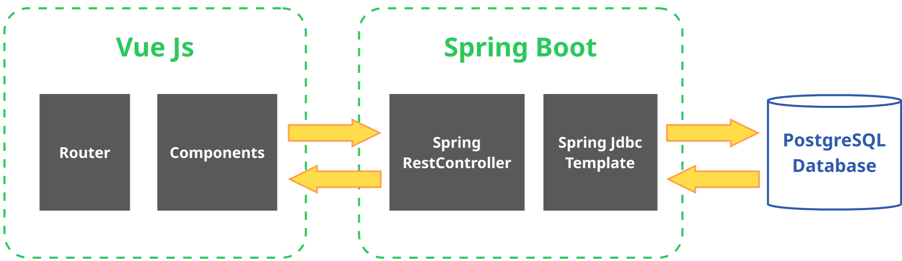

# 9.3. Stack Tecnológico Elegido

## Backend:
- **Framework**: [Java Spring Boot](https://spring.io/projects/spring-boot)  
- **IDE**: [IntelliJ IDEA](https://www.jetbrains.com/idea/)  
- **Librerías y Herramientas**:  
  - [**Lombok**](https://projectlombok.org/): Para reducir código repetitivo como getters, setters y constructores.  
  - [**Spring JDBC Template**](https://spring.io/projects/spring-boot): Para la interacción con la base de datos mediante código SQL en java.
  - [**Spring Web**](https://spring.io/guides/gs/rest-service/): Para la creación de API RESTful que conectan con el frontend.  
- **Control de Versiones**: [Git](https://git-scm.com/) (repositorio alojado en [GitHub](https://github.com/))

## Frontend:
- **Framework**: [Vue.js](https://vuejs.org/)  
- **Entorno de Desarrollo**: [Visual Studio Code](https://code.visualstudio.com/)  
- **Servidor**: Ejecutado localmente para pruebas y desarrollo
  
## Base de Datos:
- **Motor de Base de Datos**: [PostgreSQL 17](https://www.postgresql.org/)  
- **Cliente**: [DBeaver 24.3.1](https://dbeaver.io/)

## Arquitectura de la Aplicación

La arquitectura sigue un enfoque de diseño multicapa, con una separación clara entre frontend, backend y persistencia de datos. A continuación, se detalla la interacción entre estos componentes:

### Frontend (Vue.js):
- Proporciona una interfaz moderna e interactiva para el usuario final.
- Utiliza componentes reutilizables y un sistema reactivo para mejorar la experiencia del usuario.
- Realiza solicitudes HTTP al backend para ejecutar operaciones CRUD y acciones específicas como inspecciones o generación de órdenes.

### Backend (Spring Boot):
- Procesa y gestiona las solicitudes enviadas desde el frontend.
- Controla la lógica de negocio y se comunica con la base de datos relacional.
- Gestiona operaciones de inspección, producción, compras, abastecimiento, logística y distribución.
- Implementa la API RESTful para interactuar con el frontend.
- Evita el uso de ORM al gestionar código SQL directamente en el código Java.

### Base de Datos (PostgreSQL):
- Almacena de manera estructurada todos los datos del sistema, incluyendo empleados, procesos, lotes, inspecciones, órdenes y más.
- Se accede mediante JDBC y JPA desde el backend para garantizar persistencia, integridad y eficiencia.

---

## Diagrama de la Arquitectura
Este diagrama muestra la interacción entre los componentes principales del stack:

  

Este diagrama y descripción permiten ver cómo el frontend interactúa directamente con el backend mediante HTTP, mientras que el backend gestiona y persiste los datos en PostgreSQL. El control de versiones y la colaboración están gestionados a través de GitHub.